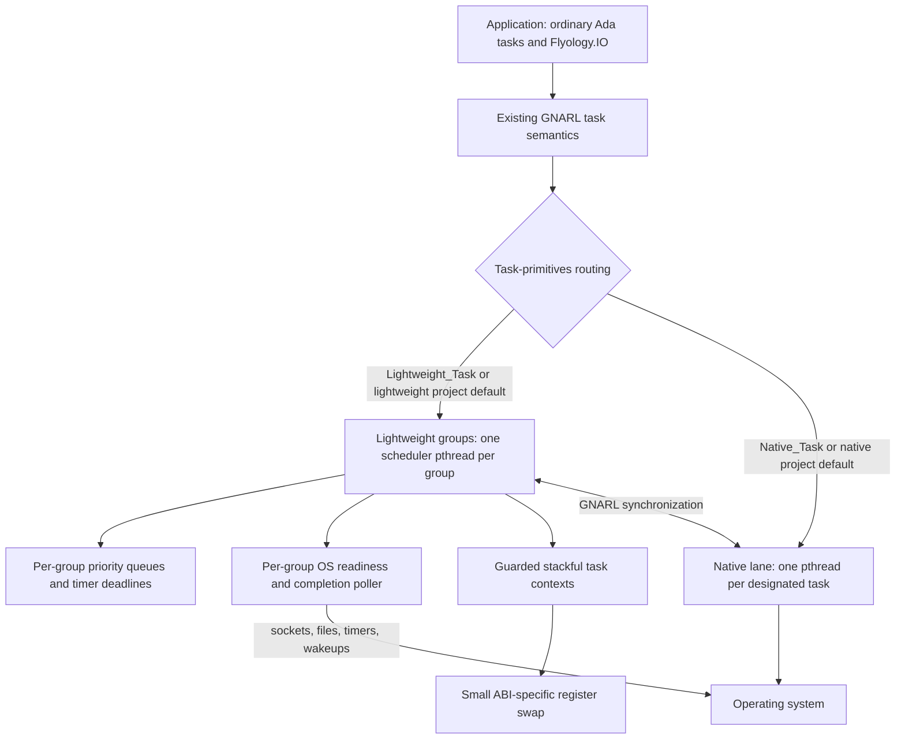
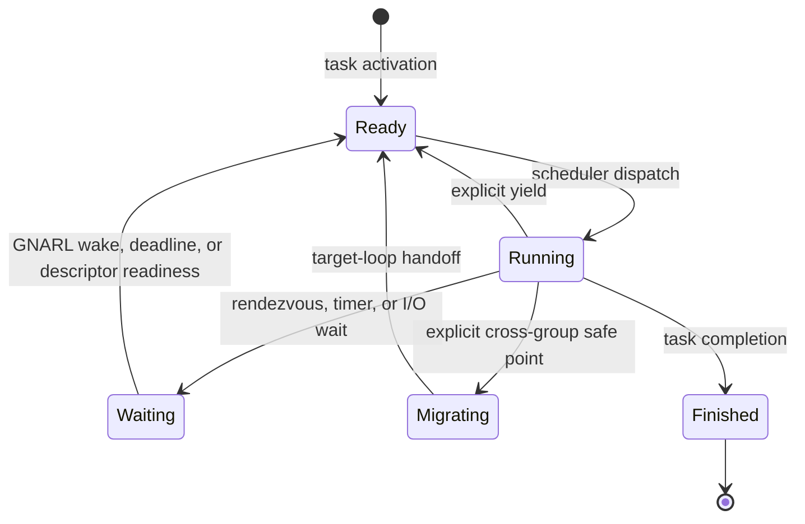
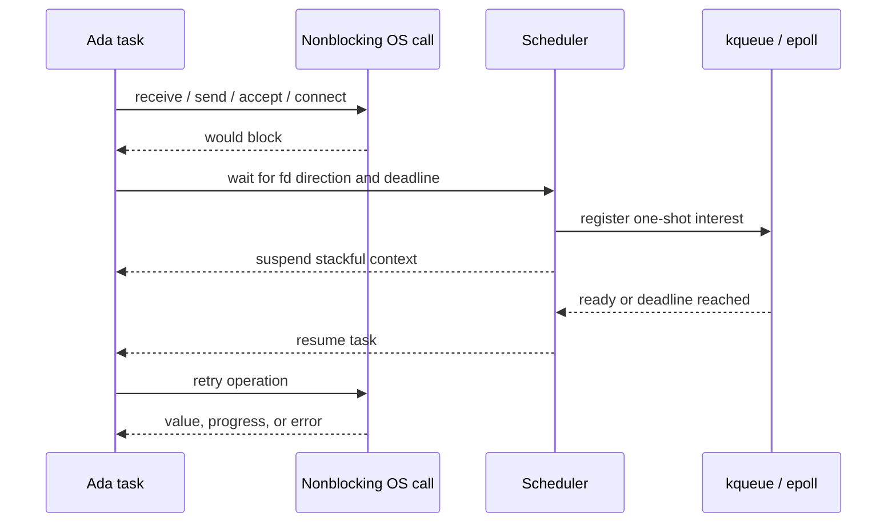

<p align="center">
  <picture>
    <source media="(prefers-color-scheme: dark)" srcset="assets/brand/flyology-horizontal-lockup-dark.svg">
    <source media="(prefers-color-scheme: light)" srcset="assets/brand/flyology-horizontal-lockup.svg">
    
  </picture>
</p>

<p align="center">
  <a href="https://github.com/flyology-ada/flyology/actions/workflows/ci.yml"></a>
</p>

<p align="center">
  <a href="https://flyology.org/runtime/">Runtime</a> ·
  <a href="https://flyology.org/libraries/">Libraries</a> ·
  <a href="https://flyology.org/guide/">Guide</a> ·
  <a href="https://flyology.org/architecture/">Architecture</a> ·
  <a href="https://flyology.org/journal/">Journal</a> ·
  <a href="https://flyology.org/api/">API reference</a>
</p>

Flyology is an experimental systems software project for Ada. Flyology Runtime
is its core GNAT runtime extension for ordinary Ada tasking. The project also
contains libraries built on the runtime and standalone libraries that can be
adopted independently.

Flyology Runtime provides task-aware I/O and two interoperable execution lanes.
By default, undesignated tasks remain native on their pthreads; explicitly
designated lightweight tasks run cooperatively as fibers on shared event-loop threads. Both
lanes keep Ada rendezvous, protected objects, exceptions, task activation,
masters, and normal synchronous control flow. Flyology adds no `async` dialect;
the closest familiar comparison for its lightweight lane is an opt-in Ada
analogue of Java virtual threads.

The name comes from Ada Lovelace's 1828 study of flight. Her letters from that
year describe examining bird anatomy, making wings from paper, silk, and
feathers, and planning a book she called *Flyology*. This history is documented
in a [study of Lovelace's early education](https://doi.org/10.1080/17498430.2017.1325297)
based on the surviving correspondence.

## Table of contents

- [Status](#status)
- [Programming model](#programming-model)
  - [Execution groups and live migration](#execution-groups-and-live-migration)
  - [Thread-per-core and ownership sharding](#thread-per-core-and-ownership-sharding)
- [Priority and real-time contract](#priority-and-real-time-contract)
- [Architecture](#architecture)
  - [GNARL integration boundary](#gnarl-integration-boundary)
  - [Context switching is not event polling](#context-switching-is-not-event-polling)
- [Concurrency primitives](#concurrency-primitives)
  - [Structured supervision](#structured-supervision)
  - [Relocatable data structures](#relocatable-data-structures)
  - [Shared-memory segments](#shared-memory-segments)
  - [Ownership-transfer buffers](#ownership-transfer-buffers)
- [Cache-line-aware storage](#cache-line-aware-storage)
- [Memory nodes](#memory-nodes)
- [Task-aware I/O](#task-aware-io)
  - [Sockets and descriptors](#sockets-and-descriptors)
  - [File watching](#file-watching)
  - [Native subprocesses](#native-subprocesses)
  - [TLS](#tls)
  - [DNS resolution](#dns-resolution)
  - [Connection lifecycle](#connection-lifecycle)
  - [Structured servers](#structured-servers)
  - [Flyology HTTP companion](#flyology-http-companion)
  - [Timers](#timers)
  - [Regular files](#regular-files)
- [Runtime observability](#runtime-observability)
  - [Sampled stall watchdog](#sampled-stall-watchdog)
- [Process lifecycle](#process-lifecycle)
  - [New-process upgrades](#new-process-upgrades)
- [Design decisions](#design-decisions)
- [Ada, C, and assembly boundary](#ada-c-and-assembly-boundary)
- [TLA+ concurrency models](#tla-concurrency-models)
- [SPARK proof boundary](#spark-proof-boundary)
- [Portability boundaries](#portability-boundaries)
- [Repository layout](#repository-layout)
- [Use as an Alire dependency](#use-as-an-alire-dependency)
- [Agent setup](#agent-setup)
- [Build and test](#build-and-test)
  - [AddressSanitizer builds](#addresssanitizer-builds)
  - [CI and releases](#ci-and-releases)
- [Showcases](#showcases)
  - [Event-loop pool showcase](#event-loop-pool-showcase)
  - [Buffer-handoff showcase](#buffer-handoff-showcase)
  - [Buffer-pool contention showcase](#buffer-pool-contention-showcase)
  - [Connection-density showcase](#connection-density-showcase)
  - [Task-lifecycle showcase](#task-lifecycle-showcase)
  - [Task-snapshot contention showcase](#task-snapshot-contention-showcase)
  - [Cancellation-density showcase](#cancellation-density-showcase)
- [Performance snapshot](#performance-snapshot)
- [Current constraints](#current-constraints)
- [License](#license)

## Status

Flyology Runtime is experimental. This checkout is verified on macOS/AArch64
with Alire `gnat_flyology_native` 16.2.0-patchset.1.1.0. Linux/AArch64 and
Linux/x86-64 backends are
present; the repository CI configuration includes Linux jobs, while the native
Docker runner uses Linux/AArch64 by default on an Apple Silicon host.
Hosted validation status is reported by Actions. Runtime preparation is pinned
to the exact host and GNAT releases listed under
[Build and test](#build-and-test) and fails closed for an unverified
combination.

The current patch family covers the exact Alire compiler cells listed below.
Linux/x86-64 runs six stock `gnat_native` releases from 13.2.2 through 16.1.0
and `gnat_flyology_native` 16.2.0-patchset.1.1.0. Linux/AArch64 starts with
stock 14.2.1 and runs the remaining five cells; the configured Alire indexes do
not publish Linux/AArch64 origins for stock 13.2.2 or 14.1.3, and the matrix
runner reports both exclusions. macOS supports the releases shown in the
Build and test table.
The event backend is
`kqueue` on macOS and `epoll` plus `eventfd` on Linux. Lightweight tasks resume
through the small ABI-specific context switch described below.

## Programming model

An undesignated Ada task runs as a native task by default, preserving the
behavior expected by existing GNAT applications:

```ada
task Worker;
```

Lightweight execution is an explicit per-task designation:

```ada
task Connection is
   pragma Task_Info (Flyology.Lightweight_Task);
end Connection;
```

The project-wide default is `native`. Applications opt individual task types
into lightweight execution with an explicit `Flyology.Lightweight_Task`
designation.

The environment task always remains native. No poller, scheduler context,
fiber stack, or event-loop pthread is created until activation of the first
lightweight child task.

An explicit `Flyology.Lightweight_Task` or `Flyology.Native_Task` always
overrides that project default. `Flyology.Project_Default` explicitly requests
the prepared default and is useful as a task-type discriminant:

```ada
task type Worker (Model : Flyology.Execution_Model) is
   pragma Task_Info (Model);
end Worker;

Lightweight : Worker (Flyology.Lightweight_Task);
Native  : Worker (Flyology.Native_Task);
Default : Worker (Flyology.Project_Default);
```

The designation is captured when each task object is created. GNAT's
`Task_Info` representation is target-specific, so Flyology supplies distinct
platform-specific values for explicit lightweight, explicit native, and project
default selection. This preserves the compiler/runtime ABI and avoids a
compiler fork.

Both forms remain Ada tasks and can rendezvous, use protected objects, and wait
on the same GNARL synchronization objects. The designation controls the task's
execution resource; it does not create a second tasking language.

### Execution groups and live migration

A lightweight task whose effective Ada CPU is `Not_A_Specific_CPU` is placed
automatically. The compatibility configuration has one loop and therefore
retains the original group-0 behavior. Set the pool size when launching an
application to distribute such tasks across a fixed pool with deterministic
round-robin tickets without rebuilding the RTS:

```sh
FLYOLOGY_LOOP_POOL_SIZE=4 ./application
```

The launch value must be an integer in `1 .. 128`. It is captured once at
application startup, before library-level tasks activate. An absent value
defaults to `1`; an invalid value fails application initialization. An
application may explicitly grow the automatic-placement ceiling later:

```ada
Flyology.Execution_Groups.Grow_Configured_Pool (8);
```

Growth is thread-safe and idempotent. Concurrent calls converge on the largest
requested size. Existing tasks remain on their current groups, future automatic
placements use the enlarged pool, and newly included groups stay lazy until
work first selects them.

An application may also lower the ceiling without waiting for drainage:

```ada
Result := Flyology.Execution_Groups.Request_Pool_Reduction (2);
Status := Flyology.Execution_Groups.Pool_Reduction;
```

The cutover applies to future automatic placements immediately. Automatically
managed tasks in removed groups migrate to group 0 when they next become ready
at an unpinned cooperative dispatch point. Waiting tasks must first wake,
pinned tasks must first unpin and yield, and a CPU-bound task that never
suspends can delay completion indefinitely. `Pool_Reduction` reports the phase
and blocker counts so callers can poll under their own deadline. Tasks selected
with a `CPU` aspect or moved explicitly with `Migrate` remain where the
application placed them. Drainage retains already-created event-loop threads;
it does not reclaim them. When automatic tasks or pre-cutover placement claims
require migration, the request may synchronously start group 0 and wait for
that destination's startup. An already-drained reduction starts no group,
preserving native-only inertness.

Pool groups are created independently and lazily: configuration inspection
does not start them, and a four-loop configuration owns no event pthreads until
lightweight tasks are activated. `Flyology.Execution_Groups.Configured_Pool_Size`
and `Configured_Placement` report the frozen process policy,
`In_Configured_Pool` classifies a group, and `Current` reports where the
calling lightweight task was actually placed. `Flyology.Observability.Snapshot` can
then inspect each created pool group without creating missing ones.

For positive values, the standard Ada `CPU` aspect is an explicit override and
selects that exact shared event-loop group without consuming an automatic
placement ticket. Ada reserves value 0 for `Not_A_Specific_CPU`, so `CPU => 0`
uses automatic placement rather than explicitly selecting group 0. Use
`Cross_To_Shard (0)` or `Migrate (0)` at a lightweight safe point when group 0
must be selected explicitly. Tasks with the same positive value share one loop
pthread; different values use different loop pthreads and can therefore execute
in parallel:

```ada
task Parser with CPU => 1 is
   pragma Task_Info (Flyology.Lightweight_Task);
end Parser;

task Writer with CPU => 2 is
   pragma Task_Info (Flyology.Lightweight_Task);
end Writer;
```

Shared group identifiers are `0 .. 127`; the positive `CPU` encodings can name
groups `1 .. 127`. Values `128 .. 255` are reserved for runtime-created
dedicated groups, so applying `CPU => 128` or greater to a lightweight task
fails activation with `Tasking_Error` rather than selecting a CPU.
The automatic pool is likewise limited to 128 shared groups. This interpretation
applies only after event-loop designation: an Ada `CPU` aspect on a native task
continues through stock GNARL's processor-affinity path.
Later dispatching-domain affinity calls on a lightweight task are inert: they
do not change its execution group, its GNARL CPU/domain bookkeeping, or the
affinity of the group's shared pthread. Native tasks retain GNARL's behavior.
Ada D.16 CPU inheritance is also preserved: a task without its own aspect but
activated by a task with an assigned CPU inherits that effective assignment and
therefore stays on the inherited group rather than entering the automatic pool.

Automatic placement, explicit `CPU` selection, and live migration are separate
decisions. Placement chooses an event loop at activation, `CPU` overrides that
choice, and `Migrate` changes the current group later at an explicit safe point.
By default none of these pins the group's pthread; the operating system may
schedule it across processors.

Loop-thread placement is a fourth, explicitly separate policy. Linux can bind
a group pthread to one zero-based OS logical-CPU id and verifies the effective
mask after `pthread_setaffinity_np`. The value is not an Ada `CPU` aspect: that
aspect names a logical Flyology group. Darwin has no public hard-core binding.
Where its kernel supports `THREAD_AFFINITY_POLICY`, Flyology instead exposes a
positive advisory tag for cache locality; a tag is never reported as a CPU.
Current Apple-silicon Darwin returns `KERN_NOT_SUPPORTED`, which the capability
query and runtime preparation report rather than pretending that a hint was
applied.

Configure a group before its lazy startup, then inspect whether the request is
pending, applied, failed, or unavailable:

```ada
if Groups.Placement_Supported (Groups.Strict_CPU)
  and then Groups.Placement_Value_Available (Groups.Strict_CPU, 3)
then
   Result := Groups.Configure_Loop_Thread
     (Group => 1, Kind => Groups.Strict_CPU, Value => 3);
end if;

Status := Groups.Loop_Thread_Status (1);
```

The same request is idempotent after startup. A different request or clearing
the request after group creation reports `Group_Already_Started`; the scheduler
never moves a live loop pthread behind the application's back. Configuration
and lazy creation serialize on the topology lock, so a race has one of two
complete outcomes: configuration wins and is applied before startup publishes,
or startup wins and configuration is rejected. Groups `128 .. 255` can be
preconfigured in the same way before `Create_Dedicated` claims them. Migration
to a placed group naturally resumes on that group's already-placed pthread.
Native-task `CPU` affinity remains entirely on stock GNARL's path.

`Flyology.Execution_Groups` also provides an explicit safe-point migration API:

```ada
declare
   package Groups renames Flyology.Execution_Groups;
   Home      : constant Groups.Group_Id := Groups.Current;
   Dedicated : Groups.Dedicated_Group_Id;
begin
   Groups.Migrate (Groups.For_CPU (2));

   Dedicated := Groups.Create_Dedicated;
   Groups.Migrate (Dedicated);
   Blocking_Foreign_Call;  --  this task now owns the loop pthread

   Groups.Migrate (Home);
end;
```

`Flyology.HTTP.Client.Authentication` provides preemptive Basic and Bearer
request helpers. `Set_Bearer` validates the RFC 6750 `b64token` form;
`Set_Basic` rejects controls and a colon in the user-id, constructs
`user-id ":" password`, and applies RFC 4648 Base64 as specified by RFC 7617.
The Basic inputs are already-encoded octet strings: an application honoring a
UTF-8 challenge supplies normalized UTF-8 bytes. Both setters atomically
replace every existing `Authorization` field, and `Clear` removes credentials
while preserving the other request fields and their order.

```ada
with Flyology.HTTP.Client.Authentication;

Flyology.HTTP.Client.Authentication.Set_Bearer (Request, Access_Token);
--  Or:
Flyology.HTTP.Client.Authentication.Set_Basic
  (Request, User_Id, Password);
```

These are request-construction helpers, not a credential cache or challenge
handler: they do not discover protection spaces, refresh tokens, retry 401
responses, or hide secrets from application logs. The request retains the
generated authorization value. Send Basic and Bearer credentials only through
authenticated TLS or equivalent protection. Same-origin redirects retain the
field; the client returns cross-origin redirects without contacting the other
authority. Custom authentication schemes remain available through
`Add_Header`.

Migration returns on the destination pthread without changing Ada task
identity, its stack, locals, exception state, master, or rendezvous semantics.
The source scheduler performs the actual handoff only after the fiber has fully
switched away, so two loops can never restore one context concurrently. A
protected object's lock belongs to the source pthread and cannot follow the
task, so `Migrate` inside a protected action is refused: a lightweight caller
raises `Program_Error` before any movement, whatever group it names, and the
normal unwinding releases the lock on the thread that holds it.

Ada task identity is not OS-thread identity. Lightweight tasks in one group share
that group's pthread and therefore also share C `pthread_key` values, signal
masks, per-thread foreign-library caches, locale state, and other pthread-local
state. A yield stays on the same group pthread, but migration changes all of
that thread-local context even though the Ada task itself is unchanged.

Code holding a thread-affine foreign resource can prevent that change with a
scoped pin:

```ada
declare
   Pin : Groups.Thread_Pin := Groups.Pin_To_Current_Thread;
begin
   Use_Thread_Affine_Handle;
   --  A Groups.Migrate call to another group raises Migration_Error here.
end; -- Pin is deterministically released, including during exception cleanup
```

Pins nest safely, and migration remains disabled until the outermost pin is
finalized. A lightweight task's pin is owned by the Ada task that acquired it
and must be finalized by that same task; the intended use is a task-local lexical
scope as above. Finalization of that pin by another task raises `Program_Error`
in that task and leaves the acquiring task pinned. A pin stabilizes the
event-loop pthread; it does not give the task exclusive use of that pthread,
so unrelated fibers in the group still share its pthread-local state. Use a
dedicated group as well when a foreign
resource requires both stable identity and exclusive access. Native tasks accept
the same API as an inherent no-op because GNARL already fixes each native task
to its own pthread. A native-acquired guard's finalization is also a no-op,
including when another task finalizes it. `Is_Thread_Pinned` reports both explicit
lightweight pins and this inherent native binding.

A dedicated group is a reusable event loop reserved for one fiber. Operationally
it gives that task an OS thread to itself, which is the safe live transition for
temporarily blocking foreign work. A stock `Native_Task` task remains fixed at
creation: its continuation lives on a pthread-owned stack and cannot be
teleported into a fiber without replacing GNARL task identity and lifecycle.

The reservation is consumed when its task migrates out, immediately making the
empty lane reusable. Call `Create_Dedicated` again before re-entering it; if no
other task claimed the lane, the API normally returns the same group id.

### Thread-per-core and ownership sharding

Flyology execution groups can support a thread-per-core-shaped architecture:
configure a shared group for each application shard, optionally place each
group's loop pthread, and keep a shard's mutable state in tasks that run on that
group. The group is the stable scheduling and ownership domain. It is not a
physical-core identifier. Configured groups start lazily, and the operating
system may move an unplaced loop pthread between processors.

`Flyology.Execution_Groups.Topology` maps a key deterministically into the
configured shared pool and gives an explicit name to an ownership-boundary
crossing:

```ada
with Flyology.Execution_Groups;
with Flyology.Execution_Groups.Topology;

declare
   package Groups renames Flyology.Execution_Groups;
   package Topology renames Flyology.Execution_Groups.Topology;
   Target : constant Topology.Shard_Id :=
     Topology.Shard_For_Hash (Request_Hash);
begin
   Topology.Cross_To_Shard (Target);
   pragma Assert (Groups.Current = Target);
   Handle_Owned_State;
end;
```

The default mapping is `Hash mod Configured_Pool_Size`. Launching with a
different pool size or calling `Grow_Configured_Pool` can remap keys.
The overload taking an explicit `Shard_Count` is available when an application
must keep a stored partitioning scheme independent of loop configuration.
Crossing targets are limited to configured shared-pool ids; dedicated groups
are not shards in this policy. A concurrent pool reduction may make a target
stale; `Cross_To_Shard` then raises `Migration_Error` without changing the
calling task's placement.

Migration alone does not make arbitrary data share-nothing. The application
must assign each mutable object to a shard and arrange that only its owner
mutates it. Ada task entries, protected message queues, or task-aware sockets
can carry cross-shard work. A native task can send those messages but cannot
migrate; a lightweight task can either send a message remotely or cross at the
explicit safe point. GNARL and the runtime still use synchronization internally,
so this architecture is not a claim that the process executes without locks.

Each group has its own ready queues, deadline heap, descriptor index, poller,
and stable loop pthread. There is no implicit work stealing between groups;
automatic placement and explicit crossings determine ownership. Topology
changes still use the short-held global topology lock. Within a group,
scheduling remains cooperative: CPU work must suspend or call a fairness
checkpoint, and an arbitrary blocking foreign call can stop every task on that
loop. Use Flyology's task-aware I/O or an explicit native-task boundary for
blocking work.

Linux `Strict_CPU` placement can bind a loop pthread to one available logical
CPU. This may be used to construct a pinned layout, but it does not identify a
physical core and it does not reserve that CPU from other processes. Darwin
offers only advisory affinity tags where supported; current Apple-silicon
Darwin reports them unavailable. `Current` remains the authoritative group
identity, while `Current_Processor` is only optional host observation.

The runnable showcase creates one task-owned counter per configured shard,
routes work from both native and lightweight callers, and explicitly crosses a
lightweight caller through every shard:

```sh
./showcases/run_thread_per_core.sh 4 1000
```

The same Flyology I/O call also works from either kind of task:

```ada
Flyology.IO.Timers.Sleep_For (0.050);
Flyology.IO.Sockets.Receive (Socket, Buffer, Last, Timeout => 1.0);
Flyology.IO.Files.Read_At
  (File, Offset => 0, Item => Buffer, Last => Last);
```

In a lightweight task, these calls suspend only the current Ada task. In a native
task, they may block only that task's pthread. Values, `out` parameters, local
variables, exception propagation, and call stacks behave like normal
synchronous Ada code in both cases.

## Priority and real-time contract

Task priorities retain two deliberately different implementation domains. An
undesignated or explicitly `Native_Task` task stays on stock GNARL's pthread
path: Flyology does not intercept its kernel scheduling policy, priority, CPU
affinity, or priority-change calls. The host GNAT runtime and operating system
therefore keep their normal behavior, permissions, and limitations.

For a lightweight task, Ada active priority orders fibers **within its current
execution group**. Every group selects the highest non-empty priority bucket;
tasks of equal priority run FIFO. The state transitions are precise:

| Priority change while the lightweight task is… | Scheduler effect |
| --- | --- |
| Ready | Remove from the old bucket and reinsert in constant time: at the head after loss of inherited priority, otherwise at the tail |
| Waiting | Record the active priority; the next wake enters that priority's bucket |
| Running | Record the active priority; it takes effect at the next suspension or yield |
| Migrating | Preserve the active priority and use it when the target loop accepts the task |
| Losing rendezvous-inherited priority | Requeue at the head only if the task is already Ready; a Running or waiting task retains no placement preference for its next yield or wake |

`Ada.Dynamic_Priorities.Set_Priority` remains the standard public operation. A
self-change reaches GNARL's normal dispatching point, which yields the lightweight
task after the runtime update. GNARL's rendezvous priority boost is also routed
into the lightweight scheduler, so a low-base-priority acceptor runs at the caller's
inherited active priority and returns with the specified loss-of-inheritance
queue placement. Head placement describes reordering a task that is already
ready; it is not a durable preference. A running server that yields or blocks
after losing inheritance was never reinserted by the priority change, so its
next yield or wake uses normal FIFO placement. The deterministic
`priority_semantics_smoke` test covers ready, waiting, running, rendezvous loss
followed by a yield or blocking, and cross-group migration cases; the
`priority_scheduling` showcase prints the visible highest-priority/FIFO trace.

This is fixed-priority cooperative scheduling, not a hard-real-time claim:

- Priorities do not preempt arbitrary lightweight instructions. A task that does
  not suspend or yield can delay even a newly ready higher-priority peer.
- Priority order is local to one loop. Separate groups execute on separate
  pthreads, so there is no process-wide total order between their ready queues.
- The loop pthread is not raised and lowered to mirror each fiber's active
  priority. `FIFO_Within_Priorities` and `Round_Robin_Within_Priorities` kernel
  policies, deadline dispatching, budget enforcement, and bounded preemption
  are not implemented for lightweight tasks.
- `CPU` chooses an event-loop group. Physical loop-thread placement is a
  separate opt-in policy; unconfigured groups remain OS-scheduled.
  Native-task CPU affinity remains stock.
- Protected-object mutual exclusion and language-level rendezvous still come
  from GNARL. Successful maximum-ceiling protected actions are covered by the
  native/lightweight semantic suite, but kernel priority-ceiling violation checks,
  priority inheritance through arbitrary pthread/foreign locks, and bounded
  priority inversion are not a lightweight guarantee. Potentially blocking work
  remains unsuitable inside a protected action. On a lightweight task the
  runtime detects that RM 9.5.1 bounded error: a potentially blocking
  operation reached inside a protected action raises `Program_Error` at the
  suspension point, the protected object's lock is released, and the object
  stays usable. Without that check a suspended fiber would hold the object's
  pthread mutex on its event-loop thread and deadlock every task in its
  execution group. Native tasks keep stock GNAT behavior, where the same
  construct is an undetected bounded error and a peer simply waits on the
  lock; configure `pragma Detect_Blocking` for a partition that wants the
  check on native tasks as well. The same detection covers Flyology's own
  lightweight suspension points that bypass GNARL's check sites: a
  `Flyology.IO` readiness wait, and therefore every socket, completion-set,
  and subprocess wait built on it, and a synchronous `Flyology.IO.Files`
  read or write raise `Program_Error` before suspending a lightweight task
  inside a protected action, while the zero-timeout immediate poll does not
  suspend and is not refused.

Applications needing OS `SCHED_FIFO`/`SCHED_RR`, physical affinity, a
preemption bound, or certified ceiling behavior should keep those tasks native
and validate the target GNAT/OS real-time configuration. Lightweight priorities are
useful for deterministic service preference among cooperative tasks on one
loop, especially at high I/O concurrency; they are not a substitute for that
configuration.

## Architecture



### GNARL integration boundary

Flyology integrates at `System.Task_Primitives.Operations`, below GNARL's task
semantics. The patched task primitives route each task to one of two execution
lanes:

- Lightweight tasks receive a guarded stack and a resumable execution context. Each
  execution group has a priority-aware ready queue, poller, and scheduler
  pthread. The environment task remains a normal GNARL task; even group 0 owns
  a separate scheduler pthread created on first lightweight-task activation.
- `Native_Task` tasks use the normal pthread-backed path.
- Alternate signal stacks are owned by OS threads. Native tasks retain GNARL's
  per-pthread stack, while each event-loop pthread installs one permanent stack
  shared by its fibers. `Task_Wrapper` therefore does not reserve GNARL's 32 KiB
  alternate-stack local inside every lightweight task stack. The lightweight
  creation path passes the requested task storage unchanged to the guarded-stack
  allocator; only native stack sizing retains GNARL's alternate-stack allowance.
- Lightweight stacks are mapped in arenas of at most 64 slots, rounding the
  4 MiB target up to a whole number of slots before the final guard. Exact
  effective stack sizes have indexed classes and per-class non-full arena
  lists, so allocation does not scan full arenas. Each usable stack is preceded
  by an inaccessible guard of at least 64 KiB, rounded to the host page size.
  Adjacent stacks share that interior guard region. A released slot is protected
  before reuse and receives best-effort page-discard advice; a completely empty
  arena is unlinked directly and unmapped instead of becoming an
  historical-peak cache.
- After a lightweight task finishes and the scheduler leaves its stack, the
  scheduler releases the stack, context, and trampoline storage. A library-level
  task's fiber record can remain registered until GNARL finalization.
- Synchronization between the lanes still passes through GNARL. A native task
  wakes the event-loop scheduler through `EVFILT_USER` on macOS or `eventfd` on
  Linux.

Keeping the integration below GNARL is what lets existing Ada task syntax and
semantics survive. Reimplementing rendezvous or protected objects would create a
parallel runtime with subtly different behavior; Flyology deliberately avoids
that.

At normal process finalization, GNARL first completes task masters, terminates
remaining library-level tasks according to Ada rules, and finalizes controlled
library objects. Flyology then reaps any already-finished static task fibers,
wakes and joins quiescent loop pthreads, and releases their pollers, contexts,
timer heaps, locks, and group records. It never tears these resources down while
a fiber can still run: if the final registry is unexpectedly nonempty after a
bounded final-reap grace period, cleanup is marked deferred and left to the
operating system at process exit.

### Context switching is not event polling

These are independent mechanisms with different jobs:

| Mechanism | Purpose | Current implementation | Portability boundary |
| --- | --- | --- | --- |
| Context switching | Save one lightweight task's CPU/stack state and resume another | Guarded stacks plus a small ABI-specific register-swap routine for AArch64 and x86-64 on macOS or Linux | ABI and architecture |
| Event polling | Sleep until socket readiness, file completion, a timer deadline, or a cross-thread wake | `kqueue` with `EVFILT_AIO`/`EVFILT_USER` on macOS; `epoll` with `io_uring`/`eventfd` on Linux | Operating system |
| Scheduling | Choose which runnable Ada task executes next | Ada priority-ready queue and deadline bookkeeping | Runtime policy |

The poller discovers readiness; the context machinery preserves a suspended
Ada task's call stack and makes resumption look like an ordinary procedure
return. Each fresh stack also has an unwind root: AArch64 enters the Ada
trampoline through an assembly frame whose DWARF CFI marks the return address
undefined, while x86-64 uses a zero return-address sentinel. Ada exception
traceback capture, including executables bound with `-Es`, can therefore walk
the fiber's frames and stop before the unrelated scheduler stack. Debuggers
likewise stop at this root; Flyology does not splice two independent stacks
into one backtrace. Scheduling connects these mechanisms without exposing them
in application code.

The scheduler state transition is:



Scheduling inside the lightweight lane is cooperative. A CPU-bound task must reach a
runtime suspension or yield point; otherwise it owns the loop. A native task is
the intended designation for code that blocks unpredictably, invokes blocking
foreign libraries, or needs independent CPU execution.

`delay 0.0` is an explicit cooperative yield for a lightweight task. A permanently
runnable yielding task does not starve descriptors: after at most 64 dispatches,
the scheduler promotes expired timers and drains up to 64 immediately available
poll events in one batched `kevent` or `epoll_wait` call before returning to the
ready queue.
Both budgets are explicit policy, keeping I/O moving without allowing a hot
descriptor set to monopolize the loop in the opposite direction.

CPU loops can make that policy reusable with a time-budgeted checkpoint:

```ada
Budget : Flyology.Fairness.Yield_Budget;

Budget.Configure (Ada.Real_Time.Microseconds (250));
while More_Work loop
   Process_One_Item;
   Budget.Checkpoint;
end loop;
```

`Checkpoint` reads the monotonic clock and performs `delay 0.0` only after its
quantum expires. It works for both task designations: a lightweight task gives its
loop peers a turn, while a native task offers its pthread to the OS scheduler.
It deliberately does not interrupt arbitrary Ada instructions; code that never
calls a runtime suspension or checkpoint remains cooperative and can still own
the loop until it returns.

`delay 0.0`, `Flyology.Fairness.Yield_Now`, `Checkpoint`, and
`Flyology.Execution_Groups.Migrate` are potentially blocking operations and
must never be called inside a protected action. GNAT diagnoses a literal
`delay` statement in a protected body, but a call to `Yield_Now`,
`Checkpoint`, or `Migrate` is not syntactically visible to that check. On a
lightweight task the yield itself raises `Program_Error`, so `Yield_Now` fails
on every call, `Checkpoint` fails on the call where its quantum expires, and
`Migrate` fails before moving the task.

## Concurrency primitives

Flyology supplies a small coordination layer for bounded work. These packages
use ordinary Ada protected entries and task scopes; they do not introduce an
executor, detached tasks, or a second scheduling model. A protected entry wait
suspends a lightweight task cooperatively and retains normal GNARL behavior for
a native task.

### Structured supervision

Ada-native [structured supervision](docs/supervision-design.md) provides typed
heterogeneous static trees and fixed-capacity homogeneous dynamic families.
Applications may supply their own task types, entries, task aspects, and task
bodies through `Supervision.Task_Generations` or
`Supervision.Input_Task_Generations`; procedure-body adapters remain available
for simpler children. Both controllers use explicit readiness,
generation-owned cancellation, 64-bit logical ids and generations, bounded
restart policy, nested incident propagation, fixed snapshots, and bounded event
rings. Static trees validate dependencies and named cohorts, start in
deterministic topological order, stop in reverse order, and coordinate isolated,
cohort, or transitive-dependent recovery. Each restart constructs a fresh Ada
task object under a local master; stale handles cannot control its replacement.
If that generation owns a nested family, reconstruction also creates an empty
one-shot family with new controller authority. Applications retain desired
dynamic requests outside the family, reconcile external state idempotently,
and admit those requests into the new family before reporting readiness.
Handles also carry a process-local controller identity, so an otherwise equal
child and generation from another supervisor remains stale. Default-constructed
handles carry invalid controller authority and are rejected even by the first
supervisor in a process. Exact-generation
manual restart and failed health probes use the same bounded stop, incident,
backoff, replacement, and readiness path as automatic recovery.
Child policies reuse `Flyology.Lightweight_Task` or `Flyology.Native_Task` as
an explicit `Task_Model` for placement validation and observation; the task
type's actual `Task_Info` and `CPU` aspects remain authoritative.
`Task_Generations` consumes the task-owned result published by GNARL after
finalization, so ordinary normal return, an escaping exception, and abnormal
completion require no application reporting handler. Explicit reporting remains
available only when application code catches and suppresses an outcome but wants
supervision to classify it differently.
`Supervision.Service_Slots` publishes bounded typed ready-generation leases
without storing task access values or application payloads. Controlled
publication revokes the exact old generation during normal, exceptional, or
abort cleanup. `Supervision.Adapters` constructs a fresh one-shot structured
service per generation and bridges blocking worker-pool, structured-server, or
listener-loop run APIs to readiness and cooperative supervisor shutdown. The
adapter preserves the service task's actual task identity and normal, exception,
or abnormal exit classification in the generation result.
`Supervision.Families.Prepared_Admissions` is an optional generic child for a
family whose request must be authorized before execution. `Prepare_Start`
reserves and copies into the family's existing fixed slot storage and exposes
the exact first-generation handle through the active claim. `Commit_Start`
transfers exact admission ownership to a one-shot admission owner while
preserving the same first-handle identity value and keeping the request blocked,
and only `Release_To_Run` queues it. Its explicit completion-token
overload publishes the result and then the caller-owned token last in the same
protected cut, so an interrupted external publication guard can reconcile
without guessing whether execution was released. Rollback, abort, shutdown, and
`Cancel_And_Join` retain one exact owner and never join a later slot generation.
The commit overload likewise publishes caller-aliased `Committed` evidence last
in the protected ownership cut, so an interrupted downstream adapter can
distinguish the active blocked admission from the still-owned prepared claim.
The child adds no second slot or monitor-capacity table; bounded kind,
admission, and deferred-fact metadata accompanies the configured
`Maximum_Children` slots and `Monitor_Capacity` tickets. After matching, the
ticket's no-longer-needed observed-handle storage carries the borrowed wake
descriptor while the coherent terminal snapshot remains fixed. One exact
nonblocking write and terminal ticket publication share a bounded protected
cut; an interrupted single attempt leaves the claim unchanged and retries only
after leaving that cut. An owner therefore cannot observe terminal state before
its wake is readable, and the producer retains no descriptor afterward. Its scoped
`Observe_Exact` operation retains one exact admission epoch. After
observing one generation's termination, callers rearm that same exact
generation to learn whether a replacement was coherently published or the
admission finally joined, without polling or a helper task.
For a start protocol that must guarantee observation capacity before release,
`Prepared_Observation_Claim` reserves one persistent monitor ticket while the
admission remains blocked. Each `Activate_Exact` operation borrows that ticket
for one generation and returns it to a dormant state on finish or cancellation.
Its generation overload qualifies an older retained fact with the claim's
opaque admission identity without sampling or following the Family's latest
generation.
`Request_Cancellation` applies only to the supplied exact current generation
inside that admission, without exposing a handle constructor, waiting, or
following a replacement.
`Admission_Join_Is_Immediate` is the generation-qualified authority for deciding
whether cleanup of that exact released admission can finish without waiting. A
copied terminal observation alone is insufficient because it does not prove that
its generation is the admission's protected current epoch or that the slot has
not been reused. If a released request is cancelled or shutdown wins before its
generation task starts, the final snapshot is published directly as `Joined`
with `Cancelled` or
`Supervisor_Shutdown`; an internal manager setup failure before the generation
task starts uses the defensive `Abnormal_Completion` cause.
The reservation overload publishes its caller-aliased `Reserved` evidence last
in the protected success cut, so interruption before or after ownership transfer
can be reconciled without inferring state from an ordinary `out` result.
Replacement rearm therefore cannot fail because another observer consumed the
ticket between generations. Reserved and dormant claims continue retaining an
exact replacement or terminal fact even when no scoped operation is armed, and
cancelling an operation does not consume that retained fact. Explicit claim
release or claim finalization drains any in-flight signal before returning the
monitor slot. Operation capacity remains a separate caller-owned completion-set
obligation; several claims may share one set wake source without sharing claim
state. If a caller probes the replacement generation before consuming the older
replacement fact, timeout restores the older boundary unchanged. A newer
terminal or replacement result may be copied to that exact probe, but remains
queued behind the older fact as an epoch-ending marker; ordered rearm therefore
cannot cross a reused Family slot.
The website has a focused [supervision guide](https://flyology.org/guide/supervision/).

`Flyology.Capacity.Gate` admits a fixed number of concurrent holders. It offers
blocking, nonblocking, and timed acquisition, terminal shutdown, waiter and
active counts, and a drain barrier. `Flyology.IO.Connections.Server` is a
source-compatible subtype of this general gate, so connection admission and
application capacity control share the same implementation. The caller remains
responsible for pairing every successful acquisition with `Release`.

`Flyology.Channels.Bounded` is generic over a definite element type and a
resource-empty value for unoccupied slots. Each channel is a fixed-storage MPMC
FIFO with blocking and nonblocking operations, relative-deadline wrappers,
current-state snapshots, and terminal close-and-drain behavior. Closing rejects
queued and later senders but preserves FIFO delivery of values already
accepted. The channel owns no task and performs no allocation after
elaboration. A dequeue clears its occupied slot immediately, so controlled
components and reference-bearing values are not retained until a later send
reuses the slot. Element assignment and finalization run under the channel's
protected lock and must not block, reenter the same channel, or propagate an
exception. Dequeue state is committed before slot clearing, so a raising
finalizer cannot make an already copied value available a second time.
The package-level nonblocking `Try_Send` overload with a caller-aliased
`Accepted` token sets that token false before it attempts to enter the protected
channel, and true only after it installs the complete value and queue state.
The token therefore remains authoritative when abort occurs before protected
entry or prevents ordinary `out` copy-out: true transfers ownership of exactly
one queued value, while false transfers none. The familiar protected
result-only overload uses the same protected transition. Once true is
published, a later internal notification failure does not revoke that ownership
even when the ordinary result is unavailable.
The production dequeue consumes one SPARK-proved scalar transition that returns
the old-head position while advancing the head and decrementing the count. It
then replaces that returned slot with `Empty_Value`. The proof ties the three
scalar results together; it does not analyze the generic element assignment,
prove that an application's `Empty_Value` releases every resource, or prove
controlled finalization behavior. The capacity-two wrap test catches an omitted
clear or use of the updated head, tail, or other slot along that blocking and
nonblocking two-slot sequence. Controlled-element tests cover immediate release
and exceptional ordering in both task lanes.

```ada
package Jobs is new Flyology.Channels.Bounded
  (Element_Type => Job,
   Empty_Value  => Empty_Job);

Queue : Jobs.Channel (Capacity => 256);

Queue.Send (Next_Job);
Queue.Close;
Queue.Await_Drained;
```

`Flyology.Worker_Pools` builds a one-shot structured worker scope on that
channel. Its generic parameters provide a resource-empty job value and fix the
worker callback, lightweight/native designation, and CPU or execution-group
selection. `Run` creates exactly the configured worker count and does not return
until shutdown closes the queue, accepted jobs drain, and every dependent task
joins. Callback failures close admission, request the shared cancellation
token, retain the first exception, and are reported as `Pool_Failed` after the
workers join. The shared context must provide its own synchronization when
workers can execute concurrently.

`Flyology.Cancellation.Token.Await_Request` provides a protected-entry wait for
task-only coordination. Descriptor-backed wakeup remains available through
`Wait_Source` when cancellation must participate in a socket or file wait; a
task-only request does not allocate an OS descriptor.

### Relocatable data structures

`Flyology.Data_Structures` provides address-independent stored layouts for
caller-owned contiguous regions. `Regions.View` records a native base only in
process-local state; stored relationships use fixed-width offsets, indices,
generations, counters, hashes, and payload bytes. Every layout begins with
magic, version, schema, extent, and configuration fields. Attachment validates
the complete extent and fails on incompatible, incomplete, truncated, or
corrupt metadata. The packages create no mapping and package elaboration starts
no task, scheduler, poller, or event loop.

The shared lifecycle word also carries a 29-bit initialization epoch. A local
view caches that epoch when it initializes or attaches. Exclusive
reinitialization advances it before rewriting metadata, so every older view
fails before using cached capacity, stride, or native addresses—even when the
same bytes are reused for a different leaf. Peers must attach again after every
initialization. Epochs do not wrap: after the final value, that extent fails
closed and must be retired. Fresh or lifecycle-corrupt bytes start at epoch one;
before using `Initialize` as recovery from out-of-band lifecycle corruption,
the application must permanently retire every earlier view because the damaged
epoch can no longer distinguish it.

Every stored leaf also provides `Create_Or_Attach` for a different case: an
allocation protocol has supplied an extent known to be virgin with an exact
zero lifecycle sentinel, but more than one participant may reach it. One
caller atomically changes zero to `Initializing`, writes the complete object,
and returns `Initialized_New`. A caller that observes a ready compatible
object validates and attaches with `Attached_Existing`; one that observes the
winning caller before publication returns `Initialization_In_Progress` with a
detached view and does not wait. Incomplete, destroyed, poisoned, incompatible,
and corrupt nonzero states are never overwritten. This is not a recovery API:
if corruption changes an old object's lifecycle word to zero, core cannot
distinguish those bytes from virgin storage without an outer allocation
directory or journal. Explicit `Initialize` remains the exclusively authorized
destructive initialization and recovery operation. Concurrent calls are valid
only while the allocation protocol still guarantees virgin bytes. Once a ready
object may exist, the leaf's ordinary attachment-quiescence rule also applies.

Value-bearing containers do not accept arbitrary Ada private types, because a
private type may hide an access value, task, controlled component, or compiler
metadata. `Storage_Types.Immutable` owns a definite byte-array `Value`, scoped
zero-copy `Const_Ref` and unpublished `Builder` types, plus a stable 64-bit type
signature and layout version. `Storage_Types.Elements` binds that representation
once to application-facing `Source` and `Observed` types. `Create` and `Observe`
are supplied once when the adapter is instantiated. Callers then pass ordinary
source values to container operations and receive ordinary observations; they
do not supply a codec or callback per operation. Creation produces the exact
native-layout bytes owned by `Value`; observation reads a scoped reference to
published bytes without first copying the representation. An adapter may also
bind an optional direct constructor for unpublished slots; a missing hook
safely falls back to `Create` plus one representation copy.

`Vectors`, `Slab_Pools`, `Rings.SPSC`, `Rings.MPMC`, `Hash_Maps`,
`Dynamic.Vectors`, and `Dynamic.Hash_Maps` are generic over these element
adapters. Each leaf incorporates the element signature and layout version into
its persisted schema and rejects an equal-sized but differently identified
adapter on attachment. `Storage_Types.Unsigned_64s.Element` is the built-in
eight-byte scalar adapter. `Byte_Strings` and `Dynamic.Byte_Strings` remain
concrete byte-sequence containers rather than element collections.

| Package | Stored value | Synchronization |
| --- | --- | --- |
| `Regions` | No stored object; checked local view and offsets | Application exclusion for view and backing lifetime |
| `Handles` | 32-bit slot plus 32-bit generation | Validation belongs to the receiving structure |
| `Envelopes` | Optional application signature/version around one nested extent | Application exclusion for initialization, destruction, and contract changes |
| `Arenas` | Generic fixed managed extent with a statically selected allocation algorithm | Selected algorithm defines metadata synchronization; payload lifetime exclusion belongs to the handle user |
| `Allocation_Algorithms.Buddy` | Persisted buddy tree with generation-stamped variable-size allocations | One process-shared metadata guard |
| `Allocation_Algorithms.Best_Fit` | In-band boundary tags and an offset-based size/address AVL tree | One process-shared metadata guard |
| `Allocation_Algorithms.TLSF` | In-band boundary tags and fixed two-level bitmap/free-list classes | One process-shared metadata guard |
| `Allocation_Pools.Adaptive` | Fixed outer chunk table plus arena-backed typed slab chunks | One chunk-growth guard; per-slot slab claims after publication |
| `Slab_Pools` | Immutable fixed-layout elements in generation-stamped slots | Per-slot atomic claims; immediate and timed operations |
| `Byte_Strings` | Bounded variable-length byte sequence | Shared guard; immediate and timed operations |
| `Vectors` | Bounded vector of immutable fixed-layout elements | Shared guard; immediate and timed operations |
| `Dynamic.Byte_Strings` | Growable byte sequence generic over an `Arenas` instance | Shared string guard; immediate arena-growth outcomes |
| `Dynamic.Vectors` | Growable vector of immutable fixed-layout elements generic over an `Arenas` instance | Shared vector guard; immediate arena-growth outcomes |
| `Dynamic.Hash_Maps` | Growable immutable key/value table generic over an `Arenas` instance | Shared map guard; immediate arena-growth outcomes |
| `Rings.SPSC` | Bounded immutable fixed-layout elements | One producer and one consumer; immediate and timed transfer |
| `Rings.MPMC` | Bounded immutable fixed-layout elements with per-slot sequences | Multiple producers and consumers; immediate and timed transfer |
| `Hash_Maps` | Immutable fixed-layout keys and values in open-addressed slots | Shared guard; immediate and timed operations |

The allocation algorithms live in the nested standalone
`flyology_allocators` crate. That crate accepts caller-owned contiguous storage
and depends on neither Flyology, shared memory, a hosted operating system, nor
Alire-generated project configuration. Its timed contention path uses
`Ada.Real_Time` and `delay 0.0`, so the selected runtime supplies the scheduling
behavior. The same sources are cross-compiled with GNAT 15 `arm-eabi` and the
`embedded-stm32f4` bare-board runtime.

An optional hosted benchmark subcrate compares the standalone algorithms with
native `malloc`/`free` using `flyology_bench` paired multi-way sampling:

```sh
./flyology_allocators/benchmarks/scripts/run.sh
```

It measures fixed-size allocation/release cycles and deterministic churn over
a bounded live allocation set. Its hosted dependencies remain outside the
standalone allocator library's manifest and bare-board project closure.

`Arenas` is generic over an `Allocation_Algorithms.Contract` instance. The
selection is compile-time: arena operations are static renames and neither a
dispatch table nor a callback is stored in the backing bytes. Each standalone
algorithm supplies its configuration type, geometry validation, allocation and
release operations, synchronization model, and recovery rules. Flyology's thin
adapter supplies the outer magic, schema, lifecycle, instance identity, and
payload-copy policy. Those identity fields and every configuration field are
checked by `Create_Or_Attach` and `Attach`; incompatible bytes fail closed.

```ada
package Buddy_Arenas is new Flyology.Data_Structures.Arenas
  (Algorithm => Flyology.Data_Structures.Allocation_Algorithms.Buddy);

package Dynamic_U64_Vectors is new
  Flyology.Data_Structures.Dynamic.Vectors
    (Arena_Provider => Buddy_Arenas,
     Element        => Flyology.Data_Structures.Storage_Types
                         .Unsigned_64s.Element);

Arena_Configuration : constant Buddy_Arenas.Configuration :=
  (Usable_Capacity => 1_048_576, Minimum_Block_Size => 64);

Buddy_Arenas.Create_Or_Attach
  (Item          => Arena_View,
   Region        => Region,
   Location      => 4_096,
   Configuration => Arena_Configuration,
   Instance_ID   => 16#A8E4_7B19_2C63_D501#,
   Result        => Arena_Open);
```

Four allocation adapters are provided. `Allocation_Algorithms.Buddy` selects
the standalone buddy algorithm, which uses a power-of-two managed capacity,
rounds requests to power-of-two blocks, and stores a complete buddy tree
outside the managed bytes. View-local order hints accelerate exact reuse.
Release retains split paths; an allocation miss coalesces the complete tree and
retries, so worst-case search is linear in the node count. Metadata size is
predictable, at the cost of internal fragmentation and a tree that approaches
half the managed capacity when the minimum block is 64 bytes.
`Allocation_Algorithms.Best_Fit` selects in-band boundary tags plus an
offset-based size/address AVL tree. It accepts a quantized non-power-of-two
managed capacity and selects the smallest fitting indexed block. Release keeps
physical neighbors separate. An allocation miss scans for and coalesces
adjacent free runs, then retries if the index changed.
`Allocation_Algorithms.TLSF` selects the same boundary-tag model with fixed
first- and second-level bitmaps and offset-linked free lists. Its successful
class lookup has a fixed bound, while an allocation miss also performs a linear
physical coalescing pass before reporting exhaustion. Size-class rounding can
leave small unusable fragments.
`Allocation_Algorithms.Slab_Span` combines out-of-band power-of-two slab
classes with contiguous fixed-run spans. Small allocations claim bitmap slots;
requests above the largest small class (`Run_Size / 2`) use whole-run spans.
Empty slabs remain indexed for hot reuse and are reclaimed under allocation
pressure. The configured run size is an allocator quantum, not an
operating-system page dependency.

`Arenas.Capabilities` exposes each selection's search class, contention scope,
metadata placement, splitting/coalescing behavior, timed-contention support,
and release-exclusion rule as compile-time data. All four implementations use
one persisted metadata guard shared by all attached views, support immediate
and timed allocation/release, and require external owner-death and quiescence
authority before poisoning. Exclusive initialization is their only recovery.
The common allocation handle contains an opaque fixed-width token and a
nonwrapping 64-bit generation. Stored metadata and handles contain no native
address.
`Attach_Allocation` can produce a process-local `Regions.View` over a live
block without exposing its base address. Releasing a handle requires exclusion
from every payload read, write, copy, or nested region derived from it.

`Allocation_Pools.Adaptive` is a separate generic for fixed-size immutable
elements. Its fixed outer table records generation-stamped arena allocations
for bounded slab chunks. Allocation scans published chunks first and adds one
chunk only after acquiring the outer nonblocking growth guard; unrelated live
slots retain `Slab_Pools` per-slot synchronization. `Slots_Per_Chunk` and
`Maximum_Chunks` are compile-time bounds, so "adaptive" means growing the
number of chunks within one fixed arena rather than an unbounded resource. If
chunk creation is abandoned, recovery requires exclusive reinitialization of
the backing arena followed by the pool. Reinitializing only the outer pool
would discard the allocation handles needed to reclaim its old chunks.

The `Dynamic` leaves are generic over an `Arenas` instance and keep a fixed
128-byte header in their containing region. They move only their payload table
or byte area between arena blocks. Growth
allocates and initializes a replacement, copies or rehashes the old content,
and then publishes its generation-stamped handle while holding the leaf guard.
The old handle is retained in a deferred-reclamation field until arena release
succeeds, so arena contention does not make published payload storage
unreachable. `Initial_Capacity`, the adapter-derived element or key/value
geometry and identity, arena algorithm identity, arena instance identity, and
arena incarnation are immutable creation parameters and must match on
`Create_Or_Attach` and `Attach`. Current capacity and length/count are
validated mutable state, not
creation parameters. "Dynamic" therefore means growable within a fixed arena;
exhaustion remains a reported outcome, and no operation grows or remaps the
backing object.

Termination after an arena allocation succeeds but before a dynamic leaf
publishes its handle can leave an allocation that the leaf cannot identify.
The core does not infer ownership from a locked header. Applications requiring
recovery for that window need an external allocation journal or exclusive
whole-arena reinitialization after establishing quiescence.

The slab allocation, release, read, and replacement operations are
nonblocking across native tasks, processes, and distinct mappings. Timed
overloads wait only through transient claim contention; a complete scan that
finds no free slot still reports `Exhausted`. A task or process that terminates
while it owns a slot leaves a persisted transitional state. An external recovery
authority must establish owner death and target-slot quiescence before marking
that slot poisoned and explicitly recycling it; recycling advances the
generation, while exclusive whole-pool initialization remains the unconditional
recovery path. A poisoned or transitional slot is never silently reused, and a
maximum generation is poisoned rather than wrapped. Termination after a slot
has become live but before the caller records its returned handle leaves a
committed allocation that the slab cannot identify as abandoned; applications
that need recovery for that window must journal handle ownership externally or
reinitialize the whole pool under exclusive authority.

SPSC and MPMC counters occupy separate 64-byte control lines, and both use
power-of-two capacities for masked slot selection. MPMC capacity is at least
two so a slot's ready and free sequence phases cannot alias. MPMC `Try`
operations report bounded contention rather than waiting; `Push` and `Pop`
retry full, empty, or contended observations through an explicit timeout. A
consumer whose bound observer raises loses only its claimed element: the ring
releases that slot before propagating the exception, so other elements remain
available. A producer or consumer that terminates after claiming an MPMC slot
but before publishing its sequence can prevent later progress. Core does not
detect that death; an external recovery authority can
poison the ring after establishing quiescence, and exclusive initialization
then restores an empty ring. A distinct local MPMC view may attach while
transfers are active: attachment validates only the published immutable
identity, geometry, and complete extent, because a legitimate claim advances a
position before publishing its slot sequence. Destruction validates every slot
sequence after the enqueue/dequeue equality check under caller-established
quiescence, so an abandoned final consumer claim is not mistaken for an empty
ring. The bounded structures cache validated geometry in
each local view and use fixed-stride contiguous storage with no allocation
after initialization. The dynamic leaves allocate only through an explicitly
supplied arena. None of these operations performs file opening,
mapping, flushing, peer discovery, descriptor exchange, wake-up signaling, or
automatic process-lifecycle recovery. Poison and recycle APIs require an
external recovery authority; a later IPC layer can supply that policy around
the same layouts.

Byte strings, vectors, and hash maps serialize ordinary operations with a guard
persisted beside the shared lifecycle state. Acquisition is one strong
compare-exchange: an operation either proceeds or raises `Busy_Error` without
spinning, sleeping, or retrying; release is a release store. If a task or
process terminates while holding the guard, it remains locked. A supervisor
may call the leaf's `Poison` only after independently establishing owner death
or whole-object quiescence; there is no automatic owner-death detection.
Poisoning makes current and later views fail with `Poison_Error`, and exclusive
`Initialize` is the only recovery. Likewise, an internal exception after a
stored mutation may have begun poisons the object rather than publishing
possibly inconsistent bytes as ready.

Arena contention during adaptive-pool or dynamic-leaf destruction is a
retryable exception to that poisoning rule. A dynamic leaf may already have
released and cleared its deferred allocation while its current allocation
remains published. An adaptive pool may already have reclaimed earlier empty
chunks while the contended chunk remains live and names its arena allocation.
Both are coherent ready states: `Busy_Error` releases the leaf guard without
poisoning, and a later `Destroy` can finish reclamation.

Timed overloads are opt-in and leave the immediate fast path unchanged. Their
nonnegative `Wait_Timeout` is at most 24 hours; zero permits one immediate
attempt. The monotonic deadline begins with the first failed claim, not before
an uncontended operation, and every retry yields the calling Ada task. Under a
Flyology runtime that is a fiber yield for a lightweight task and a pthread
yield for a native task, so a timed data-structure operation does not hide a
blocking syscall on an event-loop pthread. No kernel wake object is persisted
and there is no owner-death detection: an abandoned guard or slot remains
unavailable until the timeout raises `Timeout_Error` and an external recovery
authority applies the leaf's documented poison policy.

Each leaf always validates its own 64-bit magic, layout version, and 64-bit
schema. A consumer that also needs an application-level compatibility boundary
can instantiate `Envelopes` with the leaf's exported `Identity`, a stable
nonzero 64-bit contract signature, and a 64-bit contract version, then
initialize the leaf at the envelope's validated content location. The envelope
persists and validates that nested magic/version/schema without duplicating
their numeric literals at the call site. Direct leaf use deliberately opts out
of this extra boundary, not out of the leaf's structural validation.
Envelope initialization atomically marks the nested leaf state incomplete
before publishing the envelope. Reinitializing an extent therefore cannot
leave stale ready leaf content attachable if execution stops before the caller
completes the documented second-step leaf initialization.
Applications should assign signatures independently and keep them stable; the
value reduces accidental misidentification but is not authentication or a
cryptographic integrity check.

Explicit `Initialize` requires exclusive ownership of the target extent.
`Create_Or_Attach` requires the caller's allocation protocol to establish that
an exact zero lifecycle may be treated as virgin. Fixed and dynamic hash-map
attachment acquires the same persisted guard as ordinary operations and
validates the count, table, and allocation handles from one stable snapshot;
it reports immediate `Busy_Error` instead of waiting when another view owns the
guard. Slab attachment accepts valid transitional and poisoned slot states only
under externally established quiescence so a new recovery authority does not
need a retained pre-failure view.
Attach, Detach, Initialize, Destroy, and backing-region lifetime changes must
be excluded from every ordinary operation on the same process-local view;
the guarded hash-map attachment exception applies only to a distinct output
view. Internal synchronization coordinates separate attached views, not
concurrent mutation of one view's cached native fields. A failed attachment
leaves its output view detached. `Is_Attached` reports only whether those local
fields are retained, not whether a later reinitialization has made their epoch
stale.
Every structure view must be detached before its local mapping disappears;
`Destroy` requires the synchronization stated by the leaf package and marks
the stored header unusable for every other view. The layouts use the host byte
order and are currently tested on Flyology's 64-bit Darwin and Linux targets;
magic/version/schema validation is not a claim of cross-endian portability.

### Shared-memory segments

`Flyology.Shared_Memory` supplies the backing and mapping layer deliberately
left outside `Data_Structures.Regions`. Anonymous storage is a sealed,
size-immutable `memfd` on Linux and an unpredictable exclusive mode-0600 POSIX
shared-memory object unlinked before return on Darwin. Named POSIX objects and
regular files have separate create/open operations, exact-size validation,
`FD_CLOEXEC`, explicit unlinking, and no implicit resize or repair. File opens
use no-symlink-following where the host supports it. Mappings are shared,
read/write, operating-system placed, and never executable.
Linux memfd access is capability-based rather than pathname-permission-based;
its reported inode mode bits are not treated as an owner-only access claim.
`Unlink` requires the backing descriptor to remain open. It rejects a replaced
file or Linux POSIX shm name when the host exposes stable identity, but callers
must still exclude concurrent namespace replacement because comparison and
unlink are separate operations. Darwin POSIX shm descriptors expose no stable
per-object identity, so that external namespace ownership is the only guard.
The website's focused [shared-memory segments guide](https://flyology.org/guide/shared-memory/)
walks through backing selection, mapping, registry publication, relocatable
leaf attachment, descriptor handoff, persistence, and ordered teardown.

`Flyology.Shared_Memory.Segments` puts a fixed-capacity named-extent registry
inside those bytes. Its header persists magic, layout version, application
schema, complete mapping extent, capacity, maximum name length, slot geometry,
allocation alignment, and a nonwrapping generation counter. Lookups compare
the hash, length, and every name byte, so hash collisions do not alias names.
One persisted nonblocking guard serializes exact-name lookup, extent allocation,
removal, and reuse across processes and native tasks.

The winner of `Try_Find_Or_Create` receives a limited `Creation_Claim` and an
unpublished extent. It initializes a relocatable arena, ring, map, string, or
other fixed-layout object there, then calls `Publish` or `Publish_Failure`.
Other participants receive an explicit initialization-in-progress or failure
outcome and cannot resolve partial bytes. Removal is explicit. A reused slot
gets a new generation, so old handles fail closed. Removed extents are reused
only when their stored reservation fits; otherwise allocation advances a
bounded frontier and reports exhaustion.
Every active or reusable slot is revalidated before use: its generation, exact
name length, aligned location, reservation, payload length, and complete extent
must remain within the persisted segment geometry. The allocation frontier is
also alignment-checked at attachment and immediately before allocation.

```ada
with Interfaces;
with Flyology.Data_Structures.Byte_Strings;
with Flyology.Data_Structures.Regions;
with Flyology.Shared_Memory;
with Flyology.Shared_Memory.Segments;

Backing : Flyology.Shared_Memory.Backing_Object;
Map     : Flyology.Shared_Memory.Mapping;
Segment : Flyology.Shared_Memory.Segments.View;
Region  : Flyology.Data_Structures.Regions.View;
Claim   : Flyology.Shared_Memory.Segments.Creation_Claim;
Handle  : Flyology.Shared_Memory.Segments.Named_Handle;
Open    : Flyology.Shared_Memory.Segments.Segment_Open_Result;
Found   : Flyology.Shared_Memory.Segments.Find_Or_Create_Result;
Failure : Interfaces.Unsigned_32;
Location : Flyology.Data_Structures.Region_Offset;
Extent  : Flyology.Shared_Memory.Byte_Length;
Value   : Flyology.Data_Structures.Byte_Strings.View;

Flyology.Shared_Memory.Create_Anonymous (Backing, 1_048_576);
Flyology.Shared_Memory.Map (Map, Backing);
Flyology.Shared_Memory.Segments.Create_Or_Attach
  (Segment, Map,
   (Schema                 => 16#4D59_4150_5000_0001#,
    Registry_Capacity      => 64,
    Maximum_Name_Length    => 96,
    Allocation_Alignment   => 64),
   Open);
Flyology.Shared_Memory.Segments.Attach_Region (Segment, Region);
Flyology.Shared_Memory.Segments.Try_Find_Or_Create
  (Segment, "status",
   Flyology.Data_Structures.Byte_Strings.Required_Storage (256),
   Handle, Claim, Found, Failure);

if Found = Flyology.Shared_Memory.Segments.Created then
   Flyology.Shared_Memory.Segments.Claimed_Extent
     (Segment, Claim, Location, Extent);
   Flyology.Data_Structures.Byte_Strings.Initialize
     (Value, Region, Location, 256);
   Flyology.Shared_Memory.Segments.Publish (Segment, Claim);
end if;

--  Detach Value, Region, and Segment before unmapping. Closing Backing may
--  happen earlier: an established mapping has an independent lifetime.
```

Segments grow by replacement rather than by resizing a live backing object.
The application first stops every participant from using the source registry
and its nested objects, creates a strictly larger backing and mapping, then
asks `Try_Prepare_Replacement` to clone the quiescent stored state. The clone
preserves exact names, offsets, reservations, generations, the allocation
frontier, and every byte through that frontier; only the zero-filled allocation
tail grows. Existing handles therefore resolve in both snapshots immediately
after cloning. Registry capacity, name length, alignment, schema, and nested
object geometry remain unchanged.

```ada
New_Backing : Flyology.Shared_Memory.Backing_Object;
New_Map     : Flyology.Shared_Memory.Mapping;
Replacement : Flyology.Shared_Memory.Segments.View;
Migrated    : Flyology.Shared_Memory.Segments.Replacement_Result;
Open        : Flyology.Shared_Memory.Segments.Segment_Open_Result;

--  Application protocol: stop producers, consumers, registry callers, and
--  every process that may still operate on a nested relocatable object.
Flyology.Shared_Memory.Create_Anonymous (New_Backing, 2_097_152);
Flyology.Shared_Memory.Map (New_Map, New_Backing);
Flyology.Shared_Memory.Segments.Try_Prepare_Replacement
  (Source      => Segment,
   Target      => New_Map,
   Config      =>
     (Schema                 => 16#4D59_4150_5000_0001#,
      Registry_Capacity      => 64,
      Maximum_Name_Length    => 96,
      Allocation_Alignment   => 64),
   Quiescence  =>
     Flyology.Shared_Memory.Segments.Caller_Established_Quiescence,
   Result      => Migrated);

if Migrated = Flyology.Shared_Memory.Segments.Replacement_Ready then
   --  Stored-byte preparation and this process's view attachment are
   --  deliberately separate operations.
   Flyology.Shared_Memory.Segments.Create_Or_Attach
     (Replacement, New_Map,
      (Schema                 => 16#4D59_4150_5000_0001#,
       Registry_Capacity      => 64,
       Maximum_Name_Length    => 96,
       Allocation_Alignment   => 64),
      Open);
   if Open /= Flyology.Shared_Memory.Segments.Attached_Existing then
      raise Program_Error with "published replacement did not attach";
   end if;
end if;
```

The target must be a distinct virgin mapping derived from exclusive backing
creation; opened and received mappings cannot be overwritten. A source registry
operation reports `Registry_Busy`, and an unpublished named extent reports
`Initialization_In_Progress`. The registry guard cannot detect concurrent leaf
access, so `Caller_Established_Quiescence` is an explicit assertion of
application authority rather than a proof discovered by Flyology. The target
lifecycle becomes ready only after the bounded copy and extent update complete.
The source stays ready and unchanged, which permits handoff plus receiver
attachment acknowledgments before an application-selected cutover. Participants
must not resume against both snapshots: after cloning, their mutations diverge.

`Try_Prepare_Replacement` does not wait for registry contention, but a successful
attempt is not constant-time or event-loop-friendly: it synchronously zeroes the
whole target and copies every byte through the source frontier while holding the
registry guard. The work is linear in those byte ranges and may fault or write
file-backed pages. Run it from a native task unless occupying a lightweight
task's event-loop pthread for that operation is explicitly acceptable.

The scalar admission classifier is SPARK-proved: an accepted frontier is aligned
and lies within both mappings, the target is strictly larger, virgin, exclusive,
and distinct, and the configuration is unchanged. Address-based atomic guard
acquisition and byte copying remain in the narrow non-SPARK segment body. File
targets still require `Flush` when persistence is intended; cloning does not add
crash-consistent transactions or make namespace replacement atomic.

Only a mapping derived from exclusive backing creation may claim an exact-zero
segment lifecycle. An opener or received descriptor that sees zero reports
initialization in progress; it never treats an abandoned named object as fresh.
If a creator dies with the registry guard or a creation claim, that state stays
abandoned. Flyology does not detect process death, steal the guard, or infer
quiescence. Recovery requires an independently authorized supervisor and an
application policy, commonly replacement of the whole backing object.

`Flyology.Shared_Memory.Unix_Sockets` transfers exactly one backing descriptor
with one nonzero stream byte and one `SCM_RIGHTS` control record. Its limited
`Handoff_Channel` is the ordinary interface: it adopts sole ownership of a
connected `AF_UNIX` `SOCK_STREAM` endpoint, rejects concurrent operations,
and permanently poisons and closes the endpoint after a framing, ancillary,
transport, security, or backing-validation failure. Raw-socket overloads are
available only for callers that already enforce the same dedicated-lane rule;
no ordinary read, write, duplicate endpoint, or second protocol may share that
stream, and the caller must retire it after any raw-operation exception.

The receiver provides aligned control space for 512 descriptors, bounds every
control-header walk by the buffer actually supplied, calculates payload size
from `CMSG_LEN (0)`, scans all ancillary headers, rejects unrelated control
data, and accepts exactly one descriptor while closing every visible extra.
Missing control data, the wrong carrier, incomplete payload, malformed length,
`MSG_CTRUNC`, or `MSG_TRUNC` is a protocol error. Linux additionally closes
rights discarded during control truncation. Darwin has a kernel truncation
case that can install excess descriptors without exposing them for user-space
cleanup; the larger buffer is defense in depth, not a proof against an
untrusted peer, so `Untrusted_Peer` is rejected there.

Linux receive requests `MSG_CMSG_CLOEXEC`; Darwin sets `FD_CLOEXEC` immediately
afterward and therefore still relies on Flyology's post-tasking fork rule.
Linux send uses `MSG_NOSIGNAL`, while Darwin channel adoption applies
`SO_NOSIGPIPE`. Before a received descriptor becomes a `Backing_Object`, it
must be writable, regular or POSIX-shm storage of the exact locally expected
size. An untrusted Linux channel also requires immutable grow, shrink, and seal
seals, preventing a peer that retained a duplicate from shrinking a live
mapping. Trusted peers remain responsible for safe shared open-file-description
and backing behavior.

The package does not create or authenticate the socket, interpret peer
credentials, or acknowledge remote attachment. Successful `Send` means local
kernel acceptance only. Keep the connected sender endpoint alive until an
application acknowledgment establishes the receiver milestone the protocol
needs; closing it immediately can race receiver peer validation on Darwin.
The loaded image-index showcase acknowledges completed mapping and segment
attachment before closing each sender endpoint. The website's shared-memory
guide has the complete
[SCM_RIGHTS edge-case ledger](https://flyology.org/guide/shared-memory/#peers),
including stream-range association, short reads, descriptor-count and alignment
hazards, multiple control headers, Darwin limits, and the reason the owned
channel is the default. These rules follow the failure cases collected in
[Kenton Varda's SCM_RIGHTS notes](https://gist.github.com/kentonv/bc7592af98c68ba2738f4436920868dc).

`sendmsg` and `recvmsg` remain synchronous: use a native-task boundary unless
the application has independently established readiness and owns retry policy.
The same caution applies to create, open, unlink, map, unmap, and flush metadata
syscalls, which may occupy a lightweight task's event-loop pthread.

`Flush` provides `msync` and `fsync` control for file-backed segments. It does
not turn several registry or leaf mutations into a crash-consistent application
transaction. Applications needing durable transactions, authentication,
permissions beyond the selected OS mode, peer discovery, owner-death detection,
or schema migration must supply those protocols explicitly.

### Ownership-transfer buffers

`Flyology.Buffers` supplies fixed-block pools and limited `Unique_Buffer`
handles for payloads that should cross task boundaries without value
assignment. A pool allocates one contiguous arena during initialization and
does not grow. Acquiring a buffer selects one block; `Move` transfers its slot,
generation, length, and application tag while leaving the payload at the same
address. Finalization returns a still-owned slot to its pool.

Payload mutation is exclusive rather than atomically shared. Synchronous
`With_Writable_Data` and `With_Readable_Data` callbacks borrow a block only for
the duration of the call and must not retain its address. `Flyology.IO.Sockets`
and `Flyology.IO.Files` accept unique buffers directly, so the kernel borrows
the pool block under the same completion and cancellation rules as an ordinary
`Stream_Element_Array`. This avoids a Flyology payload copy; it does not claim
that a socket backend also avoids the kernel's network copy.

`Flyology.Buffers.Channels.Channel` is a fixed-capacity MPMC FIFO specialized
for these handles. Its protected storage contains only fixed ownership records,
not payloads. Successful `Send_Move` leaves the sender vacant. A full, timed
out, closed, or aborted send restores ownership to the sender; a channel being
finalized returns undelivered buffers to its pool. Close-and-drain behavior
matches `Flyology.Channels.Bounded`. Optional scalar transfer metadata travels
atomically with the token and remains separate from the buffer's application
tag. `Transfer_Metadata` is a distinct 64-bit modular type so it cannot mix
implicitly with unrelated integers. Each consumer owns its encoding and
validation; `No_Metadata` is the default zero value, not a presence marker.

The channel also provides operation-producing `Send_Move` and `Receive_Move`
overloads. Starting a scoped send moves the buffer into the operation. Success
moves it onward to the channel, so typed `Finish` leaves the caller's handle
vacant; timeout, close, cancellation, or driver failure moves it back before
raising. A scoped receive takes no destination while pending. Once it succeeds,
the operation owns the dequeued buffer and typed `Finish` moves it into a vacant
same-pool handle. Abandoning either operation cancels or drains it and releases
any buffer it still owns. The pool and channel must outlive the operations.

One `Pool` has one protected free list and one contiguous payload allocation.
A shared pool therefore keeps all free capacity available to every caller but
also makes every acquisition and release contend on the same state. Workloads
with many independent ownership shards can instead create one pool per stable
shard and size each pool explicitly. That bounds free-list sharing and permits
shard-local first touch, at the cost of capacity that can be idle in one pool
while another is exhausted. Flyology does not silently select a pool from the
calling execution group: lightweight tasks can migrate, and native tasks have
no Flyology group identity.

`Flyology.Buffers.Domains` owns a fixed catalogue of heterogeneous pools for
components that select storage at run time. The complete configuration is
supplied once to `Create`; failed construction releases every pool already
created. Opaque pool references include the process-local domain identity,
catalogue slot, and nonwrapping catalogue generation, so a reference from an
otherwise identical domain is still rejected before ownership changes.

Public `Owned_Buffer` handles have an access discriminant for their domain.
Ada accessibility therefore prevents them from outliving the storage their
finalizers need. The excluded `Domains.Drivers.Buffer_Capability` is a definite
provider carrier containing only scalar identity and token fields, with no Ada
access component. Every storage operation takes the domain explicitly and
validates the complete pool reference. Such a capability must remain inside a
domain-bound controlled owner; it is not an application buffer type. Moves
between owners and capabilities transfer the original block without copying,
and callback-scoped observation preserves the same borrowing rule as
`Unique_Buffer`.

The excluded provider SPI also has two prevalidated direct-commit operations
for a higher-level protected publication action. They are not general buffer
operations. The caller must validate the exact domain and claim, reserve an
unpublished vacant target, and perform every classification and possible
failure before the first direct commit. The abort-deferred action may then move
an owned buffer or capability into provider storage and publish only fixed
same-subtype metadata. The direct commit performs no domain or protected call,
allocation, callback, or fault injection, so a context can publish compound
ownership without nesting its lock with a buffer-domain gate.
The root test suite rebuilds those helpers with disabled hooks and strict
unoptimized code generation, then rejects any retained hook reference, call,
branch, or trap in either helper body.

Each domain pool also has an optional-use exclusive reservation lifecycle for
components such as remoting sessions. `Maximum_Claims` is a required per-pool
configuration bound and must be at least `Capacity`. It counts both held
buffers and acquisitions already admitted to wait on the underlying pool.
Consequently even the blocking acquisition form can return
`Claim_Limit_Reached`; it never creates an unbounded queue outside that bound.

The four reservation states are `Available`, `Reserved`,
`Released_Pending_Ack`, and `Permanently_Exhausted`. A successful reservation
of an `Available` pool publishes a complete pool reference plus a nonzero,
nonwrapping reservation generation. The final generation may be used once. Its
authorized release acknowledgment makes the pool permanently exhausted, and
ordinary as well as reservation-qualified acquisition then returns
`Pool_Permanently_Exhausted`.

Ordinary acquisitions classify the state before touching the underlying pool:

| State | Result before a base-pool attempt |
| --- | --- |
| `Available` | admitted subject to `Maximum_Claims` |
| `Reserved` | `Pool_Reserved` |
| `Released_Pending_Ack` | `Reservation_Releasing` |
| `Permanently_Exhausted` | `Pool_Permanently_Exhausted` |

Reservation-qualified acquisition first rejects invalid, foreign, or future
authority with `Program_Error`. An older generation returns
`Reservation_Stale`. For the exact current generation, `Available` returns
`Reservation_Not_Active`, `Reserved` admits the underlying pool attempt,
`Released_Pending_Ack` returns `Reservation_Releasing`, and exhausted returns
`Pool_Permanently_Exhausted`. Claim exhaustion precedes base-pool emptiness or
timeout. `Pool_Empty` is returned only by `Try_Acquire`, and
`Acquisition_Timed_Out` only by `Acquire_For`.

The excluded driver API separates authority from values that merely identify
a pool. A limited controlled `Reservation_Claim` owns rollback until the domain
gate writes the exact reference directly into an unpublished, transition-owned
context field and clears the claim in one protected action. The context must
keep that field inaccessible to lookup, close, and liveness paths until a later
protected action publishes the record active. Admission rollback clears the
same field through the domain gate before relinquishing the transition claim.

Release is a resumable two-owner protocol. `Prepare_Release` changes an exact
zero-claim reservation to `Released_Pending_Ack` and writes a limited,
domain-bound release token. Preparing the same pending generation reissues a
token. Unauthorized token finalization leaves the pool pending. The context's
final protected retirement action validates the exact token and performs only
the no-fail scalar authorization write. `Acknowledge` then runs with no context
lock, advances or exhausts the generation, and clears the token in the domain
gate. Authorized token finalization is the nonraising fallback. Older duplicate
acknowledgments are inert and cannot release a newer reservation; unknown or
future generations are internal protocol errors.

```ada
Pool  : aliased Flyology.Buffers.Pool
  (Block_Size => 64 * 1_024, Capacity => 258);
Queue : Flyology.Buffers.Channels.Channel
  (Owner => Pool'Access, Capacity => 256);
Value : Flyology.Buffers.Unique_Buffer (Pool'Access);

Flyology.Buffers.Acquire (Value);
--  Fill Value through With_Writable_Data.
Queue.Send_Move (Value);       --  Value is vacant on success.
Queue.Receive_Move (Value);    --  Value is again the sole owner.
```

The pool free list is protected once per acquisition and release. Payload
access and channel transit do not increment a reference count. Immutable
fan-out and interprocess shared arenas remain separate problems; this primitive
deliberately implements only single-owner transfer.

## Cache-line-aware storage

This repository also contains the standalone [`flyology_cachelines`](flyology_cachelines)
Alire crate. Its Ada root package is `Flyology_Cachelines`; it has no dependency
on the Flyology runtime and can be used by ordinary Ada programs and related
Flyology packages.

`Flyology_Cachelines.Padded` gives each value its own destructive-interference
region. `Padded_Groups` places a caller-selected number of same-owner values in
one region, while `Fitted_Groups` selects the largest group that fits. Both
group packages offer flat `Grouped_Array` indexing and iteration without
discarding the physical separation between groups. The root package also
reports the host cache-line and L1 data-cache sizes when those queries are
available.

These types control representation only: they do not make access atomic or
synchronized. Assign independently written values to separate regions, and
keep the usual atomic, protected, or ownership discipline for access. The
compile-time interference size is deliberately a spacing policy rather than a
promise to equal the physical cache-line size.

The crate is currently available on Linux and macOS. Windows support is not
part of this adoption. See the [cachelines guide](https://flyology.org/guide/cachelines/)
and the crate's [README](flyology_cachelines/README.md) for selection rules and
examples.

## Memory nodes

This repository also contains the standalone [`flyology_numa`](flyology_numa)
Alire crate. Its Ada root package is `Flyology_NUMA`; it has no dependency on
the Flyology runtime and can be used by ordinary Ada programs and related
Flyology packages.

A machine with several processor packages usually attaches memory to each one,
and a thread reaches memory on its own node faster than memory on another node.
`Flyology_NUMA` reports which memory nodes the host has, the processors
attached to each, the distances its firmware declares, and which nodes the
running process may use. That last set matters on its own: a container sees the
whole machine's node list while a control group restricts what it may allocate
on, so the host description alone does not establish permission.

`Flyology_NUMA.Placement` acts on that report, and `Flyology_NUMA.Pools`
supplies a storage pool whose subpools are memory nodes, so an allocation names
the node it draws from. Placement reports whether the host provides the
facility, refuses it to this process, or lacks it, because a container refusing
these calls is not the same as a machine without memory nodes.

Node and processor numbers are the host's own and are sparse: a host with three
nodes can number them 0, 2, and 5. A host with no memory-node structure reports
one node holding every processor, which is the accurate description of a
machine with one memory domain.

The crate is currently available on Linux and macOS. macOS describes no
memory-node structure and places nothing. Windows support is not part of this
adoption. See the [numa guide](https://flyology.org/guide/numa/) and the
crate's [README](flyology_numa/README.md) for the placement policies and the
recorded host descriptions used in its tests.

## Task-aware I/O

HTTP is published as the separate [`flyology_http`](https://github.com/flyology-ada/flyology-http) crate. It depends on Flyology's task-aware I/O and preserves the same synchronous call semantics in native and lightweight tasks.

Flyology exposes synchronous operations in:

- `Flyology.IO.Timers`: relative and absolute sleeps plus bounded monotonic
  timer sets.
- `Flyology.IO.Sockets`: connect, accept, partial/exact receive, and partial/all
  send operations.
- `Flyology.IO.Connections`: task-aware managed client connection, bounded
  admission, single-owner sockets, cancellation tokens, and
  descriptor-generation-safe close.
- `Flyology.IO.Connections.Drivers`: scoped, bounded full-duplex transport
  progress for a single protocol pump without descriptor extraction.
- `Flyology.IO.Connections.TLS`: ownership-preserving TLS replacement for an
  admitted plaintext connection.
- `Flyology.IO.TLS`: provider-neutral nonblocking TLS sessions with owned
  sockets, shared deadlines, cancellation, and orderly shutdown.
- `Flyology.IO.TLS.Drivers`: set-independent bounded progress for composing a
  standalone TLS connection behind a higher-level transport interface.
- `Flyology.IO.Structured_Servers`: scoped listener ownership, bounded handler
  task pools, graceful drain, deadline cancellation, and failure propagation.
- The `flyology_http` crate's `Flyology.HTTP.Client`: origin-bound HTTP/1.1 requests, streaming response
  bodies, whole-exchange deadlines, and a hidden bounded connection pool.
- The `flyology_http` crate's `Flyology.HTTP.Server`: HTTP/1.1 persistent requests, fixed-length messages,
  server-sent events, WebSocket upgrades and frames, and plain/TLS transports.
- `Flyology.IO.Files`: open, close, positional read, and positional write.
- `Flyology.IO.Files.Transfers`: positional regular-file transfer to connected
  stream sockets with one API for native and lightweight tasks.
- `Flyology.IO.DNS`: A/AAAA resolution over task-aware UDP and TCP, without a
  resolver worker thread.
- `Flyology.Subprocesses`: typed native process spawning, owned standard-stream
  pipes, exit waits, signals, and structured process-group cleanup.
- `Flyology.Subprocesses.Capture`: bounded concurrent stdin, stdout, and stderr
  progress for finite commands.
- `Flyology.IO`: descriptor waits and task-mode detection used by the packages
  above.

### Sockets and descriptors

`Flyology.IO.Sockets` owns its public `Socket_Type`, `IP_Address`, and
`Endpoint` types. Address values contain network-order octets, a host-order
port, and an optional IPv6 scope; they do not expose a platform `sockaddr`
layout. Socket handles have a private representation. `Native_Descriptor`
borrows the underlying descriptor. Handles are limited: Ada assignment cannot
copy an owner. `Move`, `Adopt`, and `Release` transfer ownership explicitly and
leave their source closed or invalid. Default-initialized handles are closed,
and `Is_Open` reports whether a handle currently owns a descriptor.

Pathname Unix-domain streams use the separate `Unix_Path` value rather than an
Internet `Endpoint`. `Unix_Pathname` accepts a nonempty NUL-free Ada `String`
whose byte length does not exceed `Maximum_Unix_Path_Length`; the bytes are
passed to the host unchanged, with no encoding conversion. Linux abstract
namespace addresses are outside this pathname API. `Create_Unix_Stream_Socket`,
the `Bind_Socket` Unix-path overload, `Listen_Socket`, the address-free
`Accept_Connection` overload, and the task-aware `Connect` Unix-path overload
provide synchronous stream calls on macOS and Linux. There is no Windows
backend.

Binding creates a filesystem entry under the process umask and directory
permissions. Flyology never unlinks or replaces it: the namespace owner must
remove stale and final entries and exclude unsafe replacement races. Filesystem
permissions are an admission boundary, not peer authentication; applications
that depend on peer identity must apply platform credential checks or another
application security mechanism. A connected client normally has no bound peer
pathname, so the Unix accept overload deliberately returns no Internet-style
address.

`Flyology.IO.Sockets.GNAT_Adapters` provides explicit transfers to and from
`GNAT.Sockets.Socket_Type`. Its `Adopt` and `Release` procedures invalidate the
source handle before returning, so integration cannot create two closing
owners for one descriptor.

The package also provides creation, bind, listen, option, numeric-address, and
immediate datagram operations. Applications therefore do not need
`GNAT.Sockets` to construct inputs for task-aware Flyology I/O. A narrow C shim
uses host headers for address conversion, socket constants, variadic descriptor
configuration, and `errno` capture; retry, timeout, cancellation, and exception
policy remain in Ada.

`Connect_Socket`, `Receive_Socket`, and `Send_Socket` issue their first syscall
without preparing the descriptor. A lightweight task must call `Prepare` first,
or otherwise ensure the descriptor is nonblocking. A blocking syscall can
occupy its execution group's event-loop pthread and stall other lightweight
tasks in that group. The receive and send forms do not wait for readiness and
report would-block as `Socket_Error`. `Connect_Socket` waits only after the
initial connect reports an interrupted or in-progress attempt. Use the
task-aware `Connect`, `Receive`, and `Send` operations when a readiness wait is
needed. Native setup code may use a blocking socket intentionally. `Prepare`
changes the descriptor's blocking mode, including for an adopted descriptor.

`Reuse_Address` and `Reuse_Port` remain separate socket options. On Darwin and
Linux, `Reuse_Port` permits multiple sockets that all enable it before
`Bind_Socket` to bind the same concrete IPv4 or IPv6 endpoint. Kernel policy
selects which socket receives each unicast datagram; Flyology does not impose a
userspace distribution policy.

`Receive_Datagram` is the task-aware UDP boundary for wildcard and multihomed
servers. One `recvmsg` returns the source endpoint, the kernel-selected local
destination endpoint, the original datagram length, explicit truncation state,
and received ECN codepoint. Zero-length datagrams remain distinct successful
messages. `Send_Datagram` can reuse that local destination as its source when
replying. Darwin and Linux use IPv4 and IPv6 packet-info ancillary data;
traffic-class ancillary data supplies ECN. `ECN_Unavailable` is reserved for an
adopted socket without traffic-class delivery or a future backend without
equivalent metadata. Flyology-created datagram sockets enable the required
options, while
`Enable_Datagram_Metadata` provides the same setup for adopted descriptors.
The scoped receive overloads may add one caller-borrowed latched descriptor
with an explicit read or write direction to the same bounded readiness set as
UDP read readiness and the existing readable lifecycle interrupts. The socket
operation never consumes that additional source; its owner disarms the borrow
after wakeup before querying or releasing the source again.

Socket operations use readiness, not callback delivery and not kernel
completion queues. The lightweight path is:



If the first system call succeeds, no suspension occurs. If it would block, the
task is parked and the scheduler runs other work. On readiness, the original
call resumes, retries the operation, and returns its result normally. A native
task uses `poll` for the equivalent wait, blocking its own pthread but not the
event-loop thread.

Descriptor registrations are one-shot so the resumed task owns the retry and
decides whether another wait is needed. On Darwin, an undelivered one-shot
knote may remain after its last waiter detaches; it can yield at most one
discarded readiness hint and descriptor close removes it before the integer can
be reused. This avoids a per-wait delete transaction. Linux indexes its
process-side registration records by descriptor. When readiness consumes the
final direction, it leaves the `EPOLLONESHOT` record disabled in that slot, so
a later wait rearms it with `EPOLL_CTL_MOD` without deleting or reallocating.
At the maintained load, open addressing gives expected constant-time lookup;
a pathological collision cluster can still require probing up to the current
table capacity. Explicit cancellation of the final direction removes the
record; descriptor close and reuse retains the MOD-to-ADD recovery when the
kernel has already removed the old interest.
Exact reads and complete writes loop over partial progress while preserving a
single deadline.

`Flyology.IO.Wait` and `Flyology.IO.Wait_Interruptibly` deliberately remain raw
integer-descriptor primitives. They do not own the descriptor or prevent a
concurrent `close(2)` from releasing its number for reuse; callers choosing
that compatibility layer must serialize descriptor lifetime themselves.

`Flyology.IO.Wait_Any` extends the same low-level contract to a bounded,
caller-provided array of read/write interests. It allocates neither in the
public library nor while registering a lightweight fiber, returns the exact array
index that became ready, and returns zero on timeout. Repeated descriptors and
separate read/write interests for one descriptor are valid; when multiple
entries are ready together the lowest index wins. The fixed limit of 192
supports 32 scoped operations with six lifecycle or readiness interests each.
The lightweight RTS allocates only the link count used by the current wait on
the suspended fiber's stack.

`Flyology.Operations` adds a bounded scoped-operation layer without replacing
the synchronous API. A caller declares one `Completion_Set` and limited
operation objects that refer to it. Additive operation-producing overloads
cover raw descriptor readiness, monotonic timers, raw stream and datagram
socket operations, Internet and Unix-stream connection attempts and accepts,
buffer-owning stream operations, managed Internet connection construction,
high-level plaintext-or-TLS connection data operations, and completion-driven
positional file reads and writes over aliased arrays or ownership-transferred
unique buffers, plus nonrecursive and recursive file-watcher `Next`, standalone
TLS handshake, receive, send, and shutdown, and retained task-result `Wait`.
Instances of `Flyology.Channels.Bounded` likewise add operation-producing
`Send` and `Receive` overloads without changing their protected entries or
nonblocking calls. `Flyology.Buffers.Channels` adds ownership-transferring
`Send_Move` and `Receive_Move` operations with the same completion-set and gate
protocol.
Initiation does not create a helper task,
per-operation stack, callback thread, or steady-state heap allocation.

`Wait_Some` returns all newly terminal operations observed in a batch; its
counted overload and `Wait_At_Least` wait for a requested number of terminal
operations. `Wait_All` waits until none remain pending. `Wait_For_Success`
waits for one successful operation, while `Wait_For_Successes` accepts a
success count. Both success gates return when their threshold is reached or can
no longer be reached.

The same wait names also have function overloads that return a limited
`Gate_Operation`. A gate consumes one set slot and is otherwise an ordinary
operation: it can be observed by a later gate, appears in completion batches,
has a terminal outcome, and is consumed with `Finish`. `Wait_Some` and
`Wait_All` gates count every terminal member outcome. `Wait_For_Success` and
`Wait_For_Successes` gates count only successful members and fail as soon as
their threshold becomes impossible. Gate construction takes fixed
generation-stamped value references to already-started operations or gates in
the same set. Those references contain no Ada access value, do not extend an
operation or set lifetime, and naturally make the construction graph acyclic.
A member result remains retained until every observing gate terminalizes.
Cancelling a gate detaches only that observer; it does not cancel its members.
Batch dispatch and dependent-gate propagation defer task abort while their
temporary guards and cleared provider sources are live. A waiting task remains
abortable between those owner-stack scheduler cuts.

Every started operation should normally reach exactly one provider-specific
`Finish`. That call releases the set slot, commits outputs such as `Last` or a
unique buffer's readable length, and raises the provider's retained exception.
Gate `Finish` returns the member identities in its stable scheduler snapshot.
If gate `Finish` raises `Operation_Cancelled`, its `out` batch is undefined, as
for any Ada `out` parameter on exceptional return. Explicit `Consume` discards
a terminal provider result when no outputs or exception are wanted. Leaving an
operation's scope without either call is safe but exceptional: finalization
cancels and drains pending work, discards any retained result, and releases the
slot. A terminal result otherwise continues occupying capacity.

Cancellation terminalizes the current readiness and timer providers
immediately. Socket providers run one nonblocking step on the owner task after
each readiness notification. A submitted file operation uses a caller-owned
runtime request node and does not become terminal until the kernel has
relinquished its borrowed array. File operations currently require a
lightweight owner; the existing synchronous file procedures remain lane-neutral.
On Darwin, a submitted scoped POSIX AIO request that is cancelled or expires is
left registered until its natural completion notification; this avoids reusing
an `aiocb` address while kqueue may still associate it with the prior request.
The completion set creates one shared wake pipe lazily when its first external
file completion is started, rather than one descriptor per operation.

Fresh user roots are limited build-in-place function results. Every current
provider also has a same-name procedure overload taking an established
operation as `in out`; composite providers use that form for child record
components. The older readiness and relative-timer `Rearm` names remain aliases
for the same route. Array and socket actuals passed through explicit access
parameters must outlive the operation and remain untouched while it is pending.
Raw socket operations capture an array's base address and scalar bounds during
initiation; they do not retain a slice descriptor whose bounds may belong to
the initiating frame.
The owner of a scoped high-level connection operation must finish it or cancel
and drain it before that same task calls synchronous `Connections.Close`;
`Close` may wait for registered work, while only the owner task can drive its
scoped operation. A concurrent closer is instead observed through the
operation's close wake source. The same rule applies to scoped standalone
`TLS.Connection` operations and `TLS.Close`.
The unique-buffer socket overloads retain the owning handle but enter its data
callback only for an immediate nonblocking socket step, so a callback view never
escapes. Unique-buffer file overloads instead move the buffer token into the
operation because the kernel retains its address across submission. Their typed
`Finish` moves the buffer back before reporting a retained provider exception;
abandonment cancels and drains before releasing the token to its pool. The pool
must outlive the owning operation, just as it must outlive an ordinary buffer
handle. Scope exit requests cancellation and drains providers with
kernel-owned buffers before releasing the operation slot.

Provider libraries implement an owner-stack driver, not an `Arm` function in
their user API. Their operation-producing overload constructs a typed root
operation and calls `Flyology.Operations.Drivers.Start`. Each `Drive`
invocation normally performs a bounded immediate step, then arms readiness or a
deadline, waits for its external completion source, or publishes a terminal
outcome. `Drive` never calls a blocking synchronous API and never runs on the
scheduler stack. Recursive watcher `Next` is the documented exception: its
owner-stack driver performs capacity-bounded directory discovery and watch
registration after its hidden readiness child completes. These metadata calls
can occupy a lightweight event loop on a slow filesystem. The recursive parent
does not terminalize until reconciliation finishes. `Request_Cancellation`
removes observational waits immediately
or starts a cancel-and-drain transition for retained kernel input.

A zero-time operation deadline is an immediate poll, not a prohibition on the
provider's first bounded step. If descriptor readiness and that operation's
deadline are both visible in the same scheduler poll, readiness drives one
bounded step before the deadline is classified. Expired deadlines belonging to
other operations still terminalize in that snapshot. This matches the
synchronous I/O wait contract while preventing an already-ready TLS `WANT_READ`
or `WANT_WRITE` transition from losing merely because its budget is zero.

Higher-level providers compose the same public operation values rather than
reaching into another provider's internal state. A composite operation owns
typed child operation objects as record components constrained by the same set.
It starts one child through that provider's public `in out` overload and calls
`Continue_After (Parent, Child)`. The child consumes a bounded slot and is
driven normally, but it is internal: user waits, batches, references, and gates
see only the parent. When the child terminalizes, the set drives the parent with
`Dependency_Changed` on the owner task's stack. The parent calls the child's
typed `Finish`, calls `Release` so a child of another type can reuse the slot,
and either starts its next child or completes. Parent cancellation propagates
to the active child and does not terminalize the parent until the child is
drained. Thus a sequential protocol such as request-send, response-receive can
be one visible operation with two bounded slots and no helper task, nested wait,
second stack, callback, or access to private I/O implementation state. The
synthetic third-party-provider example is
[`tests/operation_composition_smoke.adb`](tests/operation_composition_smoke.adb).

That typed-child pattern is appropriate when the child operation type is known
statically. A class-wide protocol transport cannot embed a runtime-selected
socket, connection, or TLS child without allocation or type erasure.
`Flyology.IO.Connections.Drivers.Capability` and
`Flyology.IO.TLS.Drivers.Capability` cover that case for admitted connections
and standalone TLS connections respectively. A concrete transport adapter
stores one definite, set-independent capability, while the higher-level HTTP-
or database-operation owns the only set slot. Bounded acquisition, immediate
transport steps, and arm calls advance the outer operation directly; `Release`
discharges the connection lease before the outer result becomes terminal. The
capabilities expose neither descriptors nor TLS provider state and create no
child operation, helper task, or allocation. Synthetic regressions are in
[`tests/connection_operations_smoke.adb`](tests/connection_operations_smoke.adb)
and [`tests/tls_operations_smoke.adb`](tests/tls_operations_smoke.adb).

The executable provider-by-gate matrix is in
[`tests/operations_smoke.adb`](tests/operations_smoke.adb); gate graph,
lifecycle, generation, capacity, and threshold cases are in
[`tests/operation_gates_smoke.adb`](tests/operation_gates_smoke.adb), and the
generic channel rows are in
[`tests/channel_operations_smoke.adb`](tests/channel_operations_smoke.adb).
Finalization cancellation and declaration-order independence are covered by
[`tests/operations_finalize_smoke.adb`](tests/operations_finalize_smoke.adb).
The corresponding generated TLA+/Ada replay lives in
[`tests/operations_finalize_conformance`](tests/operations_finalize_conformance)
and is maintained by `scripts/check-tla.sh`.
Standalone TLS operations and their set-independent capability are covered by
[`tests/tls_operations_smoke.adb`](tests/tls_operations_smoke.adb).

| Scoped operation-producing overload | First-class gate coverage | Lanes |
| --- | --- | --- |
| descriptor `Wait` | counted `Wait_Some`, `Wait_All` | native and lightweight |
| `Timers.Sleep_For` | nested some/success/all | native and lightweight |
| `Timers.Sleep_Until` | nested some/success/all | native and lightweight |
| socket array `Receive` | success quorum | native and lightweight |
| socket array `Receive_Exactly` | all and failed success | native and lightweight |
| socket array `Send` | success | native and lightweight |
| socket array `Send_All` | all | native and lightweight |
| unique-buffer socket `Receive` | all | native and lightweight |
| unique-buffer socket `Send` | all | native and lightweight |
| unique-buffer socket `Send_All` | all | native and lightweight |
| high-level Connection `Receive`, `Receive_Exactly`, `Send_All`, and TLS `Upgrade` | success and all, including handshake WANT_READ/WANT_WRITE | native and lightweight |
| standalone TLS `Handshake`, `Receive`, `Receive_Exactly`, `Send_All`, and `Shutdown` | counted waits, success quorum, and all, including queued leases and WANT_READ/WANT_WRITE | native and lightweight |
| socket array `Receive_Datagram` | success quorum and all | native and lightweight |
| socket array `Send_Datagram` | success quorum and all | native and lightweight |
| Internet-stream socket `Connect` | success quorum and all | native and lightweight |
| Internet-stream socket `Accept_Connection` | success quorum and all | native and lightweight |
| Unix-stream socket `Connect` | success quorum and all | native and lightweight |
| Unix-stream socket `Accept_Connection` | success quorum and all | native and lightweight |
| positional file `Read_At` | all | lightweight; empty and rejection cases native |
| positional file `Write_At` | success quorum | lightweight; empty and rejection cases native |
| owned-buffer file `Read_At` | success quorum | lightweight; ownership-return rejection native |
| owned-buffer file `Write_At` | success quorum | lightweight; ownership-return rejection native |
| file-watcher `Next` | success and all | native and lightweight |
| recursive file-watcher `Next` | success and all after reconciliation | native and lightweight; reconciliation metadata runs on the owner lane |
| task-result `Wait` | success and all | native and lightweight |
| bounded-channel `Send` and `Receive` | success and all | native and lightweight |
| buffer-channel `Send_Move` and `Receive_Move` | success and all | native and lightweight |
| DNS `Resolve` and `Resolve_Using` | some, success, and all, including hidden UDP/TCP children | native and lightweight |

The same programs cover cancellation, timeout, EOF, zero-length stream and
datagram operations, datagram metadata and source selection, retained connect
failure, accept timeout and cancellation, Unix queue-saturation retry,
abandoned accepted-socket and watcher-wait cleanup, retained-monitor fan-out,
same-channel receive fan-out, pending send capacity wakeup, channel close,
channel timeout, cancellation, and subscription cleanup,
descriptor-direction fan-out, failed success thresholds, terminal-before-gate
construction, nested and fanned-out gates, stale and cross-set references,
slot reuse, implicit finalization, initiation rollback, ascending stable
batches, the 32-slot dependency-mask boundary, and one-shot `Finish` behavior.

The final audit of the remaining blocking public primitives records these
decisions. “Add later” means that the primitive has a terminal result that can
compose usefully, but no operation-producing overload exists yet. Such an
overload must use a real readiness, completion, or subscription protocol; it
must not wrap the synchronous call inside `Drive`.

| Remaining primitive | Decision | Reason |
| --- | --- | --- |
| high-level connection admission and high-level connection TLS `Shutdown` | add later | Admission and close-notify have useful terminal results and existing nonblocking readiness steps; scoped `Upgrade`, high-level data operations, and standalone TLS `Shutdown` compose today. |
| wall-clock `Wait_Until` and `Timer_Set.Wait_Next` | add later | Both return useful terminal observations. Their providers must retain the wall-clock source or the timer-set arm state instead of calling the synchronous waits from `Drive`; ordinary monotonic timer roots already compose today. |
| cancellation-token `Await_Request` | add later | A token already has retained one-shot state and a readiness source, so a typed no-result operation can hide the descriptor adapter and compose directly with gates. |
| subprocess pipe I/O and `Wait` | add later | Pipe operations have descriptor readiness and the process owns a persistent exit wake source with a stable retained status. |
| `Subprocesses.Capture.Run` | add later | Capture is a useful higher-level composite of stdin, stdout, stderr, and process-exit children; synchronous spawn remains an explicitly documented initiation cost. |
| `Files.Transfers.Send_Chunk` | add later | The transfer naturally composes a file-read child with socket-send progress while retaining scratch-buffer ownership and one deadline. |
| `Native_Executors.Await` | add later | Submission is already split phase; an adapter can subscribe to the accepted handle without adding a worker or stack. |
| supervision `Wait_Termination` for exact child generations | add later | Static and dynamic supervisors retain generation-stamped terminal observations; a subscription operation would avoid polling without following replacements. |
| buffer-pool and capacity-gate acquisition | add later | Acquisition has an atomic try/subscribe/recheck shape, and typed `Finish` can transfer the permit or buffer ownership. |
| shared-memory Unix-socket handoff `Send`/`Receive` | add later | Descriptor transfer has a useful terminal result, but its dedicated-channel poison and ownership rules require purpose-built providers. |
| `Task_Scopes.Join` | keep synchronous | Join is the structured lexical cleanup boundary. Individual retained task results already compose through `Task_Results.Wait`. |
| capacity, channel, executor, and service-loop drain waits | keep synchronous | These are structured teardown boundaries. Compose the individual work and shutdown sources; do not race cleanup itself as an independently consumable result. |
| structured-server `Serve`, connection-driver `Run`, and supervision service loops | keep synchronous | These calls own long-running service lifecycles rather than one independently consumable result. Compose their shutdown and retained results instead. |
| legacy `Bounded_Channels` entries | keep synchronous | `Flyology.Channels.Bounded` is the operation-capable generic; duplicating the protocol in the older compatibility surface would add two ways to express the same channel. |
| local timed data-structure retries and execution-group migration | keep synchronous | They are cooperative caller actions without a stable external completion source; turning them into immediate reschedule loops would not create useful concurrency. |
| metadata and VM calls such as open, close, map, flush, spawn, and recursive `Refresh` | keep synchronous | They have no portable readiness completion source. Use an explicit native-task boundary when caller-lane occupation is unacceptable. |

Created and accepted Darwin sockets have `SO_NOSIGPIPE` applied before they are
exposed to the caller; Linux sends use `MSG_NOSIGNAL`. The nonblocking hot path
returns ordinary would-block and interrupted results to Ada instead of raising
and resolving exceptions for expected retry conditions. Native `poll(2)` waits
retry `EINTR` with a recomputed remaining monotonic deadline.

A `connect(2)` reported as interrupted is not a failure. POSIX keeps the request
alive and the connection continues to be established asynchronously, so both the
task-aware `Connect` and the blocking `Connect_Socket` wait for the socket to
resolve and then report its pending `SO_ERROR`. `Connect` resolves that wait
within its own deadline; `Connect_Socket` has no deadline and waits until the
handshake succeeds or fails.

### File watching

`Flyology.IO.File_Watches` reports coalesced change hints for existing files
and directories on macOS and Linux. A watcher owns one persistent platform
queue and a caller-selected maximum number of registrations; an
unconstrained declaration accepts 64 paths by default, while a declaration
such as `Watcher (Capacity => 256)` selects another per-object bound.

Linux uses one nonblocking close-on-exec `inotify` descriptor. macOS uses a
private close-on-exec `kqueue` with persistent `EVFILT_VNODE` registrations;
the execution group's ordinary descriptor poller observes that private queue
for read readiness. The watcher therefore retains changes between `Next`
calls without binding a registration to one execution group. `Next` suspends
only a lightweight caller and blocks only a native caller's pthread. No worker
task, callback thread, or scheduler-specific file-watch ABI is involved.

Events identify the registration and report portable hints for content,
metadata, pathname identity, invalidation, and lost kernel detail. They are
advisory and may be coalesced. They do not count filesystem operations, expose
Linux-only child names, or expose rename cookies. An application must inspect
the watched object after every hint and rebuild the relevant cached state after
`Events_Lost`. `Identity_Changed` with `Watch_Invalidated` requires removing
and recreating the pathname watch.

`Flyology.IO.File_Watches.Recursive` adds bounded directory-tree discovery and
registration reconciliation. Its capacity counts the root and all real
subdirectories, defaults to 64, and is selectable with the object discriminant.
Initial overflow leaves the recursive watcher closed. Later overflow preserves
the current registrations, reports `Events_Lost`, and marks coverage incomplete
until a complete refresh succeeds. The final symbolic-link component of the
root is followed, but nested symbolic links are not traversed. Recursive events
describe the tree and do not expose internal registration identifiers.

`Open`, `Add`, `Remove`, `Close`, recursive discovery, and reconciliation
perform direct metadata syscalls. They may occupy the calling lane on a slow
remote filesystem. Watcher operations are unsynchronized; one task must
serialize mutation, waiting, and close. The optional interrupt set uses the
same borrowed readable wake descriptors and single monotonic deadline as
`Flyology.IO.Wait_Interruptibly`. `Remove` retires its logical identifier even
when native cleanup reports an error. `Close` invalidates the watcher after it
attempts all cleanup, including when it raises `Device_Error`.

### Native subprocesses

`Flyology.Subprocesses` starts Darwin and Linux executables with `posix_spawn`,
not a shell command string and not a `fork` followed by Ada runtime work. A
`Command` retains separate argument values, optional explicit environment
entries, an optional working directory, and explicit path-search selection.
Spawn is synchronous and can occupy a lightweight caller's event-loop pthread.
Use a native-task boundary when that latency is not acceptable. Spawn also
resets the child signal mask and catchable signal dispositions before exec.
On Darwin, the spawned child inherits only its standard streams and any
explicitly transferred bootstrap descriptors; other application descriptors
are closed even when they lack `FD_CLOEXEC`. On Linux, application descriptors
follow their own `FD_CLOEXEC` policy, while Flyology-created descriptors are
atomically close-on-exec.

A limited `Process` owns the root process, its new process group, nonblocking
parent pipe ends, and one native reaper task. Pipe reads and writes use the
same descriptor readiness path as sockets: a lightweight caller suspends only
its task, while a native caller may block only its pthread. The reaper converts
root exit into a normal Flyology wake descriptor, reaps the root, and removes
ordinary descendants that remain in the original group. A child that
deliberately leaves the group with `setpgid` or `setsid` is outside this
cleanup boundary. The reaper stops new group signals after observing root exit
and before reaping releases the process-group identifier for reuse.

Darwin applies `F_SETNOSIGPIPE` to the parent's standard-input write end before
spawn, so a child that closes its read end produces `EPIPE` without a
process-directed `SIGPIPE`. The narrow C leaf is required because `fcntl` is
variadic and the command is selected by the host header; Ada retains pipe
creation, endpoint selection, error handling, and cleanup policy. Linux keeps
the write call's pthread-scoped signal guard.

Low-level waits, pipe operations, and signals keep process policy explicit.
`Wait` classifies ordinary exit and signal termination but does not terminate
the process when a caller deadline expires. `Stop` requests graceful group
termination and waits for the root for its grace interval. Root exit triggers
immediate hard cleanup of remaining group members; otherwise `Stop` applies
hard termination when the grace interval expires. `Close` and
finalization hard-terminate an unjoined group, reap the root, close every pipe,
and join the reaper. If hard termination fails, explicit `Close` reports the
error promptly and retains process ownership for a later retry. Finalization
closes the pipes and returns when hard termination fails. The native reaper
retains separate exit state until the root exits naturally; a collector then
releases its task and readiness source. A successful hard termination can
still wait for a root stuck in an uninterruptible kernel state.

`Flyology.Subprocesses.Capture.Run` is the bounded structured layer. It
interleaves stdin writes with stdout and stderr reads under one monotonic
command-progress deadline and optional cancellation token. After either
retention bound is full, it continues draining and reports truncation instead
of allowing a full pipe to deadlock the child. If the child closes stdin before
consuming the complete payload, capture closes the parent write end and keeps
draining stdout and stderr through process exit. A narrow C leaf supplies the
host header's `EPIPE` value; Ada retains the classification and stream-lifecycle
policy. Timeout or cancellation attempts hard structured cleanup and closes
the parent descriptors before the original exception propagates. Cleanup
failures are suppressed in that path, and cleanup can extend delivery beyond
the command-progress deadline.

Each live process currently consumes one native reaper task and pthread. One
native collector task reclaims reapers left alive by failed finalization. This
initial backend is intended for bounded subprocess populations. A shared
high-density reaper remains a separate design boundary.

### TLS

`Flyology.IO.TLS` owns TLS orchestration but not cryptography. An application
passes a provider object when it transfers a connected socket into a limited
TLS connection. The connection becomes the socket's sole closing owner. It
serializes provider calls, maps `Want_Read` and `Want_Write` to the same
`kqueue`/`epoll` readiness waits used by plain sockets, and keeps one monotonic
deadline across every retry. A lightweight task suspends on its event loop; a
native task blocks only its pthread.

The shipped `Flyology.IO.TLS.OpenSSL` adapter supports OpenSSL 3.x. It loads
`libssl` and `libcrypto` at run time, so building or linking Flyology does not
require a TLS library. Applications may select an installation directory when
initializing a provider and may use different provider objects for different
connections. The directory must contain a matched OpenSSL 3 library pair;
the adapter verifies that `libssl` is bound to the selected `libcrypto`, and
OpenSSL 1.x and 4.x are rejected. Code modules and provider contexts remain
loaded only while a provider or one of its sessions retains them. A session
therefore remains usable after its provider object is finalized.

Client configuration is secure by default and has no insecure mode: it verifies
the peer chain, sends SNI, and verifies the requested DNS hostname. An empty CA
path selects OpenSSL's default trust store. Server configuration requires a PEM
certificate chain and matching private key. The shipped server adapter does not
request client certificates. Provider initialization synchronously loads code,
trust data, certificates, and keys, so it should run before event loops start or
from a native task. Flyology neither reads TLS records itself nor contains
cryptographic primitives.

`Flyology.IO.TLS.ALPN` is an optional capability layered over the core provider
SPI. Existing providers remain source-compatible; an ALPN-aware provider opts
into separate provider and session interfaces. A client builds an ordered list
of opaque identifiers with `Offer` and `&`, supplies it to the ALPN `Take`
overload, completes the ordinary TLS handshake, and then reads the peer's
selection with `Selected_Protocol`. An empty result means that the peer made no
selection. The admitted-connection API has matching
`Flyology.IO.Connections.TLS.Upgrade` and `Selected_Protocol` operations, so a
pooled HTTP client can negotiate before choosing its protocol implementation.
Flyology does not interpret identifiers or decide whether a missing or fallback
selection is acceptable.

The OpenSSL adapter implements the ALPN capability. Client offers are set per
session in caller order. The ALPN overload of `Initialize_Server` accepts an
ordered server preference list and selects its first identifier also offered by
the client; no overlap produces no selection. For example, an HTTP client can
offer `ALPN.Offer ("h2") & "http/1.1"`, then require `"h2"` or use the returned
`"http/1.1"` according to its own policy.

The adapter boundary is public. A downstream crate can implement another
provider by returning nonblocking `Complete`, `Want_Read`, `Want_Write`,
`Peer_Closed`, or `Failed` steps. Flyology currently tests only OpenSSL 3.
`tlsada`/libtls remains a possible downstream adapter but would add an Alire and
system-libltls dependency. wolfSSL remains possible downstream under its
GPL/commercial licensing terms. OpenSSL states that releases from 3.0 onward
use [Apache License 2.0](https://openssl-library.org/source/license/); its
nonblocking guide documents the
[`WANT_READ`/`WANT_WRITE` contract](https://docs.openssl.org/master/man7/ossl-guide-tls-client-non-block/).

`Shutdown` completes the bidirectional `close_notify` exchange under one
deadline. `Close` is separately idempotent: it wakes and drains any active
operation, destroys provider session state, and only then closes the socket.
Cancellation never releases provider-owned state while a provider call is
active. Leader cleanup runs in an abort-deferred controlled finalizer, so an
aborted closer cannot leave the connection permanently closing. A peer
transport close without `close_notify` is a `TLS_Error`.
Calls queued behind another operation on the same TLS connection retain the
same original deadline. They accept the shared `Flyology.Cancellation.Token`
and notice either a token request or a concurrent close within a 10 ms
scheduling quantum; active provider readiness waits use wake descriptors and
do not poll at that quantum. Each queued call retains the connection generation
it observed at entry and is cancelled if the object is closed and reused before
acquisition.
On Linux, each OpenSSL call temporarily blocks `SIGPIPE` on its pthread, removes
one newly pending signal when none was pending before the call, and restores the
exact prior mask before returning to Ada. Darwin applies `SO_NOSIGPIPE` to the
owned socket. A task never suspends while the temporary Linux signal mask is
installed.

### DNS resolution

`Flyology.IO.DNS.Resolve` is an in-tree Ada stub resolver. Numeric addresses and
`localhost` return without opening a socket. Other names use numeric servers,
search domains, `ndots`, attempt counts, timeouts, and rotation read from
`/etc/resolv.conf` through `Flyology.IO.Files`, so a lightweight caller parks while
the kernel-completion backend reads the configuration. `Resolve` accepts an
alternate configuration path for isolated deployments and tests; numeric
IPv4 `address:port` and bracketed IPv6 `[address]:port` server entries are a
Flyology extension. `Resolve_Using` accepts explicit numeric endpoints for
split-DNS applications and deterministic tests.

Scoped `Resolve` separates resolver configuration I/O from asynchronous name
resolution. `Load_Configuration` synchronously reads and validates one bounded,
immutable `Resolver_Configuration`; a client can load that snapshot once and
reuse it for origin resolutions. Starting an operation copies the selected
servers, search domains, `ndots`, attempts, retry interval, and rotation policy,
so `Drive` never reads resolver metadata and the snapshot is no longer borrowed
after initiation. Scoped `Resolve_Using` instead copies an explicit server list
and omits search expansion, matching its synchronous counterpart.

Both scoped forms accept one absolute `Ada.Real_Time` deadline. Numeric,
`localhost`, and cache results may terminalize during the bounded initiation
step. Network paths compose the existing socket send, receive, exact-receive,
complete-send, and connect operations through `Continue_After`. The root and
one active child temporarily consume two completion-set slots; the child is
internal and never appears in user completion batches or gates. A cancellation
token contributes its readable wake descriptor to every child, while explicit
`Operations.Cancel` remains available on the root. Cancellation and scope
abandonment cancel and drain the child, close temporary sockets, and release
the token descriptor before publishing the root outcome. Typed `Finish` then
returns at most sixteen addresses or raises the same DNS/I/O exception class as
the synchronous resolver. Failure to reserve a hidden child during the initial
`Start_Operation` rolls back initiation with `Capacity_Error`; exhaustion when
a later driver transition starts a child instead publishes `Failed`, closes its
temporary sockets, and is retained by `Finish` as `Resolution_Failed`.

Each attempt sends a nonblocking UDP query to one configured server and parks
the calling task on the socket, deadline, and optional cancellation descriptors
in one wait set. Replies must match the connected source, transaction ID,
question name, type, and class. Transaction IDs come directly from OS entropy
for every query—there is no fork-repeated pseudo-random stream—and entropy
failure stops resolution rather than weakening validation. The bounded parser
handles compressed names,
A/AAAA records, CNAME chains, NXDOMAIN/NODATA negative TTLs, malformed packets,
and compression or alias loops. A truncated UDP reply retries the same query
over task-aware TCP within that server's attempt budget, so a silent TCP
primary does not hide a healthy secondary. Server order remains part of the
split-DNS cache identity. `Any_Family` reserves finite-deadline time for A when
AAAA transport is silent. Cancellation covers connect, send, and receive. A
64-entry process-local LRU cache honors bounded positive and negative TTLs and
owns no descriptors, tasks, or shutdown resources; cache hits retain remaining
TTL when composing CNAME aliases.

This is deliberately DNS, not libc `getaddrinfo` parity. It does not consult
arbitrary NSS modules, LDAP, platform mDNS/Bonjour databases, or non-localhost
`/etc/hosts` entries, and it does not validate DNSSEC. The resolver accepts up
to four configured name servers, returns up to sixteen addresses, bounds UDP
packets to 4096 bytes and TCP replies to 16 KiB, and caps cached TTLs at one day.
Applications that require platform identity-service semantics should perform
that lookup on an explicitly native task.

### Connection lifecycle

`Flyology.IO.Connections.Server` puts a bounded admission gate in front of
socket ownership. For an Internet client that needs managed connection I/O,
`Connect` is the direct path. It reserves capacity, creates the stream socket
for the endpoint family, connects it, and transfers ownership to the limited
`Connection`. One monotonic deadline covers admission, creation, and connect.
Manager shutdown and an optional token can interrupt the work without polling.

```ada
Manager : aliased Flyology.IO.Connections.Server (Capacity => 1);
Client  : aliased Flyology.IO.Connections.Connection (Manager'Access);

Flyology.IO.Connections.Connect
  (Manager, Database_Endpoint, Client, Timeout => 5.0);
```

`Take` remains the adoption path for a socket that the application created,
configured, or connected itself. It waits indefinitely for capacity, and its
compatibility signature has no timeout or token. `Flyology.IO.Sockets` remains
the foundational public API for simple synchronous clients, datagrams, Unix
sockets, custom socket setup, and protocol adapters that operate directly on a
socket. Managed connections do not deprecate that layer.

Use the operation-producing `Connections.Connect` overload when connection
construction must join a `Completion_Set`. It retains the admission permit and
temporary socket until typed `Finish` transfers both to a closed `Connection`.
The operation does not borrow that target while it is pending, so the caller
can select it at `Finish` time.

```ada
declare
   Set : aliased Flyology.Operations.Completion_Set (2);
   Attempt : Flyology.IO.Connections.Connect_Operation :=
     Flyology.IO.Connections.Connect
       (Set'Access,
        Manager'Access,
        Database_Endpoint,
        Timeout => 5.0);
begin
   Flyology.Operations.Wait_All (Set);
   Flyology.IO.Connections.Finish (Attempt, Client);
end;
```

The parent and its hidden raw-socket child temporarily use two set slots while
the kernel connects. Admission waiting and a retained terminal result use one.
Cancellation, deadline expiry, manager shutdown, or abandoned operation scope
drains the child before it closes the socket and releases admission. After
`Finish`, a protocol operation can drive the public set-independent
`Connections.Drivers.Capability` over the managed `Connection`; it does not
need a second transport-driver mechanism.

`Accept_Connection` acquires capacity before accepting from the listener, so
overload remains in the kernel backlog instead of becoming an unbounded
user-space task or socket queue. Its one monotonic `Timeout` covers both a
full-capacity admission wait and the subsequent socket accept work, while its
token can cancel either phase without polling.

```ada
Manager : aliased Flyology.IO.Connections.Server (Capacity => 256);
Owned   : Flyology.IO.Connections.Connection;

Manager.Accept_Connection (Listener, Owned, Peer);
Owned.Receive_Exactly (Request);
Owned.Send_All (Response);
```

Protocols that negotiate encryption after admission keep this same owner. For
example, a PostgreSQL-style handler can inspect its bounded startup packet,
decline TLS and continue with `Owned`, or send the one-byte acceptance and
replace the transport in place:

```ada
Owned.Send_All ([1 => Character'Pos ('S')]);
Flyology.IO.Connections.TLS.Upgrade
  (Owned, OpenSSL, Flyology.IO.TLS.Server, "", Timeout => 5.0);
Owned.Receive_Exactly (Encrypted_Request);
```

`Upgrade` does not release or expose the raw socket. The `Connection` remains
the sole closing owner and retains the same admission permit, manager shutdown
source, and structured-handler lifetime. The operation takes the connection's
exclusive lease, advances its descriptor generation so already-queued
plaintext operations are cancelled, creates a provider session over the same
descriptor, and performs the handshake under one deadline. Later `Receive`,
`Receive_Exactly`, and `Send_All` calls use TLS transparently.

The additive scoped overload returns an `Upgrade_Operation` in a completion
set. Provider-session creation is still an eager initiation step, while lease
waiting and every handshake `Want_Read` or `Want_Write` step compose with
timers, gates, and other operations. Provider, timeout, and cancellation
failures are retained until `Flyology.IO.Connections.TLS.Finish`.

Plaintext fallback is a protocol decision made before calling `Upgrade`. Once
the transport enters its upgrade state, provider setup failure, handshake
failure, timeout, cancellation, manager shutdown, concurrent close, or task
abort closes the connection and releases its permit; it never falls back to
plaintext after sending an acceptance response. Repeating `Upgrade` is an
error. `Flyology.IO.Connections.TLS.Shutdown` exchanges `close_notify` without
releasing ownership, and ordinary `Connections.Close` remains the terminal,
idempotent cleanup. Structured-server handlers need no new transport type: the
connection they already receive supports the child-package operation in both
lightweight and native handler lanes.

Long-lived multiplexed protocols can put one transport pump under
`Flyology.IO.Connections.Drivers.Run`. The callback receives a scoped
`Capability`, not the socket or TLS session. `Receive` and `Send` each perform
at most one immediate plaintext syscall or provider step and report progress,
peer closure, or the read/write readiness needed next. `Wait` combines those
transport interests with a reusable `Outbound_Wakeup`, concurrent connection
close, manager shutdown, and an optional cancellation token. It suspends a
lightweight task or blocks only a native task's pthread.

An owner-stack protocol operation can use the composable `Arm_Transport`
overload instead of `Wait`. It arms the hidden transport direction returned by
`Receive` or `Send` together with the same `Outbound_Wakeup` and lifecycle
sources, without exposing a descriptor or consuming another completion-set
slot. A notification that is already pending is consumed before the operation
is rescheduled; the resumed owner must exhaust all currently published output
before rearming. Additional overloads include one caller-borrowed latched
descriptor in the same readiness set, with or without `Outbound_Wakeup`; the
caller disarms that borrow after wakeup before querying or releasing its source
again. A separately armed capability deadline remains in effect. One operation
may retain at most six readiness sources, covering the token-present transport,
outbound, source, close, and manager-shutdown combination.

```ada
procedure Pump
  (IO : in out Flyology.IO.Connections.Drivers.Capability) is
begin
   --  Drain bounded protocol input/output work, then wait for transport or
   --  outbound work. The protocol owns framing, streams, and queue policy.
   null;
end Pump;

Flyology.IO.Connections.Drivers.Run
  (Owned, Pump'Access, Timeout => 30.0, Token => Stop'Access);
```

`Run` holds the connection's existing generation-checked operation lease for
the callback. Callback return, exception unwinding, and task abort restore the
socket to `Connection`; the admission permit remains held. A concurrent
`Close` wakes the pump, waits for that restoration, then closes the descriptor
and releases admission. TLS `WANT_READ` and `WANT_WRITE` are reported directly,
including when a receive needs write readiness or a send needs read readiness.
The child package contains no HTTP framing, stream, compression, retry, or
pooling policy.

The standalone `Flyology.IO.TLS.Connection` API remains available for sockets
that start as TLS before connection admission. Its `Handshake`, `Receive`,
`Receive_Exactly`, `Send_All`, and `Shutdown` names have additive operation-
producing overloads and reusable `in out` forms. Each shares one deadline across
lease acquisition and provider retries, retains failure for typed `Finish`, and
releases the TLS lease before publishing its terminal result. A protocol whose
transport is selected at runtime can instead embed one definite
`Flyology.IO.TLS.Drivers.Capability`; the outer protocol operation owns the only
completion-set slot and drives bounded handshake, receive, send, or shutdown
steps itself. The standalone owner is not a route for extracting a socket from
an admitted `Connections.Connection`.

The limited owner cannot be copied and closes its socket while releasing the
admission permit during explicit `Close`, normal scope exit, or exception
unwinding. Each adoption receives a monotonically wrapping generation tag. A
concurrent `Close` signals that generation's private wake source, waits for its
active operation to detach every scheduler waiter, and only then releases the
OS descriptor. Linux has removed the corresponding registrations by that
point; Darwin descriptor close also drops any retained one-shot knotes. The
kernel therefore cannot reuse an integer while an old generation can still act
on a fiber. An in-flight operation interrupted by close raises
`Operation_Cancelled` in both native and lightweight lanes.

A connection admits one socket operation at a time. Additional operations queue
at the owner rather than registering duplicate waits, which gives
same-descriptor waiting bounded, exclusive semantics instead of a thundering
herd. Independent connections remain fully concurrent. The `Server` object
must outlive its admitted owners. Name that server as the connection's
`Manager` discriminant — `Item : Connections.Connection (Gate'Access)` — and
Ada's accessibility rules enforce the lifetime rule at compile time;
`Take` and `Accept_Connection` then refuse any other server. The default
null discriminant keeps existing declarations compiling and leaves the rule
unchecked.

Operations register both an optional per-operation `Cancellation_Token` and the
server shutdown source in the same kernel wait as the socket. A token request
or `Request_Shutdown` signals the persistent nonblocking descriptor borrowed by
registered operations: native tasks observe it in `poll`, while lightweight
tasks observe it through their loop's `kqueue`/`epoll` poller. A task-only
request allocates no descriptor. The suspended call resumes immediately without
closing the connection descriptor and without periodic timer wakeups. One
signal wakes all operations registered with that source.

The raw I/O boundary represents these independent wake descriptors as an
`Interrupt_Set` rather than fixed close/shutdown/token parameters. This keeps
owner-specific policy in `Connections`, TLS, and other structured layers while
allowing low-level callers to compose a bounded set of lifecycle sources. Raw
waits and scoped socket connection attempts observe set members for readability
but never consume or close them.

A raw wait borrows its descriptor rather than owning it, so another task may
close that descriptor while a poller interest is still armed. The kernel then
drops the registration silently. Unless a later wait rearms the reused number,
the suspended wait has no readiness source: it ends at its deadline, through
an interrupt source, or not at all when neither is supplied. Closing a watched
descriptor is therefore a liveness hazard for the waiting task, but it is not
a runtime error. The pollers report the resulting `EBADF` or `ENOENT`
cancellation as a removed interest, so a close race cannot escalate into a
fatal scheduler failure. A later wait on a reused descriptor number always
rearms the kernel interest; because raw waits identify only the integer, both
the old and replacement wait may observe the reused descriptor's readiness.
`Connections` avoids the hazard entirely by draining scheduler waiters before
it releases a descriptor; descriptor close then removes any retained Darwin
one-shot knotes before numeric reuse.

`Flyology.Cancellation.Token` is the canonical one-shot token shared by
connection and file I/O. `Connections.Cancellation_Token` and
`Files.Cancellation_Token` are source-compatible subtypes of it, and both
packages rename the same canonical `Operation_Cancelled` exception. A
structured handler can therefore pass its existing connection token into a
file operation, and either package-qualified exception name catches cancellation
from either I/O domain.

`Cancellation_Quantum` remains in the API for source compatibility but is no
longer a polling interval and is ignored. Cancellation tokens and servers must
outlive operations waiting on their wake sources. `Request_Shutdown` also closes
admission, releases tasks queued at the capacity gate with `Admission_Closed`,
and causes active lifecycle I/O to raise `Operation_Cancelled`;
`Await_Drained` returns after all owners release. Raw `Flyology.IO.Sockets`
remains the lower-level mechanism when an application needs different ownership
or cancellation policy. Its explicit interrupt sets and the raw
descriptor-wait APIs are unsafe lifetime building blocks: callers retain their
ownership, close serialization, and wake-source lifetime responsibility.

### Structured servers

`Flyology.IO.Structured_Servers` is the application-facing orchestration layer
above `Connections`. It is generic over a limited handler context, a typed
handler procedure, and the handler task type's execution designation:

```ada
procedure Handle
  (State        : in out App_State;
   Connection   : in out Flyology.IO.Connections.Connection;
   Peer         : Flyology.IO.Sockets.Endpoint;
   Cancellation : not null access
     Flyology.IO.Connections.Cancellation_Token);

package HTTP is new Flyology.IO.Structured_Servers
  (Handler_Context => App_State,
   Handle          => Handle,
   Handler_Model   => Flyology.Lightweight_Task,
   Handler_CPU     => System.Multiprocessors.Not_A_Specific_CPU);

Server : aliased HTTP.Server (Capacity => 256);
HTTP.Serve (Server, Listener, State, Drain_Timeout => 5.0);
```

`Serve` takes ownership of an already-bound listening socket and leaves the
caller's limited handle closed. If the calling task is aborted, the transfer
still has one owner, the dependent handlers are joined, and the listener is
closed exactly once. Abort is deferred only across the bounded ownership and
cleanup transitions, not across the serving loop. `Serve` creates exactly
`Capacity` dependent Ada handler tasks in a lexical task scope; each task
accepts at most one connection at a time, so accepted work cannot exceed the
bound and overload remains in the kernel listen backlog. There is no detached
task, hidden worker thread, or user-space connection queue. A native
instantiation creates ordinary GNARL native tasks backed by pthreads; a
lightweight instantiation creates fibers on the configured loop pool. The
designation belongs to the instantiated task type and never changes during a
connection. `Handler_CPU` is also a task-type property: an explicit
value chooses an event group for lightweight handlers (or keeps normal Ada CPU
semantics for native handlers), while `Not_A_Specific_CPU` uses the configured
automatic event-loop pool or stock native placement.

The handler context is one shared limited object, not one copy per connection.
With `Capacity > 1`, callbacks may use it concurrently and native handlers may
do so in parallel on different pthreads. Mutable context therefore belongs
behind protected operations, atomics, or an application-defined lock. The pool
is eager for the duration of `Serve`: even an idle server owns `Capacity` tasks,
so the bound is also an explicit resource choice (especially for native tasks).

Shutdown has two explicit phases. `Request_Shutdown` is idempotent and wakes
idle accepts without cancelling admitted connections. Existing handlers drain
normally until the `Serve` call's monotonic `Drain_Timeout`. If that deadline
expires, the package signals both the handler cancellation token and the
connection manager; tasks blocked in connection I/O resume with
`Operation_Cancelled`. Arbitrary CPU code remains cooperative and must inspect
the token's `Requested` query at its own safe points. The listener is closed
only after every accept has left the poller and every handler has terminated,
so its descriptor cannot be reused by a stale waiter.

A shutdown request made before the one allowed `Serve` call is retained. That
call still takes and safely closes the listener, creates and joins its bounded
task scope, and admits no connections; a `Server` object is deliberately
one-shot rather than restartable.

A handler or admission exception stops further admission, is retained in the
server snapshot and `First_Failure_Information`, and is re-raised to the
`Serve` caller as `Server_Failed` after the whole scope is joined and the
listener is closed. The snapshot also reports active, accepted, completed, and
cancelled counts plus whether deadline cancellation was needed. Thus no handler
outlives `Serve`, its context, the server object, or their Ada master.

An aborted backlog entry or protocol-level admission error is retried rather
than treated as a server failure. If `accept` succeeds but the connection
becomes unusable during descriptor configuration, that accepted descriptor is
closed and skipped without reclassifying its setup error as a listener failure.
Process-wide or system-wide descriptor exhaustion uses exponential backoff
capped at 50 milliseconds; shutdown and other cancellation wake that backoff.
Listener state errors such as an invalid descriptor remain structural failures
and stop the server.

The structured guarantee applies to `Serve`. Direct use of `Connections`, raw
socket operations, interrupt descriptors, and descriptor waits remains
deliberately unstructured: those APIs are compatibility/building blocks whose
callers own task scopes, wake-source lifetime, shutdown ordering, and close
serialization themselves.

The structured smoke program is also compiled and linked against the
ASan-aware RTS. It is not executed under ASan on Darwin because orderly server
shutdown necessarily propagates and catches `Operation_Cancelled` on a lightweight
stack, which crosses the fully instrumented Ada exception-propagation boundary
called out in [AddressSanitizer builds](#addresssanitizer-builds). Ordinary
macOS and Linux runs exercise those exception paths in both handler lanes.

### Flyology HTTP companion

[Flyology HTTP](https://http.flyology.org/) provides the HTTP/1.1 client and
application-server library built on the task-aware I/O packages above. Its
origin-bound client, protocol connection, routing, middleware, streaming, SSE,
WebSocket, TLS, conformance tests, and HTTP showcases are maintained in the
[`flyology-ada/flyology-http`](https://github.com/flyology-ada/flyology-http)
repository. See the separate [client guide](https://http.flyology.org/guide/client/)
and [server guide](https://http.flyology.org/guide/server/).

Flyology Runtime itself keeps the transport, cancellation, buffer, task-scope,
and scheduling primitives used by that library.

### Timers

A lightweight sleep records a scheduler deadline and suspends the current context.
A native sleep blocks only its pthread. Timer calls share one public API and use
monotonic time, so wall-clock changes do not alter elapsed waits. The supported
Darwin and Linux clocks pause during system sleep, matching their pthread and
event-poller timeout domains; these waits resume after the machine wakes.

`Flyology.IO.Timers.Timer_Set` lets one task own many one-shot monotonic
deadlines without creating one Ada task per deadline. The set has a fixed
capacity, allocates no storage after declaration, and uses caller-selected ids:

```ada
use type Ada.Real_Time.Time;

declare
   package Timers renames Flyology.IO.Timers;
   Schedule  : Timers.Timer_Set (3);
   Activated : Timers.Activation_Batch (3);
   Deadlines : constant Timers.Deadline_Array (1 .. 3) :=
     (1 => Ada.Real_Time.Clock + Ada.Real_Time.Milliseconds (10),
      2 => Ada.Real_Time.Clock + Ada.Real_Time.Milliseconds (20),
      3 => Ada.Real_Time.Clock + Ada.Real_Time.Milliseconds (30));
begin
   Timers.Replace (Schedule, Deadlines);
   while Timers.Armed_Count (Schedule) > 0 loop
      Timers.Wait_Next (Schedule, Activated);
      for Position in 1 .. Activated.Count loop
         Handle (Activated.Ids (Position));
      end loop;
   end loop;
end;
```

`Wait_Next` samples the monotonic clock and disarms every timer due at that
sample. Callers must not depend on the order of ids in a batch. A timer that
passes while the caller processes the returned batch remains armed; the next
call classifies it before attempting another sleep. Each arm is therefore
returned once unless the caller explicitly cancels or replaces it. `Arm` also
reschedules one slot,
and `Replace` maps a complete one-based deadline array to ids. The object is
caller-owned rather than task safe, so one task must serialize its operations.

The timed overload bounds one wait without cancelling later timers:

```ada
declare
   Outcome : Timers.Timer_Wait_Outcome;
begin
   Timers.Wait_Next
     (Schedule, Activated, Timeout => 0.050, Outcome => Outcome);
   case Outcome is
      when Timers.Timers_Activated =>
         Process (Activated);
      when Timers.Wait_Timed_Out =>
         Run_Maintenance;
   end case;
end;
```

A zero timeout polls once. Timers due at that terminal monotonic-clock sample
win over timeout; otherwise the returned batch is empty and every arm remains
pending for the next call.

The set keeps an indexed binary min-heap. Arm, reschedule, cancellation, and
each extracted activation are `O(log n)`; the next deadline is available in
`O(1)`. Only that earliest deadline is registered through the calling task's
normal delay path, so the scheduler still stores one deadline for the waiting
fiber rather than one fiber per application timer.

`Flyology.IO.Timers.Wait_Until` is the explicit wall-clock exception to that
rule. It accepts an `Ada.Calendar.Time`, completes when the adjustable clock
reaches that target, and reports a backward adjustment larger than the caller's
tolerance instead of silently extending the wait. The steady sample is
monotonic and the wall sample remains `Ada.Calendar.Clock`. Each wall read is
bracketed by steady reads; broad brackets are retried, brackets wider than one
second are rejected, and classification uses the least elapsed time consistent
with the accepted brackets so descheduling cannot manufacture a backstep. Linux
uses an absolute cancel-on-clock-set `timerfd`. Darwin arms a relative monotonic
kqueue timer from a fresh wall sample, pairs it with the system clock-set
notification, and re-evaluates the wall deadline in at-most-one-second
active-time slices that continue after resume. A missed notification therefore
has bounded active-time detection latency apart from task scheduling delay.
These are ordinary readiness sources, so a lightweight caller suspends only
its fiber while a native caller blocks only its pthread. A forward clock change
may complete the wait; a backward change has precedence when both conditions
are observed together.

Each loop stores finite deadlines in an indexed binary min-heap. Insertion and
cancellation are `O(log n)`, the next poll deadline is available in `O(1)`, and
expiration removes the minimum repeatedly without scanning unrelated fibers.
The index stored in each fiber also lets readiness, abort wakeups, and reaping
remove that fiber's deadline directly. A positive timeout that extends beyond
the monotonic clock's representable range saturates at the largest finite
deadline; only a negative timeout selects an unlimited wait.

The earliest deadline becomes the timeout of the group's next `kevent64` or
`epoll_wait`; expiry therefore wakes the same event-loop syscall already used
for sockets and file completions. A platform poll whose relative-timeout field
cannot represent the full remaining interval uses its largest accepted finite
slice and re-evaluates the retained absolute deadline afterward. There is no
timer thread and no per-task OS timer object.

### Dormant stack advice

`Flyology.Dormancy` lets a lightweight task opt into best-effort stack
reclamation without changing its Ada scheduling priority:

```ada
Flyology.Dormancy.Set_Policy
  (Flyology.Dormancy.Reclaimable, Minimum_Wait => 5.0);
delay 60.0;
```

`Prompt` is the default. A reclaimable task is considered only while waiting
solely on a timer whose remaining delay is at least `Minimum_Wait`.
Descriptor waits are excluded because their scheduler links may live on the
suspended stack, and file waits are excluded because the kernel may own a
stack-backed buffer. On Linux hosts that expose `MADV_COLD`, Flyology marks the
complete usable stack mapping cold after switching to the scheduler stack.
The mapping, contents, guard, and virtual address remain unchanged; the kernel
may reclaim its resident pages later under pressure. Other hosts retain the
policy but perform no advice, as reported by `Cold_Advice_Supported`.

Cold advice is not a residency guarantee in either direction. `Prompt` stops
Flyology from proactively cooling the stack but does not lock it into RAM, and
an accepted reclaimable hint does not prove that any page was evicted. A wake
removes the stack's cold classification before it becomes ready. Group
observability reports current cold stacks and bytes plus cumulative advice
attempts, acceptances, and failures.

For longer, explicitly latency-tolerant waits, `Page_Out` asks a supporting
Linux kernel to reclaim applicable pages immediately with `MADV_PAGEOUT`:

```ada
Flyology.Dormancy.Set_Policy
  (Flyology.Dormancy.Page_Out, Minimum_Wait => 30.0);
delay 300.0;
```

The mapping and bytes remain intact. Anonymous pages move through the host's
configured swap path, which may be disk-backed swap, zswap, or zram; Flyology
does not create a swap file or embed a stack compressor. The kernel may ignore
inapplicable pages, and waking the task may incur page faults.
`Pageout_Advice_Supported` reports the running kernel capability, while group
observability distinguishes cumulative page-out calls from cold advice.

### Task-owned memory regions

`Flyology.Memory_Regions` provides an explicit storage pool for allocations
whose lifetime belongs to one task phase. The declaring task owns the pool and
all of its regions; use from another task raises `Ownership_Error`. Allocation
uses Ada named-subpool syntax, which keeps controlled-object finalization tied
to the region:

```ada
Pool : aliased Flyology.Memory_Regions.Task_Pool;
type Node_Access is access Node;
for Node_Access'Storage_Pool use Pool;

Region : Flyology.Memory_Regions.Region_Handle :=
  Flyology.Memory_Regions.Create_Region (Pool);
Head : Node_Access := new (Region) Node'(...);

--  Finalizes every controlled object, then releases all backing chunks.
Flyology.Memory_Regions.Release (Region);
```

Every allocator for an access type associated with `Task_Pool` must name a
region; an unnamed `new Node` raises `Program_Error`. References into a region
must not escape its lifetime. Pool finalization releases any live regions, but
explicit `Release` makes the peak-memory boundary visible and promptly returns
all region chunks to the underlying allocator. `Statistics` reports live
regions plus consumed and reserved storage for application policy and tests.

This facility does not redirect ordinary Ada allocations and is not
automatically coupled to dormant-stack advice. A future integration can add
reclaim advice for page-backed region chunks without changing access-type
ownership or allowing escaped references to be restored unsafely.

### Regular files

Regular files are not readiness-oriented: marking a regular descriptor readable
with `kqueue` or `epoll` does not make a potentially blocking `pread` safe on an
event-loop thread. Flyology therefore submits positional reads and writes to an
actual kernel completion facility and suspends only the calling Ada task.

- On macOS, POSIX AIO posts `EVFILT_AIO` completions directly to the execution
  group's kqueue. `kevent64` carries the XNU completion result and error back to
  the Ada scheduler.
- On Linux, each execution group owns an `io_uring`; its completion queue
  signals the group's existing eventfd, which is already watched by epoll. If
  setup is unavailable or forbidden, the kernel probe does not report `READ`
  and `WRITE`, or later ring initialization fails, Flyology releases the
  partial ring and uses Linux native AIO with `IOCB_FLAG_RESFD` and the same
  eventfd completion path.

Linux interfaces without ordinary libc functions cross a small typed C bridge.
Its syscall wrappers select `SYS_*` numbers from the target headers, and its
epoll wrappers translate the host's native `struct epoll_event` into an
eight-byte Ada-neutral event record. This keeps both AArch64's aligned epoll
record and x86-64's packed record out of Ada while leaving engine policy,
submission, completion handling, and scheduling in Ada.

Linux submission pressure is explicit backpressure: Flyology caps outstanding
`io_uring` SQEs at the kernel-reported completion-queue capacity, and a task
that cannot yet be submitted remains suspended in a per-group FIFO. The engine
also detects a kernel overflow backlog and asks `io_uring_enter` to flush it
before admitting more work. After consuming the shared eventfd, the poller
retains a file-drain obligation until it observes spare completion capacity.
Under continuous descriptor readiness, one slot in each 64-event scheduler
batch is reserved for that drain; one-event callers alternate sources. No Ada
worker task, pthread pool, or blocking
`pread`/`pwrite` call is hidden behind the lightweight API. Native-designated
callers use direct positional syscalls. Explicit offsets avoid shared
file-position races in both lanes.

`Read_At` and `Write_At` accept the same shared optional cancellation token.
Cancellation is terminal rather than optimistic: the call never raises
`Operation_Cancelled` while the kernel can still access the caller's buffer.
It is not transactional. A cancelled `Write_At` may already have changed the
file; its `Last` out parameter is not meaningful when the exception propagates,
and blindly retrying can duplicate or overwrite data. Applications that retry
writes need their own idempotence or committed-offset protocol.
The scheduler serializes cancellation and ordinary completion under the owning
group lock and applies these states:

| State when cancellation is observed | Action | Safe resumption point |
| --- | --- | --- |
| Token already requested | No request is submitted | Immediate |
| Waiting for kernel queue capacity | Remove the request from the per-group FIFO | Immediate |
| Darwin POSIX AIO submitted | A synchronous wait calls `aio_cancel` and distinguishes `AIO_CANCELED`, `AIO_NOTCANCELED`, and `AIO_ALLDONE`; a scoped operation records cancellation and leaves the request registered | Immediate `EVFILT_AIO` deletion and `aio_return` for a synchronously cancelled request; otherwise the normal terminal event |
| Linux `io_uring` submitted | Submit `IORING_OP_ASYNC_CANCEL`; consume its administrative CQE separately | The original operation's terminal CQE |
| Linux native AIO submitted | Call `io_cancel`; positional read and write iocbs have had no kernel cancel handler since Linux 3.11 and report `EINVAL`, which is recorded as not-cancelable | The normal completion event |
| Cancellation unsupported, already completing, or not cancelable | Record the disposition and retain ownership | The normal completion event |

Completion and cancellation can become ready in the same poll batch. Whichever
the scheduler observes first selects the public result; in either order exactly
one terminal path wakes the fiber and exactly one path recycles the backend
request. Ada task abort uses the same cancellation state machine. Native tasks
retain their direct `pread`/`pwrite` behavior: a token is checked before the
syscall, but an already-running native syscall is not interrupted by a hidden
worker or polling thread.

`Flyology.IO.Files.Transfers.Send_Chunk` sends a positional file region without
changing the file descriptor position. Native tasks use the host `sendfile`
operation. The Darwin binding imports `sendfile` directly in Ada; the Linux
binding uses a narrow synchronous wrapper only to scope `SIGPIPE` safely around
an interface that has no flags argument. Retry, deadline, partial-progress, and
exception policy remain in Ada.

Lightweight tasks keep regular-file input on the completion engine. On Linux,
an `io_uring` probe enables `IORING_OP_SEND_ZC`; Flyology retains the unique
buffer until the notification CQE says that the kernel has released it. The
engine reserves capacity for both CQEs before submission and falls back to the
ordinary buffer send when the opcode is unavailable. Darwin currently uses the
completion-driven read plus ordinary socket-send fallback because its
`sendfile` call can still fault on file data and is therefore not run on an
event-loop pthread. The caller owns one reusable `Unique_Buffer`, advances the
explicit offset by `Sent`, and can use the same loop in either lane.

Cancellation and timeout do not shorten that Linux buffer-lifetime rule. If a
peer stops making progress after accepting a zero-copy prefix, the notification
CQE—and therefore the call's exceptional return—may remain delayed until the
peer consumes data or the connection closes. This is terminal cancellation,
not a bounded cancellation-latency guarantee.

Each call performs at most one socket send and reports its positive progress on
normal return. A positive completion wins over cancellation observed in the
same completion, because those bytes cannot safely be replayed. A timeout or
cancellation may still race with irreversible socket progress that cannot be
reported through an `out` parameter on an exceptional return; callers must not
blindly retry the same region when duplicate bytes would be unsafe.

`./showcases/run_file_transfer_benchmark.sh` compares `Send_Chunk` with an
16 MiB reusable-buffer `Read_At` plus `Send_All` loop at 1, 16, and 64 MiB in
both lanes. It validates both paths during warmup, alternates their order in
paired samples, and reports median loopback wall throughput, median sender CPU
efficiency, and median paired speedups. On Linux it also reports the selected
file backend and distinguishes SEND_ZC usage reports from the kernel's copy
fallback. A crossover is reported only at 1.05x or greater. Results are host-
and kernel-dependent; the runner prints when no crossover was measured instead
of treating opcode availability as a performance result.

`Open` and `Close` are still direct metadata syscalls because neither supported
platform provides an equivalent portable completion operation for them. They
normally complete quickly on local filesystems, but applications should isolate
potentially slow remote-filesystem metadata operations on a native task.
`File_Descriptor` remains a low-level scalar owner: callers must not invoke
`Close` concurrently with an operation and must retain the token, descriptor,
and buffer until the call has returned. The cancellation guarantee makes it
safe to join the operation and then close or reuse the descriptor; it does not
turn raw file descriptors into generation-tagged connection owners.

## Runtime observability

`Flyology.Task_Results` gives each successfully created Ada task in either lane
a persistent terminal result. `Observe (Task_Id)` copies it without waiting;
`Wait` waits indefinitely or for a relative timeout. Results distinguish normal
return, an unhandled exception, and abnormal completion such as abort. An
exception result copies at most 96 characters of fully qualified exception name
and 128 characters of message, with separate truncation flags; it does not
retain an exception occurrence or runtime-owned address.

```ada
declare
   use type Flyology.Task_Results.Observation_Status;
   Observation : constant Flyology.Task_Results.Task_Observation :=
     Flyology.Task_Results.Wait (Worker'Identity, Timeout => 0.250);
begin
   if Observation.Status = Flyology.Task_Results.Terminal then
      Put_Line (Observation.Result.Cause'Image);
   else
      Put_Line ("worker is still running");
   end if;
end;
```

`Worker` may be a declared task object or an allocator-created task. Its result
remains available while the task object is alive. The caller must not retain a
`Task_Id` after a declared task leaves scope or after its access object is
deallocated. `Wait` uses the same Ada-level operation from either lane: a native
caller blocks through GNARL's native tasking path, while a lightweight caller
suspends its fiber.

When observation must outlive the task object, attach a limited
`Flyology.Task_Results.Monitor` while the task identity is still valid. The
monitor retains only the fixed result sidecar and completion gate. It does not
retain, cancel, abort, restart, or otherwise signal the Ada task, and it never
follows a later task or supervised generation.

```ada
declare
   Watch : Flyology.Task_Results.Monitor;
begin
   Flyology.Task_Results.Attach (Watch, Worker'Identity);

   --  Worker still follows its ordinary Ada master. Watch may be observed
   --  after that task object has been joined and reclaimed.
   declare
      Observation : constant Flyology.Task_Results.Task_Observation :=
        Flyology.Task_Results.Wait (Watch, Timeout => 0.250);
   begin
      null;
   end;
end; --  Controlled finalization detaches Watch.
```

An attached monitor must outlive every concurrent borrower; detaching or
finalizing it concurrently with `Observe` or `Wait` is erroneous. Multiple
monitors may attach to one live task. There is no process-wide monitor registry
or callback dispatch path.

The task-owned result is attached to the ATCB before activation, so a task may
terminate before its allocator returns without creating a registration race.
If activation fails, Ada propagates `Tasking_Error`; an allocator that fails
does not return a `Task_Id`, so there is no result object to query. Observation
does not catch or resume the old task and does not define supervisor or restart
policy. The exact wrapper point, identity lifetime, storage cost, and remaining
environment-task limit are described in
[`docs/task-exit-results.md`](docs/task-exit-results.md).

Supervisor monitoring is generation-qualified rather than `Task_Id`-qualified.
The static and family controllers return an exact `Child_Handle`, and
`Wait_Termination` reports that generation as terminated, replaced, or still
live at the timeout. It never silently follows the replacement. Failure
coupling remains structured: task scopes can cancel siblings on one operation
failure, while supervisors express isolation, cohort, dependency, and nested
escalation policy. Flyology does not add an unstructured symmetric task link.

`Flyology.Observability` separately exposes a stable, read-only scheduler and
stack snapshot for each event group. Calling `Snapshot` for a group that has
never existed returns `False` and does not create a pthread, poller, scheduler
context, or any other event
runtime resource. A native-only application can therefore link and query the
package without losing lazy-start inertness.

```ada
declare
   Sample : Flyology.Observability.Group_Snapshot;
begin
   if Flyology.Observability.Snapshot (0, Sample) then
      Put_Line ("ready" & Sample.Ready'Image
                & " waiting" & Sample.Waiting'Image
                & " dispatches" & Sample.Dispatches'Image);
   end if;
end;
```

`Snapshot_Tasks` copies a bounded prefix of one group's lightweight task
membership into caller-owned records. Each record contains a process-lifetime
instance ID, scheduler state, base priority, wait/pin/deferred-reap flags, and
usable guarded-stack bytes. It contains no ATCB, fiber, or task-control pointer.
List order is unspecified; `Total` reports complete membership so callers can
detect truncation. A lightweight task can correlate itself with a copied record
through the lock-free `Current_Task_Instance`; native tasks receive
`No_Task_Instance`.

```ada
declare
   Items : Flyology.Observability.Task_Snapshot_Array (1 .. 32);
   Count : Natural;
   Total : Flyology.Observability.Counter;
begin
   if Flyology.Observability.Snapshot_Tasks (0, Items, Count, Total) then
      --  Only Items (1 .. Count) was overwritten.
      null;
   end if;
end;
```

A snapshot reports thread startup state and whether the group is dedicated or
reserved; total and thread-pinned members; members in ready, waiting, running,
migrating, and finished states;
active timer, descriptor, interrupt-enabled, and file-operation waits; file submissions queued behind kernel
backpressure; timer-only dormancy candidates and their usable stack bytes; and
lifetime cold-stack state and advice outcomes; dispatch, poll-batch,
delivered-event, GNARL-wakeup, and migration-in/out counters; and the loop's
elapsed and idle nanoseconds with its count of blocking poller waits. A dormancy
candidate is waiting only on a timer, so its scheduler metadata and any
kernel-owned buffer are outside its stack. Wait categories overlap: for
example, a
descriptor wait with a deadline contributes to both `Descriptor_Waits` and
`Timer_Waits`; a connection wait also contributes to `Interrupt_Waits` when it
has a cancellation or shutdown wake source. `File_Waits` counts operations,
including several scoped file operations owned by one task.
`Pending_File_Submissions` is the subset of synchronous and scoped file
operations not yet accepted by the bounded kernel queue. Scoped operations
remain pending in their caller-owned runtime nodes; cancellation can remove a
queued node without ever lending its buffer to the kernel.

`Uptime_Nanoseconds` and `Idle_Nanoseconds` describe the group's event loop
rather than its tasks. A loop enters its poller only when no task of its own is
runnable, so its idle time is exactly the time it spends in that wait, and a
snapshot includes a wait still in progress. `Idle_Nanoseconds` never exceeds
`Uptime_Nanoseconds`, so the difference is the time the loop spent running task
code and its own scheduler work:

```ada
Busy_Nanoseconds := Sample.Uptime_Nanoseconds - Sample.Idle_Nanoseconds;
```

A task suspended on readiness or a deadline leaves its loop idle by this
measure, so a fully blocked group and an unloaded one both report a high idle
fraction; `Waiting` and `Descriptor_Waits` distinguish them. A task that loops
in CPU code without reaching a suspension point keeps its loop out of the
poller entirely and so reports as fully busy, which is the monopolization case
`Flyology.Fairness` exists to address.

This accounting adds two monotonic-clock readings per blocking poller wait and
none per dispatch, so its cost scales with how often a loop runs out of
runnable work rather than with how much work it does.
`benchmarks/idle_wait_rate` reports the wait rate a loop reaches, and
`runtime_callback_bench` reports `monotonic_clock_read`, so the share is
measured rather than assumed. On the checked macOS/AArch64 host, one reading
costs about 20 ns, a socket ping-pong between two groups reaches roughly 32,000
to 38,000 blocking waits per second per loop, and a loop doing nothing but
entering and leaving its poller reaches roughly 120,000 to 160,000. Those rates
put the accounting under 0.2% of a working loop's time and under 0.7% in the
degenerate case.

Topology and queue values are coherent at one instant: the runtime holds the
short topology lock and the selected group's scheduler lock while walking its
member list. Snapshot cost is therefore `O(group members)` and briefly delays
group creation or migration as well as scheduler queue maintenance; it is
intended for periodic diagnostics, not per-request instrumentation. Lifetime
counters are updated under the owning group lock, wrap modulo 2^64, and never
reset because groups are permanent.

`Snapshot_Tasks` uses the same lock order but stops after the caller's buffer is
full, so its locked work is `O(min(group members, buffer capacity))`. It neither
allocates nor invokes a callback while locked. A small buffer therefore bounds
this call's list-walk hold time independently of group size; lock-acquisition
wait and repeated callers can still delay that group's scheduler. Task creation
already held the registry shard and group locks before instance IDs were added.
ID assignment occurs under the existing shard-lock acquisition and adds no new
lock or lock order.

`Made_Progress` compares two samples. A group with runnable or running work but
no dispatch or poll progress over the sampling interval is a useful loop-lag
signal; an empty waiting group with no progress is merely idle. This sampled
design avoids adding a monotonic-clock read to every dispatch; the utilization
counters above are read on the loop's idle path only, for the same reason. A policy-driven
stall watchdog is provided as an opt-in layer on these observations and is
deliberately not a runtime scheduling policy.

### Sampled stall watchdog

`Flyology.Observability.Stall_Watchdogs` can monitor one group from a dedicated
native Ada task. Merely declaring a `Watchdog` is inert. `Start` creates the
native monitor, but observing a group that does not exist still does not create
that group or any event-runtime resource. `Stop` waits for the monitor to exit;
the limited controlled object also stops it during finalization, and a stopped
object can be restarted.

```ada
declare
   Monitor : Flyology.Observability.Stall_Watchdogs.Watchdog;
begin
   Flyology.Observability.Stall_Watchdogs.Start
     (Monitor,
      (Group           => 0,
       Sample_Interval => 0.050,
       Stall_Threshold => 0.250));
   --  Poll Latest_Report from a service health or diagnostics task.
   Flyology.Observability.Stall_Watchdogs.Stop (Monitor);
end;
```

Reports distinguish an absent or starting group, an empty idle group, a group
whose members are waiting, an advancing group, runnable work that has not yet
crossed the threshold, a suspected stall, a failed event thread, and a stopped
or failed monitor. A suspected stall requires runnable or running work plus no
change to dispatch or polling progress for the configured threshold. Its
episode count is latched so a service can observe a transient stall after the
loop resumes.

This is a sampled diagnosis, not proof of deadlock. Each snapshot is coherent,
but work can arrive, yield, or finish between samples; detection latency is
quantized by `Sample_Interval`. The watchdog does not interrupt, migrate,
reprioritize, or otherwise preempt a monopolizing task. Sampling also retains
the snapshot operation's `O(group members)` cost and brief scheduler-lock hold,
so intervals should be diagnostic rather than per-request scale.

Fatal invariant paths retain a small `Last_Fatal` classification and write the
same category directly to standard error before `abort`. A live process normally
reports `No_Fatal`; the retained atomic scalar is chiefly postmortem context for
a crash handler or debugger and querying it takes no scheduler lock.

## Process lifecycle

`Flyology.Process_Lifecycle` exposes the event runtime's process-wide state and
the number of lazily created groups without starting a loop. A native-only
program reports `Dormant` and zero groups. The first lightweight task changes the
state to `Running`; successful GNARL process finalization changes it to
`Stopped` and returns the group count to zero. `Cleanup_Deferred` means Flyology
found state it could not safely tear down and deliberately left it to operating
system process exit.

Task creation and process finalization are mutually exclusive rather than merely
ordered. A create claims its registry shard before it names an execution group,
and finalization holds every shard while it decides the runtime is quiescent, so
a create that arrives during finalization is refused instead of joining a group
that is being stopped, and finalization destroys pollers, group mutexes, and
groups only after every claim is released. This matters for threads the Ada
runtime does not wait for: GNARL admits foreign threads through foreign-thread
registration, and such a thread can call task creation while the environment
task is already finalizing.

Shutdown is intentionally not a public application operation. Ada masters,
task termination, and controlled-object finalization establish the only safe
global boundary; stopping a group earlier could invalidate a suspended task's
stack or an in-flight kernel file buffer. The event runtime is therefore
one-shot and cannot be restarted inside the same process. Higher-level servers
should stop accepting, cancel owned connections, and let their task scopes
finish normally.

`fork` does not clone the other pthreads of a multi-threaded process. GNARL and
Flyology mutex ownership, loop threads, pollers, and TLS therefore cannot be
continued safely in the child. Flyology records the process that initialized the
runtime: its lock-free lifecycle query reports `Fork_Child` after `fork`, and an
attempt to enter a scheduler lock fails loudly instead of waiting forever for a
vanished owner. The supported child path is the POSIX minimum: call only
async-signal-safe operations and then `exec` or `_exit`. After `exec`, the new
image initializes a fresh `Dormant` runtime. This restriction applies even when
the calling Ada task was native because stock GNARL is already multi-threaded.

Loop pthreads inherit the creator's signal mask. A signal handler may therefore
run on a loop pthread and interrupt the kernel wait; pollers treat `EINTR` as a
retry/no-event result. Application signal handlers must still obey normal
async-signal-safety rules and must not call Ada tasking or Flyology APIs.

### New-process upgrades

`Flyology.Process_Generations.Coordinators` and
`Flyology.Process_Generations.Agents` provide an experimental two-process
upgrade protocol. A stable coordinator retains the original listener, starts a
new executable with fresh Ada tasks and a fresh supervision tree, provisions an
exact topology epoch and digest, and lends it a validated listener duplicate.
The previous image owns and drains every connection it already accepted.

A canary can be cancelled by synchronously revoking its admission, draining its
structured server, and running an idempotent application compensation hook.
Promotion drains the previous image. Reversal after promotion starts another
fresh process from the retained prior artifact; it never transfers or revives
Ada tasks, task stacks, protected objects, TLS sessions, connection handlers,
or subprocess parentage. Shared listener duplicates also provide no weighted
traffic guarantee. The complete ownership, failure, and native-boundary
contract, including working-directory, environment, signal, and descriptor
inheritance, is in
[the process-upgrade website guide](https://flyology.org/guide/process-upgrades/).
The repository also retains the detailed
[process-upgrade design record](docs/process-upgrades-design.md).

## Design decisions

| Decision | Rationale | Consequence |
| --- | --- | --- |
| Keep ordinary Ada task syntax | Existing programs and GNARL semantics remain recognizable | No separate `async`/`await`, callback, or future API is required |
| Default to native execution, with a project-wide lightweight option | Existing tasking code keeps its blocking and parallelism assumptions while high-I/O projects can opt in once | Lightweight examples and mixed projects must designate their intended lane |
| Start event machinery on first use | A native-only program should not acquire a poller, scheduler context, fiber stack, or loop pthread merely because it links the custom RTS | The first lightweight task pays the one-time group startup handshake |
| Finalize loops only at GNARL's process boundary | Suspended stacks, in-flight file buffers, and Ada masters must outlive their tasks | There is no arbitrary shutdown/restart API; unsafe cleanup is deferred to OS exit |
| Keep native threads as a task designation | Some foreign calls, CPU work, and platform APIs genuinely need threads | The runtime is hybrid rather than ideologically thread-free |
| Place undesignated lightweight tasks through a configurable loop pool | High-I/O applications can select initial parallelism at startup, add automatic groups, or cooperatively drain automatically managed tasks from removed groups without encoding a `CPU` aspect into every task declaration | The default remains one loop; reduction can be delayed indefinitely by waiting, pinned, or CPU-bound tasks, retains created loop threads, and round-robin balances task count rather than measured work |
| Map Ada `CPU` aspects to event-loop groups | Existing Ada syntax expresses task co-location without a second annotation system | On macOS the value selects a loop thread, but cannot hard-pin that pthread to a physical core |
| Configure loop pthread placement separately | Logical co-location and physical scheduling are different policies | Linux can verify a strict one-CPU mask; Darwin exposes only a capability-checked advisory cache tag, and requests become immutable once startup begins |
| Allow live fiber migration | Work can be rebalanced or moved to a dedicated blocking lane without changing task identity | Migration is explicit and occurs only at the API safe point |
| Integrate below GNARL | Rendezvous, protected objects, activation, and masters are already mature | The patch is coupled to the exact GNAT runtime source version |
| Record immutable lane identity in each ATCB | GNARL predicates must distinguish lightweight and native tasks without consulting shared scheduler state | Ordinary task creation publishes the designation once; environment and foreign ATCBs remain native |
| Hash lightweight ATCB addresses to fibers | Operations that need scheduler state must not scan every lightweight task while holding the registry lock | Lookup and removal are constant-time on average; a prime-sized fixed bucket table avoids allocation in Fiber-consuming paths |
| Shard the task registry | Independent loops and native wake sources should not serialize every lookup on one process-wide mutex | 64 shard locks isolate ordinary wake and priority paths; group creation, reservations, migration, and destruction still coordinate through a short-held topology lock |
| Hash descriptor waiters per group | Readiness delivery must not scan every fiber once for every ready descriptor | Delivery is constant-time on average while collision chains retain same-descriptor reader/writer fan-out |
| Keep deadlines in per-group indexed heaps | Timer maintenance must scale with active deadlines rather than every fiber in a loop | Insert and arbitrary cancellation are logarithmic; earliest-deadline lookup is constant-time |
| Make CPU fairness explicit | Arbitrary signal-time preemption would cross Ada and GNARL critical regions at unsafe instructions | Time-budgeted checkpoints provide bounded cooperative slices where application invariants are known to be stable |
| Use stackful contexts | Normal calls, locals, `out` values, and exceptions survive suspension naturally | Each lightweight task still needs a virtual stack and ABI-specific switching code |
| Pack stacks into guarded arenas | Neighboring stacks can share one inaccessible boundary while allocation and reclamation remain arena operations | Every slot reserves a 64 KiB guard region; creation and reap briefly take one process-wide stack-pool mutex, empty arenas are unmapped, and partially occupied slots receive best-effort page-discard advice |
| Select ASan fiber annotations at RTS build time | AddressSanitizer must learn the real source and destination stack around a custom assembly transfer | Sanitized builds use LLVM's fiber interface; ordinary builds compile out every hook and sanitizer TLS object |
| Separate scheduler, context, and poller | CPU state, scheduling policy, and OS readiness are different concerns | New architectures and new OS pollers can be ported independently |
| Use readiness-and-retry I/O | It maps directly to nonblocking sockets and keeps control in Ada | Arbitrary blocking libc or foreign calls cannot be intercepted transparently |
| Use kernel-completion file I/O | Disk operations must not stall an event-loop pthread or require hidden workers | Darwin AIO and Linux `io_uring`/native AIO add platform ABI code, bounded submission queues, and backend-specific cancellation handshakes |
| Make connection lifetime explicit | High-density servers need a bound on accepted work and one authority to close each descriptor | Generation-tagged limited owners cancel and drain the exact active operation before releasing an OS descriptor for reuse |
| Keep TLS providers selectable | Readiness, deadlines, and descriptor ownership are Flyology policy; protocol and cryptography belong to maintained TLS libraries | OpenSSL 3 is the shipped adapter; other libraries implement the public provider boundary |
| Put runtime logic in Ada | Types, task coordination, errors, and policies remain inspectable in the target language | OS entry points are imported from C system interfaces; only register switching is assembly |
| Generate a static custom RTS | The experiment works without a compiler fork and can fail closed on mismatched sources | Builds require a matching installed runtime from the tested GNAT 13–16 family |

## Ada, C, and assembly boundary

Ada implements scheduling, queues, timeout and backpressure policy, descriptor
registration, stacks, task routing, and I/O retry logic. It imports the platform
primitives exposed through the C ABI, including `kqueue`/`kevent64`,
`epoll`/`eventfd`, `mmap`, `poll`, POSIX AIO, `syscall`, and socket calls. The
socket bridge marshals Flyology's portable endpoint values through host
`sockaddr` definitions and captures `errno`; it does not contain readiness or
retry policy. The
file engine itself is Ada: platform bodies define explicit representation
clauses for Darwin `aiocb` and Linux `io_uring`/native-AIO UAPI records, own the
mapped rings and control blocks, submit operations, and drain completions.

The shared Linux rings require acquire/release ordering against the kernel.
Flyology uses GNAT's `System.Atomic_Primitives` for atomic loads. GNAT 13 and
the supported stock GNAT 14 toolchains do not provide the usable corresponding
store operation, so their narrow C ABI shim calls the compiler's
`__atomic_store_n` intrinsic; no worker runtime is involved. GNAT 15 and later
use the Ada binding directly. That binding was added during GCC 14 development
in upstream commit `4784601d726e5b70b6c4e050c77749706536ccf3`, “ada: Add
__atomic_store_n binding to System.Atomic_Primitives.”

The OpenSSL adapter adds a C ABI table for dynamically resolved OpenSSL 3
functions. Ada owns session lifetime, readiness retry, timeout, cancellation,
and socket-close policy. The bridge translates provider return codes and does
not implement TLS records or cryptographic operations.

The only assembly is the minimal context swap needed to save and restore the
callee-saved machine state. Rewriting a system-call declaration in Ada would
not make the kernel implementation Ada; the useful boundary is to keep policy
and coordination in Ada while treating the OS ABI as a narrow platform layer.

## TLA+ concurrency models

The executable models under [`formal/tla`](formal/tla/README.md) extract the
implemented MPMC claim/publication protocol, guarded hash-map attachment, and
shared-segment registry. They also extract the three standalone allocation
algorithms and the composed static-supervisor and nested-family lifecycle.
Bounded TLC configurations check persisted guards, claims, publication,
exact-name selection, generations, extents, allocator block partitions,
free-index consistency, lazy coalescing, retry, restart order, authority,
incident ownership, readmission, shutdown, and joins. Fairness configurations
check allocator operation termination and cooperative shutdown liveness.
For Buddy, Best-Fit, and TLSF, the same runner also executes bounded traces
through the real standalone Ada kernels and compares every operation-boundary
state with the corresponding TLC state: physical extents, live allocation
generations, logical free indexes, TLSF classes and bitmaps, Buddy view-local
hints, handles, and results.
Paired broken configurations must reproduce the removed shared-memory races,
allocator false-exhaustion/index defects, and supervision defects:

```sh
TLA2TOOLS_JAR=/path/to/tla2tools.jar ./scripts/check-tla.sh
```

This is exhaustive interleaving exploration within the configured bounds plus
bounded implementation/model trace conformance, not a claim that TLC proves
Ada atomics, compiler lowering, platform memory models, OS behavior, arbitrary
topology size, every implementation execution, or unbounded liveness. The
model review records each abstraction and maps every action back to the
production operation it represents. Allocator termination assumes that no
metadata-guard owner dies; it is not a wait-free or real-time claim.

## SPARK proof boundary

SPARK can cover the deterministic policy kernels without pretending that the
entire task runtime is currently proofable. `Flyology.Time_Math` implements the
timeout clamp used by socket retry loops and the nanosecond/millisecond
conversions used by event-loop and native descriptor waits. Its contracts cover
the infinite-timeout sentinel, non-expired timeout, expiration, remaining-time
cases, rounding up to poll milliseconds, and saturation at the `poll(2)` integer
limit.

The standalone `flyology_bench` crate also uses a private SPARK numeric kernel
for saved-baseline regression gates. Bounds derived from the unsigned clock
delta and maximum iteration count keep its sample sums, means, independent-run
ratios, percentile interpolation, time-change conversion, and interval verdict
free of floating overflow. The proof covers those deterministic primitives;
artifact I/O, bootstrap orchestration, and reporter formatting remain
behaviorally tested boundaries.

The standalone benchmark crate uses the same narrow boundary for its exact
empirical-scaling range classifier and operating-condition policy. GNATprove
establishes the overflow-free decision between a sub-twofold and
at-least-twofold unsigned 64-bit input range. For operating conditions it
proves counter-reset handling and exact nonwrapping event and throttled-time
deltas, while the proved policy functions decide whether normalized evidence is unacceptable
and select Observe, Pause, Fail, or the configured pause-timeout fallback.
Foreign command output, kernel counters, Objective-C calls, floating-point
model fitting, and benchmark collection remain outside SPARK. ABI tests,
bounded-capture edge cases, pure-policy tests, and live-host behavior cover
those boundaries.

The public-library proof boundary also covers native `poll` and `accept` result
classification, including `EINTR` retry and would-block handling. Socket policy
proves the IPv4/IPv6 and stream/datagram ABI encodings, maps host-supplied errno
constants to portable error kinds, and classifies receive/send retry and connect
completion decisions. The constants and syscall results remain inputs from the
C boundary; the decisions made from them are the proved production functions.
Regular-file policy proves open validation and exact Darwin
`O_RDONLY`/`O_WRONLY`/`O_RDWR`, `O_CREAT`, and `O_TRUNC` flag composition for
Darwin and Linux. The Ada import of variadic `open(2)` remains an ABI boundary
and uses GNAT's `C_Variadic_2` calling convention.

Production connection and TLS controllers consume proved decisions for lease
admission, generation replacement, waiter wakeups, close leadership, drain
completion, and open-state reporting. TLS buffer policy additionally proves
that provider progress is in range, that wait and peer-close results preserve
the caller's progress bound, that retry sentinels lie outside the active slice,
and that advancing a completed slice cannot overflow. Structured-server phase
changes use proved one-shot start, stop, handler/worker admission, terminal
drain, and snapshot classifications. Capacity gates and bounded channels use
proved admission, close/drain, counter, and circular-index transitions. Worker
pools likewise consume proved start, completion classification, worker join,
and terminal-state decisions. Resource destruction, task activation,
protected-object mutual exclusion, and provider calls remain outside SPARK.

Relocatable data-structure geometry and scalar state decisions also consume a
private SPARK policy kernel. Its contracts prove checked addition,
multiplication, power-of-two alignment, contained slices, initialization and
slot-generation advancement without wrap, masked ring/hash indexing, bounded
slab slot selection, SPSC distance bounds, and MPMC modular sequence
classification. Native-address conversion, process-shared atomics, byte moves,
and the concurrent algorithms remain outside that kernel and are covered by
relocation, corruption, wraparound, and native-task stress tests.

The supervision policy kernel proves run-time safety and its contracts for
bounded state transitions, complete successful start plans, prerequisite
precedence, dependent-recovery closure, exact isolate and cohort sets, restart
classification and accounting, capped backoff, stability reset,
incident observation, nonzero generation matching, repeated-incident
classification, and dynamic-family join admission. Production controllers use
proved generation matching for every generation-qualified publication and
command. They also consume proved retained-event transition, family admission,
exact-generation stop, repeated-attempt, and structured-join decisions. Family
admission is derived from configured, shutdown, and terminal state rather than
stored in a second mutable flag. The model smoke test supplies the deterministic
lowest-id tie-break, exact minimal dependent set, incident, stale-generation,
and admission examples described in the design document.
Task construction, readiness, stopping, and resource reclamation are
implemented by the non-SPARK structured controller and covered by live semantic
smoke tests.

Structured listener cleanup also consumes a proved descriptor-token transition
after the imported close function returns: the token becomes invalid before a
reported close error can reach another cleanup path. This proves only the Ada
ownership-state update. It does not model `close(2)`, its return semantics, or
descriptor reuse; the fault-enabled cross-lane reuse test covers that boundary.

The scheduler policy unit proves saturated construction of finite deadlines,
deadline classification, and safe calculation of the next poll timeout. It
also proves earliest-deadline selection,
maintenance cadence, dispatch-counter safety, and the distinction between
immediate and deferred fiber destruction, including the in-flight `Migrating`
phase. Shared/dedicated group classification, dedicated-lane availability, and
migration admission are exact contracted functions used by the production
scheduler. One-based timer-heap parent/child arithmetic and descriptor-bucket
indexing are also proved before the scheduler uses them. Ready tasks live in one
FIFO bucket per bounded Ada priority: append, removal, and priority changes are
constant-time, while choosing the next non-empty priority scans only the fixed
`System.Any_Priority` range. Intrusive ready/timer link updates, heap ordering,
lock ownership, descriptor-generation matching, and the actual context handoff
remain outside SPARK.

Fiber stack sizing is a separate proved kernel. The context allocator asks it
which caller-supplied stack size it may accept for the host page size and the
guard size, and how many bytes an accepted request occupies once rounded up.
Its contracts keep the rounded size at least as large as the request and less
than one page above it, and keep the per-slot arena stride and the single-slot
arena mapping length representable in `size_t`. Stack sizes are carried in the
modular type `size_t`, so an unchecked oversized request would wrap rather than
fail; the proved bounds are what make an unrepresentable request a refusal
instead of a zero-byte stack above a guard page. Page alignment of the rounded
size, the mapping and protection calls, and arena bookkeeping remain outside
SPARK and are covered by the stack pool, guard, and sizing tests.

The Linux poller consumes a separate SPARK batch-arbitration policy. Its
contracts bound the epoll and file-drain budgets, latch a file-drain obligation
when the shared eventfd is consumed, and make a retained obligation take the
next bounded drain turn even when the preceding epoll batch used all 64 result
slots. GNATprove coverage of these contracts concerns only the deterministic
Ada state transitions; it does not prove kernel readiness or liveness, eventfd,
epoll, io_uring, the C bridge, or the existence and delivery of a completion.
Linux integration and stress tests remain authoritative for those behaviors
and for kernel-owned buffer lifetime.

The HTTP chunk-size encoder used by production streaming and SSE responses is
also inside the SPARK boundary. Its proof covers the uppercase hexadecimal
buffer and index arithmetic through `Natural'Last`; behavioral boundary tests
check the emitted representation at the seven-to-eight-digit transition and at
the maximum value.

The high-level WebSocket handler also consumes a proved timeout classifier.
Given the failed-or-terminal state reported by the connection wrapper and the
remaining request budget, it permits another receive quantum only when the
connection is still active and budget remains. This proof does not establish
that the I/O core sets terminal state; focused behavioral tests still exercise
control-write and message-deadline propagation plus active quantum retry.

The production WebSocket receive core stores its incremental frame cursor on
the connection and consumes proved transitions for header-to-payload entry,
absolute masking position, payload progress, normal completion, and terminal
abandonment. The contracts keep payload state active until an explicit reset,
so a retryable quantum timeout cannot make the next payload byte eligible for
header parsing. Deterministic tests pause repeatedly within the header and a
masked fragmented payload, then resume through an interleaved control frame.
Transport reads, protocol validation, and exception classification remain
outside this SPARK unit.

The production WebSocket DEFLATE policy also shares one proved encoder-window
bound between extension negotiation and the fixed-window encoder. A separate
proved decision classifies exactly one declared zero-length distance code as
`No_Tree`, and the decoder consults a proved requirement classifier that
rejects length symbols when no distance tree exists. This establishes the
negotiation bound, distance-tree classification, and missing-distance
enforcement. Reserved-symbol rejection remains a separate production check;
neither decision is a proof of general DEFLATE correctness.

Run the proof through the Alire-provided GNATprove toolchain:

```sh
./scripts/prove.sh
```

GNATprove is a dependency of the nested `proof` development crate, not of the
published Flyology library. Applications therefore do not download proof tooling
merely because they depend on the runtime API.

[scripts/prove.sh](scripts/prove.sh) prints the authoritative check totals in
its GNATprove success summaries; the totals change as contracts and policy
units evolve. Its final suite marker is emitted only after every selected proof
target succeeds, and CI checks that marker instead of a change-prone summary or
check count. A successful run proves every selected flow, functional-contract,
termination, and run-time-safety check with zero unproved checks. The current
boundary includes the loss-of-inherited-priority queue-placement choice. Good
next proof candidates are intrusive ready-bucket and timer-heap invariants, DNS
wire parsing and cache replacement, and descriptor wake-generation matching.

The GNARL tasking integration, imported system calls, address conversions,
assembly register swap, and kernel behavior remain trusted boundaries. These
can be wrapped in contracts, but GNATprove cannot establish their implementations
from this Ada source tree. `Socket_Type` is limited, so the Ada compiler rejects
implicit owner copies; explicit move and adapter behavior remains covered by
contracts and behavioral tests rather than a linear SPARK ownership proof.

## Portability boundaries

| Area | macOS | Linux | Remaining boundary |
| --- | --- | --- | --- |
| Descriptor poller | `kqueue` with `EVFILT_USER` | `epoll` with `eventfd` | Windows IOCP needs a completion-oriented adapter |
| Regular-file completion | POSIX AIO with `EVFILT_AIO` | Per-group `io_uring`; Linux native AIO fallback | Windows overlapped I/O/IOCP adapter |
| CPU placement | Stable pthread; capability-checked advisory tag only, with no physical-CPU claim | Stable pthread; optional verified one-CPU affinity mask | Windows processor-group adapter |
| Context switch | AArch64 and x86-64 assembly | AArch64 and x86-64 assembly | One small implementation per additional architecture/ABI |
| Stack allocation | `mmap` plus guard pages | `mmap` plus guard pages | Platform virtual-memory API |
| OS calls | Thin Ada imports plus a header-derived socket/address bridge | Thin Ada imports plus header-derived bridges for sockets, Linux syscall numbers, and epoll record padding | Per-platform binding body |
| GNARL hook | Versioned GNAT 13–16 Darwin patch | Versioned GNAT 13–16 Linux patch | Add and verify a new family when GNARL source changes |

The scheduler and public I/O semantics are intended to remain Ada and
platform-neutral. Pollers and context implementations are explicitly isolated
rather than hidden behind a claim of universal portability.

## Repository layout

- [`runtime/ada`](runtime/ada): platform-neutral scheduler, context, and poller
  interfaces.
- [`runtime/config`](runtime/config): project-default execution and generated
  automatic loop-pool policy selected while preparing the RTS.
- [`runtime/platform`](runtime/platform): `kqueue` and `epoll` poller bodies,
  plus the Ada platform file-engine implementations.
- [`runtime/native`](runtime/native): ABI-specific context-switch assembly and
  narrow C bridges for Linux syscall numbers and `epoll` record translation,
  thread placement, fork detection, virtual-memory operations, test fault
  hooks, and compiler intrinsics unavailable from Ada.
- [`runtime/compat`](runtime/compat): version-selected bindings for runtime ABI
  differences such as the GNAT 16 `timespec` move.
- [`runtime/patches`](runtime/patches): versioned Darwin/Linux GNARL
  task-primitives integration and its tested-release manifest.
- [`src`](src): public task-aware I/O packages, the optional dynamic TLS
  provider bridge, and compiler-selected atomic-store implementations whose C
  compatibility leaves are retained only for stock GNAT 13 and 14.
- [`flyology_cachelines`](flyology_cachelines): standalone cache-line-aware
  storage and host cache-query crate, with its own tests and benchmarks.
- [`flyology_numa`](flyology_numa): standalone memory-node reporting,
  placement, and node-bound storage pool crate, with its own tests.
- [`flyology_http`](https://github.com/flyology-ada/flyology-http): the separate
  HTTP library, tests, documentation, maintained showcases, and comparison
  fixtures built on Flyology.
- [`tests`](tests): behavioral and semantic-parity programs covering tasking,
  I/O, lifecycle, stress, fault injection, sanitizers, and observability; the
  detailed scope is listed under [CI and releases](#ci-and-releases).
- [`showcases`](showcases): side-by-side scheduling and I/O demonstrations.
- [`flyology_debug`](flyology_debug): an independent bounded in-memory tracing
  crate with separate typed trace and persistent-gauge generics, zero-copy trace
  batches and borrowed visitation, independently synchronized producer shards,
  Flyology-aware automatic shard selection, allocation-free merged consumption,
  injected clocks, producer-local admission sequences, reversible producer
  control, and configurable overwrite, drop, or blocking trace overflow.
- [`flyology_bench`](flyology_bench): an independent adaptive and paired
  comparison benchmarking crate for Ada and Flyology workloads. The website's
  [benchmarking guide](https://flyology.org/guide/benchmarking/) covers the
  runnable API, multi-way comparisons, telemetry, machine output, and the
  interpretation of fractional nanosecond results, bounded custom axes, and
  caller-synchronized alternate timing.
- [`flyology_cli`](flyology_cli): the installable `flyology` aggregate command,
  including project initialization and PATH-based extension-command dispatch.
- [`scripts`](scripts): custom RTS construction, verification, and test runners.
- [`docker`](docker): native-architecture Linux validation Dockerfile.

## Flyology CLI

The standalone `flyology_cli` crate installs the `flyology` executable. Its
`init` command creates a Flyology-dependent Alire binary or library in the
current directory or another destination. Initialization can use a downstream
consumer or Flyology-project profile, provision `flyology-ada/agents` through
APM, and add `flyology-ada/website-kit` with static-site and GNATdoc generation
scripts. It checks the configured Alire indexes and offers to add the Flyology
organization index ahead of the community index when needed.

```sh
cd flyology_cli
alr install

flyology init ../sample_app \
  --bin --yes
```

Consumer projects are the default; `--flyology-project` selects the
Flyology-maintained project profile. Agent guidance is enabled by default, and
website generation is disabled by default. Use `--no-agents` to opt out or
`--website` to add the site scaffold. Without `--yes`, the CLI prompts for an
omitted crate kind and name. It also asks before adding a missing Flyology
index. Run `flyology init --help` for the full interface. Commands not built
into the aggregate executable are delegated by name: `flyology foo` runs
`flyology-foo` from `PATH`, preserving its arguments and exit status. See the
crate's [README](flyology_cli/README.md) for the non-interactive profiles and
extension contract. The website has a focused
[Flyology CLI guide](https://flyology.org/guide/cli/).

## Use as an Alire dependency

Until Flyology has a community-index release, keep the community index enabled
for compiler and third-party dependencies, then add the Flyology organization
index ahead of it:

```sh
alr init --bin flyology_app
cd flyology_app
alr index --reset-community
alr index --add=git+https://github.com/flyology-ada/alire-index.git \
  --name=flyology --before=community
alr with flyology
alr build
```

The organization index is a development channel separate from the community
index. Remove it with `alr index --del flyology` when Flyology is available
from the community index.

Applications that need only cache-line-aware storage can add the related crate
without preparing a Flyology RTS:

```sh
alr with flyology_cachelines
alr build
```

Applications that need only memory-node reporting or placement can add that
crate the same way:

```sh
alr with flyology_numa
alr build
```

Alire makes `flyology.gpr` available to the application and exports
`FLYOLOGY_ROOT` as the dependency root. Every `alr build` runs Flyology's
pre-build action, prepares an RTS matching the selected compiler, current
Flyology sources, and persisted project policy, and exports a GPR configuration
that selects it. With no explicit policy the default is native. Configure the
prepared project policy by passing the RTS settings through the environment
and adding `--configure`:

```sh
alr exec -- sh -c \
  'FLYOLOGY_DEFAULT=lightweight "$FLYOLOGY_ROOT/scripts/prepare-alire-rts.sh" --configure'
```

The resolved settings, including defaults for variables not supplied to that
command, are written to the ignored `build/flyology-rts.conf` file in the
Flyology dependency checkout. Subsequent plain `alr build` commands use that
file and do not reinterpret ambient `FLYOLOGY_*` variables while building.
Change the policy by running `--configure` again with the complete desired
settings, or restore the native defaults with:

```sh
alr exec -- sh -c \
  '"$FLYOLOGY_ROOT/scripts/prepare-alire-rts.sh" --reset'
```

This also prevents a path-pinned checkout updated in place from retaining an
older generated runtime. Preparation uses a content stamp covering the
toolchain, target, compiled configuration, runtime sources, patches, and build
scripts, so an unchanged build validates and reuses its existing RTS. The
generated GPR configuration binds the Ada and C drivers from the exact
validated Alire `gnat_native` or `gnat_flyology_native` prefix even when
preparation is invoked outside `alr exec`. The archive member and AArch64
unwind root are checked before reuse. No checkout-relative source paths or
explicit `--RTS` argument is needed.

Concurrent Alire processes that share one path-pinned Flyology checkout
serialize its RTS preparation with a host advisory lock. The lock is released
by the kernel if its owner exits, including after a signal, so a stale lockfile
does not block a later build. A rebuild invalidates its currentness stamp,
assembles a clean sibling RTS tree, replaces the old tree only after assembly
succeeds, publishes the generated GPR configuration and persisted policy by
atomic rename, and publishes a new stamp last. An interrupted preparation is
therefore rebuilt by the next invocation, and units absent from the replacement
cannot survive from an older runtime.

This lock covers Flyology's preparation action, not Alire's own workspace
updates. Two complete `alr build` processes that share one local path pin can
race in the pin's Alire-owned `alire/build_hash_inputs` before Flyology's
pre-build action starts. Do not run that configuration concurrently. Give each
parallel build a separate Flyology checkout and path pin, or serialize the
complete `alr build` commands externally. An indexed or fetched dependency is
equivalent to separate checkouts only when inspection confirms that Alire
deployed a distinct dependency directory for each workspace.

The application's GPR file may explicitly `with "flyology.gpr"`; Alire also
supports its normal automatic GPR dependency wiring. To test an unindexed local
checkout while developing Flyology, replace the indexed dependency with a path
pin:

```sh
alr with flyology --use /path/to/flyology
alr build
```

## Agent setup

Flyology provisions its shared agent instructions and skills through
[APM](https://microsoft.github.io/apm/). Install the validated APM release and
the exact dependency revision recorded in `apm.lock.yaml`, then generate
resources for Codex and Claude:

```sh
curl -sSL https://aka.ms/apm-unix | sh -s -- @v0.28.0
apm --version

apm install --frozen
apm compile --target codex
```

The generated `AGENTS.md` files remain committed so Codex can use the repository
without a setup step. Claude-specific rules and both clients' installed skill
directories are generated locally from the same package graph. Flyology's
repository and nested-scope rules are local packages under `agent-packages/`;
only general instructions and skills come from `flyology-ada/agents` `main`.
`apm.lock.yaml` records the exact dependency commits and content hashes, so
frozen installs do not float. Review an upstream update explicitly:

```sh
apm outdated
apm update flyology-ada/agents
apm compile --target codex
apm audit --ci
```

Commit the reviewed lockfile and generated `AGENTS.md` changes together.

## Build and test

This section is for contributors developing Flyology itself from a source
checkout. Application projects should use the Alire dependency workflow above.

Handwritten Ada source uses a 110-column limit. The `Format` package in each
crate's root project file supplies the shared layout to GNATformat. Format the
handwritten Ada files you changed with the owning project, for example:

```sh
gnatformat -P flyology.gpr src/flyology.adb [...]
gnatformat -P flyology_bench/flyology_bench.gpr flyology_bench/src/example.adb [...]
```

The same project settings are available to GNATformat through the Ada Language
Server. Do not format generated Ada independently; make layout changes in its
generator and regenerate it.

```sh
git clone https://github.com/flyology-ada/flyology.git
cd flyology
alr build
```

Flyology supports Alire 2.1 or newer with the exact compiler cells shown below.
The patched provider publishes GNAT 16.2 before the community provider, so the
newest release is intentionally identity-specific. Darwin support and the
ordered Linux runtime matrix are listed separately because Linux compiler
publication varies by architecture:

| Identity | Host | Releases |
| --- | --- | --- |
| `gnat_native` | macOS/AArch64 | 13.2.2, 14.1.3, 14.2.1, 16.1.0 |
| `gnat_flyology_native` | macOS/AArch64 | 13.2.2, 14.1.3, 14.2.1, 16.1.0, 16.2.0-patchset.1.1.0 |

<!-- BEGIN ALIRE LINUX RUNTIME MATRIX -->
| Provider | GNAT release | GPRbuild release | Linux/x86-64 | Linux/AArch64 |
| --- | --- | --- | --- | --- |
| `gnat_native` | `13.2.2` | `25.0.1` | required | not published |
| `gnat_native` | `14.1.3` | `25.0.1` | required | not published |
| `gnat_native` | `14.2.1` | `25.0.1` | required | required |
| `gnat_native` | `15.1.2` | `25.0.1` | required | required |
| `gnat_native` | `15.3.1` | `25.0.1` | required | required |
| `gnat_native` | `16.1.0` | `26.0.1` | required | required |
| `gnat_flyology_native` | `16.2.0-patchset.1.1.0` | `26.0.1` | required | required |
<!-- END ALIRE LINUX RUNTIME MATRIX -->

The ordered executable source for this Linux table is
`scripts/alire-runtime-matrix.txt`. The focused enumeration regression checks
both documentation copies against that file.

The crate declares a generic `gnat >=13 & <17` dependency so Alire can select
either compiler provider; no package-specific dependency is required. Runtime
preparation accepts only package prefixes for those two identities and then
checks the exact host/release pair against the versioned patch manifest. An
unknown identity, release, or host/release pair fails closed. Alire's Darwin
GNAT 15 packages bundle a different
`s-taprop.adb` source shape and need a separate Darwin patch family before
they can be enabled. macOS/AArch64 and Linux/x86-64 are the hosted CI reference
targets; Linux/AArch64 is the native local Docker reference. The source also
contains the x86-64 macOS context switch, but that host/ABI combination is not
part of the hosted matrix.

Scripts use `ALR` when set, otherwise `alr` from `PATH`, with `~/alr` retained
as a compatibility fallback:

```sh
alr build
./scripts/prepare-rts.sh                       # native project default
FLYOLOGY_DEFAULT=lightweight ./scripts/prepare-rts.sh
FLYOLOGY_LOOP_PLACEMENT=strict \
FLYOLOGY_LOOP_PLACEMENT_MAP=0:2,1:4 ./scripts/prepare-rts.sh  # Linux
alr exec -- gprbuild --RTS="$PWD/build/rts" -P path/to/application.gpr
FLYOLOGY_LOOP_POOL_SIZE=4 ./path/to/application
```

Generate the public API reference with:

```sh
./scripts/docs.sh
```

The [documentation script](scripts/docs.sh) runs GNATdoc with
undocumented-entity warnings enabled for Flyology Runtime and the standalone
`flyology_debug`, `flyology_bench`, `flyology_cachelines`, and `flyology_numa`
crates. It also rejects GNATdoc internal analysis errors, because GNATdoc 26.0
can report a Libadalang property error while returning a successful exit
status. It writes the ignored HTML output to `docs/api/index.html`,
`docs/api/flyology_debug/index.html`, `docs/api/flyology_bench/index.html`,
`docs/api/flyology_cachelines/index.html`, and
`docs/api/flyology_numa/index.html`. It also builds client-side name
indexes for the published API references, covering compilation units,
declarations, enumeration literals, record fields, formal parameters,
parameters, and exceptions. Search is case-insensitive and tolerates nearby
misspellings while ranking exact and prefix matches first. Build the complete
GitHub Pages artifact, including the guide, architecture notes, and all
published API references, with:

```sh
./scripts/build-site.sh
node ./vendor/website-kit/scripts/check-site.mjs build/site
```

GNATdoc recursively analyzes every non-excluded project in a root project's
dependency closure. A downstream crate that publishes only its own API should
exclude Flyology from that closure instead of asking GNATdoc to analyze
Flyology's implementation bodies again:

```gpr
package Documentation is
   for Excluded_Project_Files use
     (external ("FLYOLOGY_ROOT", "") & "/flyology.gpr");
end Documentation;
```

`FLYOLOGY_ROOT` is exported by the Alire dependency. The attribute must be in
the downstream root project because GNATdoc does not inherit it from a
dependency. This keeps the downstream reference scoped to its own API and is
the deterministic path around GNATdoc 26.0's infinite-recursion defect when it
resolves the body of `Flyology.Channels.Bounded`; Flyology's own documentation
project deliberately presents public specifications only.

The build script detects the exact active compiler release, selects its versioned patch
family and runtime ABI adapter, copies the matching installed runtime sources,
selects the project execution default, and builds a static RTS in a clean
sibling directory before replacing the requested destination.
Set `FLYOLOGY_RTS_DIR` to put that generated runtime somewhere other than the
crate checkout. Relative values are resolved from the caller's current
directory; the resulting path is canonicalized before patching runtime files.
The destination must be new, empty, marked as a Flyology-owned RTS, or have the
complete shape of an older prepared RTS. Preparation rejects nonempty unrelated
directories, symbolic links, paths containing `..`, broad system directories,
and the project, caller workspace, home directory, or any of their ancestors.
Every newly prepared tree contains `.flyology-rts-root`; do not copy that marker
into a directory that Flyology does not own.
`FLYOLOGY_DEFAULT` accepts only `native` or `lightweight`.
At application startup, `FLYOLOGY_LOOP_POOL_SIZE` accepts `1 .. 128` and
defaults to `1`. It is captured once before task activation. An empty,
malformed, or out-of-range value fails application initialization. The
`Grow_Configured_Pool` operation may increase the effective size later;
`Request_Pool_Reduction` may lower the automatic-placement ceiling and drain
eligible automatically managed tasks cooperatively.
`FLYOLOGY_PLACEMENT` currently accepts `round_robin`.
`FLYOLOGY_LOOP_PLACEMENT` accepts `none`, `strict`, or `advisory`, and
`FLYOLOGY_LOOP_PLACEMENT_MAP` supplies unique `GROUP:VALUE` pairs. `strict` is
Linux-only; its values are zero-based OS logical CPUs in the process leader's
current allowed mask and preparation rejects unavailable values. `advisory` is
Darwin-only, requires positive tags, and is rejected on Apple-silicon hosts
where the kernel reports `THREAD_AFFINITY_POLICY` unsupported. An empty default
map adds no placement initialization syscall to a native-only process. These
generated preparation policies are compiled into the RTS rather than read from
the application environment. The script applies each source patch from the
generated include directory in non-index mode, so an enclosing Git worktree
cannot filter a nested path pin. Before publication it checks both targeted
source text and symbols in the archived replacement objects; an incompatible
or skipped patch therefore fails rather than being silently accepted. It then
publishes exact hashes for every patched source and replacement archive member.
Stamped Alire reuse validates that manifest and its stamp-bound hash before
accepting an existing prepared RTS.

`scripts/test-compiler-identities.sh` checks both supported Alire compiler
environment variables and package-prefix shapes, every approved release, and
fail-closed rejection of ambiguous, unknown, and unsupported selections.
`scripts/test-external-consumer.sh` copies a small consumer into a fresh
temporary workspace, adds Flyology through an Alire path pin, verifies the
automatic native-default build and persisted lightweight policy, and prepares
a separate lightweight-default RTS to run the other variant. It checks a
standalone prepared-RTS control and the same core source and object
postconditions with the pin nested below a different Git worktree; consumer
runs are bounded so a missing lightweight bridge cannot hang the suite. It
also verifies stamped-RTS reuse rejects missing, source-modified, and
symbol-preserving replaced core artifacts, paths containing spaces, exact
compiler binding despite a mismatched `PATH`,
clean replacement of stale runtime files, interrupted-publication recovery,
native-default inertness, and lazy event machinery for the lightweight opt-in.

Run the complete verification suite with:

```sh
./scripts/test.sh
./scripts/prove.sh
TLA2TOOLS_JAR=/path/to/tla2tools.jar ./scripts/check-tla.sh
```

The root test runner resolves the development-only `tests/development` Alire
workspace. That workspace path-pins both this checkout and its nested
`flyology_allocators` crate, so root behavioral links exercise allocator
changes from the same checkout. The publishable root `alire.toml` retains its
indexed version constraint and contains no development pin. Use
`./scripts/alr-development.sh build` for the same root development build.

The root test runner includes the standalone `flyology_cachelines` and
`flyology_numa` suites. Their focused test and documentation runners remain
available under `flyology_cachelines/scripts/` and `flyology_numa/scripts/` for
iteration on one crate alone.

`flyology_numa/scripts/multinode-check.sh` is an optional non-gating check. It
boots guests with several memory nodes and runs the crate's host suite inside
them, which reaches the parts that choose between nodes. It needs a Linux host,
a kernel image, and qemu, so the root runner does not include it.

Run the bounded, reproducible concurrency and fault campaign with:

```sh
./scripts/stress.sh
```

Generate a source-coverage baseline with:

```sh
./scripts/coverage.sh
```

This requires the Alire `gnatcov_bin` tool crate on `PATH`. The script runs the
portable behavioral programs selected by `scripts/coverage.sh` and consolidates
statement and decision coverage for the Ada units in the Flyology library
project. The native-default pass remains the inertness control. Focused pool,
topology, and fault-policy programs are relinked against explicit prepared
runtime configurations when that configuration exposes a distinct library
decision. The summary computes the program, execution, and configuration
counts from the run. It also writes a detailed text report and annotated `xcov`
sources under `coverage/`; those generated files are ignored. The Alire
GNATcoverage binary does not include its dynamic HTML reporter.

The baseline deliberately excludes generated configuration, test sources, the
prepared custom RTS, C bridges, and assembly. Source instrumentation still
links and runs against that prepared RTS, but `prepare-rts.sh` compiles runtime
units before the GPR instrumentation build. Existing behavioral, ABI, fault,
sanitizer, and architecture-specific tests remain the evidence for those
boundaries.

### AddressSanitizer builds

AddressSanitizer awareness is opt-in when preparing the runtime:

```sh
FLYOLOGY_RTS_DIR="$PWD/build/asan-rts" \
FLYOLOGY_SANITIZER=address ./scripts/prepare-rts.sh
# Compile/link the application with the same GCC toolchain and
# -fsanitize=address, then run with:
ASAN_OPTIONS=detect_stack_use_after_return=0:use_sigaltstack=0 ./application
```

The address configuration brackets every assembly context transfer with
LLVM's `__sanitizer_start_switch_fiber` and
`__sanitizer_finish_switch_fiber` interface. It covers first task entry,
yield/sleep/I/O suspension, resumption on another group pthread, terminal
switch-away, scheduler-stack discovery, and normal event-thread teardown.
Scheduler pthread stack bounds are learned from the first completed transfer;
runtime-owned task stacks are checked against their exact guarded mappings on
every return.

Fake-stack handles are deliberately null. LLVM documents that mode for
programs which do not require stack-use-after-return detection, and it is the
only supported mode here because a lightweight task can migrate to a different
pthread while ASan fake stacks are thread-owned. Set
`detect_stack_use_after_return=0` accordingly. Flyology also installs the loop
pthread's alternate signal stack for guard-page translation, so ASan must not
install and later unmap a competing stack; set `use_sigaltstack=0`.

Run the focused positive and negative campaign with:

```sh
./scripts/test-sanitizer.sh
```

It proves the normal RTS object contains no sanitizer references or
sanitizer-only TLS, then exercises instrumented C frames on lightweight task
stacks across yields, timers, I/O interruption, cross-pthread migration,
repeated task destruction, and process finalization. An isolated executable
also performs an intentional fiber-stack out-of-bounds write and must terminate
with an ASan `stack-buffer-overflow` report.

This is stack-switch awareness, not a promise that every sanitizer/toolchain
combination understands Ada. The current Darwin GNAT/libasan combination can
fail inside fully ASan-instrumented Ada exception propagation, so the checked
harness instruments C frames and leaves its Ada frames uninstrumented. Leak
scanning of suspended or migrated custom stacks is not claimed and the test
disables leak detection. The assembly entry boundary deliberately terminates
unwind traversal, so debugger and Ada exception tracebacks include the active
fiber but not the scheduler stack that dispatched it. TSan fiber identities
and Valgrind stack registration are not enabled by the ASan switch and require
separate, tool-specific lifecycle designs.

The default short campaign reports every seed and runs four seeds through
repeated lightweight/native task allocation and destruction, cross-lane
rendezvous, priority changes, yield and delay, abort, group migration, pin
rejection, readiness, interrupt, and timeout waits, concurrent kernel file
submissions, and four active event groups. Override `FLYOLOGY_STRESS_SEEDS`,
`FLYOLOGY_STRESS_BATCHES`, `FLYOLOGY_STRESS_WIDTH`, or
`FLYOLOGY_STRESS_TIMEOUT` to reproduce or resize a run. For example:

```sh
FLYOLOGY_STRESS_SEEDS="42" FLYOLOGY_STRESS_BATCHES=50 \
  FLYOLOGY_STRESS_WIDTH=64 ./scripts/stress.sh
```

The stress runner rebuilds a test-only RTS with `FLYOLOGY_TEST_FAULTS=1` and
exercises deterministic failure counters for fiber allocation, stack mapping,
group startup, poller watch/wait/wake, interrupted poll waits, and file-queue
saturation. On Linux it also drives more operations than the reported
`io_uring` completion capacity, a retryable `EBUSY`, and the overflow-flush
path while checking that every completion is delivered. Recoverable failures
must surface to Ada and permit a subsequent
task to run; poller failures that violate
scheduler progress must terminate the isolated subprocess with `SIGABRT`. The
runner restores a normal, fault-disabled RTS before exiting. The selected
production configuration exposes a compile-time false constant, so fault
conditions and their cross-language hook calls are eliminated from scheduler,
poller, and context objects; production contains no random decision logic or
fault-hook call overhead.

The normal `scripts/test.sh` run also builds a fault-enabled RTS for one bounded
accept regression. It injects aborted admissions, protocol errors, descriptor
pressure, and a structural listener error through the host's errno constants.
Both task lanes check recovery, bounded retry, deadline, shutdown, and
escalation behavior under an outer timeout, so hosted macOS and Linux jobs
exercise this server policy directly.

The longer campaign is deliberately opt-in:

```sh
FLYOLOGY_LONG_SOAK=1 ./scripts/stress-soak.sh
```

Its defaults execute 16 fixed seeds, 250 batches per seed, and 64 workers per
batch. All sizing and seed variables remain overrideable. A failure log's seed,
batch count, and width are sufficient to replay the exact operation plan.

`scripts/test.sh` first checks its portable timeout runner, then verifies both
project defaults and runs the behavioral suite with the compatibility-oriented
native default and explicit lightweight/native task designations. The runner
requires Perl 5's core POSIX support, places each command and its descendants in
a dedicated process group, terminates that group on timeout or interruption,
and reports a timeout with status 124.
`scripts/showcases.sh` selects the lightweight project default;
`many_lightweight_tasks.adb` deliberately uses `Flyology.Project_Default`, while the
mixed-lane showcases keep explicit overrides.

Docker builds the host's native Linux architecture by default, so an Apple
Silicon host validates Linux/AArch64 without emulation:

```sh
./scripts/test-linux-docker.sh
```

The default image uses Ubuntu 24.04, the matching official AArch64 or x86-64
Alire 2.1.0 archive, patched GNAT 16.2, and GPRbuild 26.0.1. The test run
deliberately
denies `io_uring_setup` at the C bridge and asserts that a real lightweight file
operation selected Linux native AIO. It also builds and runs the standalone
`flyology_debug` and `flyology_bench` crates before the main runtime suite.
`FLYOLOGY_LINUX_ARCH=amd64` requests the x86-64 compatibility target explicitly;
`FLYOLOGY_GNAT_PROVIDER`, `FLYOLOGY_GNAT_VERSION`, and
`FLYOLOGY_GPRBUILD_VERSION` select another pair, and `FLYOLOGY_LINUX_IMAGE`
overrides its local image name. The script removes its test image when the run
finishes, including after a test failure. Set `FLYOLOGY_KEEP_LINUX_IMAGE=1` to
retain it for inspection. `FLYOLOGY_LINUX_PERF=1` adds Docker's `PERFMON`
capability, requires the benchmark example to collect every Linux hardware
counter, and requires the crate's smoke test to show that worker-task work is
counted; the run fails when the host or virtual machine does not expose a PMU.
To run every cell published for the selected Linux architecture and report any
architecture exclusions:

```sh
./scripts/test-alire-runtime-matrix.sh
```

### CI and releases

`.github/workflows/ci.yml` runs the following checks without
`continue-on-error` fallbacks:

- the full behavioral suite and a 1,000-connection showcase smoke on macOS and
  Linux with `gnat_flyology_native` 16.2.0-patchset.1.1.0;
- explicit `epoll` and `io_uring` checks in the Linux behavioral run; and
- the SPARK proof crate on Linux with GNATprove 16.1; and
- the bounded TLA+ shared-memory and supervision models, allocator Ada/TLA+
  state-trace conformance, and required invariant and temporal
  counterexamples, with TLC 2.19.

A separate CI policy job reads the official TLC 1.8.0 release metadata before
toolchain provisioning and records its phase, mutability, published digest,
trigger kind, and selected checksum policy as machine-readable outputs. On
ordinary pull-request and main-branch runs, an explicit prerelease defers the
TLA+ work because the asset may be replaced; the established TLA+ job still
runs and reports that deferral as its successful result. It does not accept the
observed digest as a checksum. Flyology release-tag runs always require the
full TLA+/TLAPS/Ada replay gate, even while TLC is a prerelease. A final TLC
release also automatically selects that strict path. The reviewed harness's
single pinned SHA-256 remains mandatory for installation and verification.
Missing or malformed release metadata fails both the policy job and the
established TLA+ job instead of turning the latter into a successful skip.

The official Alire setup action is pinned to its v6.0.0 commit and Alire 2.1.1.
Its cache key includes runner OS, architecture, Alire revision, and the exact
GNAT/GPRbuild selection, so toolchains are reused without sharing incompatible
runtime objects. The reviewed harness pins the official TLC 1.8.0 release-name
artifact by SHA-256, and the TLA+ job runs the same `scripts/check-tla.sh` entry
point used locally. Local and Docker scripts remain the source of the commands
run by CI; generated `alire`,
`config`, `obj`, `lib`, `build`, and test/showcase output directories stay
ignored and are not release inputs.

For a release, replace the `-dev` crate version with the intended semantic
version, run `./scripts/test.sh`, `./scripts/stress.sh`, and
`./scripts/prove.sh`, and require the complete hosted matrix to pass. Tag the
same commit with that version, then run Alire's publishing assistant against
the tagged public origin. Do not widen the generic compiler dependency or add a
GNAT release to the verified list until its exact bundled GNARL sources apply
the matching patch family and pass the external-consumer and behavioral
matrices. `alr publish` is intentionally a maintainer action; CI never submits
or publishes a release.

Current smoke coverage includes:

- inert pool configuration queries, one-loop compatibility, exact explicit
  `CPU` override, round-robin distribution across three lazy loops, native
  `CPU` behavior, and automatic-placement interaction with scoped pins and
  dedicated groups;
- deterministic hash-to-shard boundaries and distribution, runtime-independent
  fixed-count mapping, native crossing rejection, configured-pool validation,
  and
  lightweight safe-point crossings;
- capability-checked loop-thread placement, invalid value rejection, pre-start
  and idempotent configuration, immutable post-start policy, dedicated-group
  placement, Darwin no-hard-pin behavior, and Linux runtime verification that
  a strict group runs on the requested logical CPU;
- `CPU`-selected shared groups, same-group thread identity, cross-group live
  migration, reusable dedicated lanes, and native-task migration rejection;
- real C pthread-local state shared by same-loop fibers and changed by
  cross-group migration, plus nested scoped pinning, exception cleanup,
  dedicated-group stability, and native pthread identity;
- lightweight and native task activation, rendezvous, protected operations, and
  timers;
- one generic semantic-conformance scenario instantiated unchanged for both
  lanes: conditional and timed entry calls, selective accept delay and
  terminate alternatives, requeue, asynchronous transfer of control,
  suspension objects, task attributes, dynamic priority across a
  maximum-ceiling protected operation, nested and access-type task masters,
  abort during activation/delay/entry wait/finalization, and rendezvous in both
  directions across the native/lightweight boundary;
- a four-way native/lightweight termination matrix covering task entry
  families, calls to normally and exceptionally terminated tasks, partial
  sibling activation failure with abort cleanup, abort during an active
  rendezvous, nested asynchronous transfer of control, all three
  `Ada.Task_Termination` causes, and an explicit cross-group entry-family call;
- automatic task-result retention in both lanes for fast normal return,
  unhandled named exceptions and bounded messages, abort, task-body activation
  exceptions, lightweight execution-lane creation failure, finalization order,
  declared and allocator-created tasks, timeoutable native and lightweight
  waiters, concurrent wakeup, and abortable waits;
- lightweight/native socket-pair transfer, simultaneous read/write watches on one
  descriptor, bounded multi-descriptor waits, lowest-index simultaneous
  readiness, partial-registration rollback, abort cleanup, descriptor reuse,
  and timeout behavior;
- native/lightweight local DNS resolution with source/question validation, OS
  entropy and deterministic test injection, positive/negative cache TTLs,
  ordered split-DNS identity, retry and TCP failover, AAAA-to-A deadline
  fallback, task-aware resolver-configuration reads, cancellation, and a
  bounded parser mutation corpus covering compression, record counts, and
  RDLENGTH arithmetic;
- bounded connection admission, one-shot cancellation, shutdown-driven I/O
  cancellation, RAII socket release, admission closure, accept cancellation,
  immediate pre-requested cancellation, timeout precedence, 64 idle lightweight
  connections, and blocked native parity despite a ten-second legacy quantum;
- generation-tagged connection close under forced descriptor-number reuse,
  simultaneous cancellation/close, readiness/timeout races in both lanes,
  exclusive same-descriptor waiters, waiter detachment, and descriptor-close
  cleanup of retained one-shot registrations;
- provider-neutral ALPN offer ordering, validation, no-selection, `h2`, and
  `http/1.1` fallback outcomes, retained-provider sessions, admitted-connection
  upgrade, timeout, cancellation, and native/lightweight parity;
- OpenSSL 3 handshake, hostname verification, ALPN no-selection, `h2`, and
  `http/1.1` fallback negotiation, backpressured partial transfer,
  orderly `close_notify`, abrupt peer failure, timeout, immediate cancellation,
  queued cancellation and timeout, concurrent close, provider lifetime,
  mismatched-library rejection, provider result validation, explicit
  provider-directory selection, and native/lightweight parity over local
  socket pairs;
- structured listener ownership and bounded handler pools in both lanes,
  overload backpressure, handler-failure propagation, concurrent idempotent
  shutdown, accept cancellation, graceful drain, deadline cancellation,
  transient admission recovery, descriptor-pressure backoff, structural
  listener-failure escalation, abort before/during/after ownership transfer,
  abort while serving and closing, exact-once close, final scope joining, and
  listener descriptor reuse;
- descriptor-readiness fairness under a continuously yielding lightweight task;
- coherent event-group load/counter snapshots and native-only observation that
  does not eagerly start a loop;
- read/write/create/truncate file-open combinations plus 64 concurrent
  positional operations through the kernel-completion path;
- shared cross-domain cancellation identity, pre-submission and queued file
  cancellation, completion-versus-cancel races in both task lanes, task abort,
  not-cancelable/already-completing fallbacks, and descriptor/request reuse;
- repeated lightweight-child teardown under a native master, exercising deferred
  fiber destruction and ATCB-address reuse;
- 16 KiB `Storage_Size` parity across lightweight and native tasks, including
  task-aware socket suspension and resumption;
- native TCP connect, accept, send, and receive behavior, including verification
  that accepted sockets suppress `SIGPIPE`.
- deterministic short/soak stress for mixed-lane lifecycle, cross-group and
  cross-lane concurrency, descriptor and file completion, abort, priority, and
  ATCB reuse, plus isolated boundary fault injection with per-case timeouts.

## Showcases

Run every showcase with:

```sh
./scripts/showcases.sh
```

After they have been built, an individual showcase can be rerun directly:

```sh
./showcases/bin/lightweight_pipeline
./showcases/bin/many_lightweight_tasks
./showcases/bin/cooperative_fairness
./showcases/bin/dns_resolution example.com
./showcases/bin/priority_scheduling
./showcases/bin/connection_lifecycle
./showcases/bin/cancellation_density lightweight 1000
./showcases/bin/hybrid_blocking_bridge
./showcases/bin/structured_http
./showcases/bin/http_client_cli http://127.0.0.1:8080/health
./showcases/bin/http_server lightweight 100 18080 64
./showcases/bin/https_server 18443
./showcases/bin/lightweight_vs_native
./showcases/bin/lightweight_io
./showcases/bin/lightweight_file_io
./showcases/bin/execution_groups
./showcases/bin/runtime_observability
./showcases/bin/stall_watchdog
./showcases/run_synchronization_benchmark.sh 20000 5
./showcases/run_data_structures_benchmark.sh 200000 30 800 4
./showcases/bin/data_structures_benchmark 200000 30 800 4
./showcases/run_data_structures_allocator_memory.sh
./showcases/run_loop_thread_placement.sh
./showcases/run_event_loop_pool.sh
./showcases/run_thread_per_core.sh 4 1000
./showcases/run_buffer_handoff.sh
./showcases/run_buffer_pool_contention.sh 32 20000
./showcases/run_connection_density.sh
./showcases/run_task_lifecycle.sh
./showcases/run_task_snapshot_contention.sh
./showcases/run_dormant_stack_pressure.sh 128 64
./showcases/run_file_transfer_benchmark.sh
./showcases/run_shared_image_index.sh
./showcases/run_socket_preparation_benchmark.sh 200000
./showcases/run_http_benchmark.sh
./scripts/run-tcp-readiness-benchmark.sh \
  16 16 500000 build/tcp-readiness-oha.json
```

The socket-preparation benchmark runs a lightweight UDP echo task against a
native client with an optimized build and a 16-loop prepared runtime. It
reports round trips per second and test-only nonblocking descriptor setup
attempts; the counter is absent from normal library builds.

The TCP readiness benchmark is a persistent HTTP/1.1 request/reply fixture for
the lightweight socket path. Its runner prepares an optimized custom RTS,
refuses to build or run without the Flyology RTS ownership marker, and records
`oha` JSON plus server and client `/usr/bin/time -lp` resource data. The
adjacent optimization record is in
[`benchmarks/lightweight-readiness-notebook.md`](benchmarks/lightweight-readiness-notebook.md).

The examples demonstrate:

- a loaded shared image-index pipeline that continuously feeds 2,000
  deterministic P6 image slots, execs eight independent native workers, and
  hands each the same anonymous segment with `SCM_RIGHTS`. It coordinates
  bounded MPMC job/result rings, a
  race-safe named-extent claim, and a deliberately contended relocatable hash
  map. The coordinator creates the segment once and reuses its registry
  entries, rings, and map across every safety epoch. Generation and indexing
  overlap: an irregular deterministic source emits bursts and short gaps. At
  the logical high-water mark the producer pauses and admits four extra
  workers; at the low-water mark it resumes. The extra workers remain through
  a stable recovery interval, then drain and leave. Joiners receive the
  retained segment capability, attach new mappings, acknowledge
  attachment and registry resolution, then enter the job ring. A departing
  worker stops dequeuing, publishes its possible in-flight image, acknowledges
  departure, detaches, and exits. In a terminal the showcase keeps producing
  until `q` or Esc stops further image admission and requests a drained stop.
  The coordinator discards any generated-but-not-queued slot, drains only the
  jobs already admitted to the ring, and then detaches the workers. The
  interactive dashboard uses
  [`flyology_tui`](https://github.com/flyology-ada/flyology-tui) for raw-mode
  lifecycle, typed input and resize events, color fallback, declarative
  surfaces, and changed-cell rendering. Its responsive layout reports
  generation, throughput, per-worker progress, queue pressure, registry
  retries, and map-guard retries. Wide terminals show separate workload,
  segment, and worker panels. Narrow terminals combine or omit secondary
  detail while retaining current state, progress, and the stop action. After
  the requested stop completes, the backend restores the terminal and the
  runner prints cumulative session totals, final-epoch statistics, and the
  stored segment layout as ordinary text. The
  segment panel uses the TUI table component to show the validated header and
  every published registry extent with its offset, length, relocatable
  structure kind, and current activity;
  the last completed layout remains visible after exit. A safety-epoch value in
  the shared gate holds each worker after exactly one end marker; once every
  active worker reports quiescence, the coordinator publishes the next epoch
  identity and safely reuses the bounded image files. The gate's worker limit
  also changes within an epoch to admit acknowledged joiners on saturation and
  request drained departures after recovery. Because a worker samples the
  limit before dequeue, a lowering can race at most one newly claimed job;
  that job is completed and published before departure. Detached worker slots
  remain visible when they fit; the worker panel reports hidden slots when the
  terminal is too short.
  `NO_COLOR=1` selects one deterministic epoch with stable line output.
  Six positional arguments override workers, images, width, height, analysis
  passes, and index rounds; a seventh positive argument selects an exact epoch
  count for a non-interactive run. The runner fingerprints the native RTS
  inputs and uses incremental executable builds, so unchanged setup phases are
  cache hits while each epoch deliberately regenerates its image corpus;
- a producer/transform/sink pipeline using entry calls;
- uncontended and shared protected-procedure, protected-entry, and rendezvous
  costs across one lightweight execution group, two lightweight groups, native
  tasks, and mixed lanes;
- adaptive, position-balanced `flyology_bench` shootouts for bounded
  relocatable vectors, hash maps, byte strings, SPSC/MPMC rings, and slab pools
  beside the relevant Ada containers and GPRBuild-compiled C++
  standard-library peers; a separately labeled section measures steady-state
  arena-backed vectors, hash maps, and byte strings against their Ada peers,
  plus Buddy, best-fit, and TLSF allocate/write/read/release cycles and a fixed
  versus adaptive slab-pool comparison;
  when installed, Boost container/lock-free and Abseil flat-map rows are added
  through a narrow C ABI shim. Raw C++ rows and separately mutex-protected rows
  are labeled because their synchronization contracts differ. A second section
  compares aggregate throughput under synchronized native-task/C++-thread
  contention, including vector and hash-map guards, matched queue producers and
  consumers, and immediate/timed allocator cycles. A separate deterministic
  allocator-memory runner reports stored extent, metadata, live requested and
  block-capacity bytes, exhaustion utilization, and a deliberately fragmented
  largest-allocation probe without mixing those figures into timing. The
  timing runner's arguments are the maximum iterations per sample,
  sample count (`10 .. 1000`), target milliseconds per shootout, and an even
  native worker count of at least two. It prints the retained binary path so the
  same colorful terminal report can be rerun without rebuilding;
- fan-out timers and protected aggregation;
- uncooperative CPU monopolization versus time-budgeted cooperative checkpoints
  on the same event loop;
- bounded connection admission followed by cancellation and a fully drained
  graceful shutdown, including automatic socket ownership cleanup;
- a deterministic HTTP/1.0-style server run with the same scoped API over
  event-loop and native handler task types, with bounded admission, listener
  ownership, client-driven completion, and signal-independent shutdown;
- an HTTP/1.1 server with persistent connections, SSE and WebSocket routes,
  plus a one-request HTTPS example over the dynamically loaded OpenSSL adapter;
- an `oha` loopback benchmark that uses identical request, concurrency, route,
  and capacity settings for explicit lightweight and native handler pools;
- cancellation-enabled connection density with one second of idle process-CPU
  measurement and immediate release from a deliberately ten-second legacy
  quantum;
- lightweight coordination with native CPU workers;
- the same synchronous DNS API on native and lightweight tasks, backed by UDP/TCP
  readiness rather than a resolver worker pool;
- `CPU`-selected loop groups, live cross-loop migration, a reusable dedicated
  one-task thread, and rejection of unsafe live stock-native conversion;
- side-by-side logical group selection and physical/advisory loop-thread
  placement, including the explicit unsupported result on current arm64 Darwin;
- lightweight versus native tasks under identical source-level work;
- a real loopback TCP exchange, positional file I/O, and timers through the
  task-aware I/O API;
- 256 lightweight file tasks sharing one event-loop pthread, with the process thread
  count sampled before their kernel-completion writes are released;
- periodic per-group diagnostics showing parked load, idle progress, dispatch,
  poll, and wakeup counters before and after releasing 128 tasks;
- native-thread sampling that distinguishes normally waiting and idle groups
  from a sustained, runnable event loop that is not making progress;
- repeated socket-readiness waves over one loop and a configured loop pool,
  including per-group task distribution and poll/dispatch counters;
- task-owned state sharded across configured groups, with rendezvous messages
  from native and lightweight callers and explicit lightweight crossings;
- value-copy and unique-buffer handoff throughput at payload sizes from 64
  bytes through 64 KiB, both within one execution group and across two groups;
- shared and per-pair buffer-pool throughput as independent handoff pairs scale
  across execution groups, with empty-block churn and one-byte-touch workloads;
- 10,000 simultaneously waiting socket connections on one event-loop thread,
  followed by an isolated same-load resource comparison with native tasks.
- separate-process `Prompt` and `Reclaimable` timer waits with touched stack
  pages, temporary memory pressure, RSS samples, and maximum wake lateness.

### Event-loop pool showcase

`run_event_loop_pool.sh` rebuilds the same explicitly lightweight workload first
with one automatic loop and then with a configurable pool. Each worker owns a
real socket endpoint; every round sends one byte to every endpoint, waits for
all task-aware receives, and reports elapsed time plus per-group worker,
dispatch, poll-batch, and delivered-event counts:

```sh
./showcases/run_event_loop_pool.sh 1024 20 4
```

The arguments are workers, readiness rounds, and comparison pool size. Timing
starts after task and socket creation, so the measurement is repeated I/O wake
and dispatch rather than setup density. The pool permits the OS to run several
loop pthreads concurrently, but it deliberately makes no physical-core-pinning
claim; load shape, kernel behavior, and host scheduling determine whether more
loops improve elapsed time.

### Buffer-handoff showcase

`run_buffer_handoff.sh` prepares a two-group lightweight runtime and reports CSV
rows for the existing value-semantic `Unbounded_Bytes` channel and the
single-owner buffer channel. Each producer constructs the same payload before
handoff; the consumer either receives a copied value or takes and releases the
pool block. Each task explicitly crosses to its reported shared group before
the timing barrier and verifies the observed group. The script first runs both
tasks on group 0 and then places the consumer on group 1:

```sh
./showcases/run_buffer_handoff.sh
```

The reported MiB/s is logical payload throughput, not memory-bus traffic or
network throughput. Results depend on payload size, build profile, host, and
group placement, so the showcase reports measurements rather than selecting a
fixed zero-copy threshold in the API.

### Buffer-pool contention showcase

`run_buffer_pool_contention.sh` scales independent producer/consumer pairs
across the configured execution-group pool. Every pair has its own channel, so
there is no single queue lock shared by the workload. The `shared` rows make
all pairs acquire and release through one buffer pool; the `partitioned` rows
divide the same total slot capacity among one pool per pair:

```sh
./showcases/run_buffer_pool_contention.sh 32 20000
```

The `churn` workload transfers empty 64-byte blocks to emphasize pool and
channel synchronization. The `touch` workload writes and reads one byte in
each 4 KiB block, adding page allocation and cache-line movement without a
full-payload copy. Producer `i` runs on shared group `i`; its consumer runs on
the next shared group, wrapping to group 0 at the configured group count. Every
task explicitly crosses to and verifies that group before the timing barrier,
including the single-group case. The CSV records the topology and exact group
range. Timing excludes pool, channel, and task creation but includes initial
payload-page faults.

The comparison exposes the tradeoff rather than selecting a pool policy.
Partitioning can reduce one shared protected-object bottleneck and improve
first-touch locality, but it can also strand free slots in one pool while
another is exhausted. A shared pool retains elastic capacity across all
callers.

### Connection-density showcase

`run_connection_density.sh` uses separate processes so peak and current
resource measurements from one mode cannot contaminate the other. Every
connection owns a real socket endpoint and an Ada task that enters
`Receive_Exactly`; an in-process peer endpoint releases every connection after
the resource measurement. Both modes request the same 16 KiB task stack.

The sampling barrier establishes that every worker has reached the boundary
immediately before its `Receive_Exactly` call. It does not claim every worker
has completed kernel-poller registration by that instant. Task stacks and, for
native mode, pthreads already exist at the boundary, so the resource comparison
does not depend on that narrower scheduling distinction.

The default run is:

```sh
./showcases/run_connection_density.sh 1000 10000
```

The first argument is the connection count used for the lightweight/native
comparison. The second is the lightweight-only scale run. On a host capable of
creating 10,000 pthreads, a full head-to-head can be requested explicitly:

```sh
./showcases/run_connection_density.sh 10000 10000
```

The following same-load run was recorded on the development Apple Silicon host
with Alire GNAT 16.1.0. Values are one run, not fixed performance guarantees:

| Mode | Connections | OS threads at sample | RSS increase | Peak RSS | Virtual-memory increase | Setup | Release all |
| --- | ---: | ---: | ---: | ---: | ---: | ---: | ---: |
| Lightweight | 10,000 | 2 | 463.922 MiB | 465.875 MiB | 1,571.547 MiB | 0.205089 s | 0.019983 s |
| Native | 10,000 | 10,001 | 616.750 MiB | 618.734 MiB | 1,191.500 MiB | 7.875962 s | 0.133239 s |

In this run the lightweight lane created the tasks about 38.4 times faster and
released all waits about 6.7 times faster. It used one event-loop pthread in
addition to the main thread instead of one pthread per connection. The
lightweight lane had the lower waiting-sample RSS, while the native lane had
the lower virtual-memory increase. The useful distinction is the resource
shape, not a claim that one lane always uses less memory or finishes faster.

The lightweight stack-pool counters reported 278 active arenas, 10,000 live
stacks, 48 KiB of effective usable stack per task, and 1,112.000 MiB of exact
runtime-controlled reservation. The 64 KiB inter-slot guards account for most
of that reservation without committing corresponding resident pages. Process
RSS and virtual size also include Ada task state, allocator behavior, socket
storage, and other process resources, so they should be measured on the
deployment host.

The process holds both ends of each socket pair to provide a self-contained load
generator, so it reports twice as many file descriptors as server-side
connections. Results vary with the OS, compiler, allocator, and resource limits.

### Task-lifecycle showcase

`run_task_lifecycle.sh` isolates Ada task creation and activation from socket or
file setup. It runs 1,000- and 10,000-task cold bursts and bounded warm churn,
using the same requested 16 KiB task stack as the connection-density showcase.
The warm case keeps one live stack in a 32-task window so released slots can be
reused without retaining an empty arena. One- and four-group runtimes cover
automatic and explicit placement. Four prestarted native harness tasks also
issue lightweight creation and deallocation concurrently; their setup and
teardown are outside the measured phases.

Each row separately reports creation through body start, released body
completion, task-object deallocation/finalization, and any remaining delay
until the stack-pool snapshot returns to its baseline. The phase barriers check
that every body ran exactly once. Resource fields include RSS, virtual memory,
thread count, stack and arena peaks, mappings, unmappings, slot reuse, and page
discard counts. Timing values are measurements only; semantic and resource
invariants determine pass or failure.

The default runs each case five times and writes CSV outside the repository:

```sh
./showcases/run_task_lifecycle.sh 5 /tmp/flyology-task-lifecycle.csv
```

The toolchain, platform, architecture, compiled runtime default, configured
group count, placement policy, task count, creator count, mode, and requested
stack size are recorded with every CSV row. A bounded 1,000-task native run is
included as a reference; the scale and contention cases remain lightweight.
The investigation and retained-change measurements are recorded in
[`docs/task-lifecycle-performance.md`](docs/task-lifecycle-performance.md).

### Task-snapshot contention showcase

`run_task_snapshot_contention.sh` creates 1,000 or 10,000 lightweight tasks in
one execution group, parking all but one runnable member that uses cooperative
checkpoints. A native observer requests 1, 32, 256, or all task records. The
saturated phase reacquires the observation locks continuously to expose the
contention bound; 100 Hz phases measure periodic diagnostic use. The existing
aggregate group snapshot is included as an `O(group members)` reference.

Each CSV row reports call throughput, p50/p95/p99/maximum call latency, and the
runnable member's dispatch rate relative to adjacent no-observation windows,
along with toolchain, platform, architecture, runtime configuration, member
count, capacity, cadence, and requested stack size. Correctness checks validate
membership and unique nonzero IDs; timing does not determine pass or failure.

```sh
./showcases/run_task_snapshot_contention.sh 5 \
  /tmp/flyology-task-snapshot-contention.csv
```

Design details and the retained host measurements are in
[`docs/task-snapshot-observability.md`](docs/task-snapshot-observability.md).

### Dormant-stack pressure showcase

`run_dormant_stack_pressure.sh` compares `Prompt`, `Reclaimable`, and `Page_Out`
in separate processes. Each lightweight task touches one byte per page of a
256 KiB live stack payload and then waits on the same monotonic timer.
The process records its RSS, allocates and touches a temporary pressure mapping,
releases that mapping, samples RSS again, and reports the latest timer wake.

```sh
./showcases/run_dormant_stack_pressure.sh 128 64
```

The arguments are task count and temporary pressure MiB. On Linux, the
reclaimable and page-out runs report their accepted advice separately. Cold
advice does not force immediate eviction, and page-out still depends on the
host's swap configuration, so an unconstrained host may show no RSS reduction.
Repeated runs inside the intended deployment cgroup or memory limit are more
informative than increasing pressure until the entire machine swaps.
Unsupported hosts still run all cases and report both capability flags. The
benchmark verifies every stack payload after wake; RSS and wake lateness are
measurements, not pass/fail performance thresholds.

### Cancellation-density showcase

`cancellation_density` parks real socket-owning connections with cancellation
enabled, samples process CPU across one idle second, then requests a shared
token and reports the time to drain every connection. Each operation passes a
ten-second `Cancellation_Quantum`: cancellation completing promptly demonstrates
that the value is compatibility-only and no periodic quantum drives progress.

```sh
./showcases/bin/cancellation_density lightweight 1000
./showcases/bin/cancellation_density native 1000
```

The lightweight lane should remain close to idle process CPU with one loop thread;
the native lane blocks a pthread per connection. Absolute CPU and cancellation
latency vary by host, so the showcase reports measurements rather than asserting
a fixed performance ratio.

## Performance snapshot

One run on the development Apple Silicon machine during this verification:

| Workload | Lightweight tasks | Native tasks | Result |
| --- | ---: | ---: | --- |
| 256 tasks × 100 yields | 12.812 ms | 8.600 ms | pthreads 1.49× faster |
| 2,048 tasks × 20 ms wait | 79.377 ms | 307.338 ms | lightweight 3.87× faster |

This is the intended tradeoff, not a claim that event loops always win. Native
threads are very competitive at modest concurrency and can run CPU work in
parallel. Lightweight tasks become attractive when many mostly-waiting activities
would otherwise pay for thousands of pthreads and kernel scheduling events.

## Current constraints

- Supported combinations are macOS/AArch64, Linux/AArch64, and Linux/x86-64.
  Both Linux architectures use the verified Linux release matrix; the
  macOS/x86-64 context switch is implemented but is not part of the current
  automated run.
- Each event group uses one scheduler pthread. Tasks within a group are
  cooperative, while separate groups can execute in parallel.
- Lightweight tasks without a `CPU` aspect use the compiled automatic pool. Its
  default size is one for compatibility; the only current policy is
  round-robin task count, which does not measure per-task CPU or I/O load.
- A group identifies a stable loop pthread but is unplaced by default. Linux
  strict placement uses one zero-based logical CPU from the process leader's
  allowed mask and verifies the resulting one-CPU mask. CPU hotplug or a
  concurrent external affinity-policy change can still make startup fail; the
  group's placement status preserves the OS error. Darwin never claims strict
  pinning: advisory tags are exposed only on supported host architectures,
  and an actual kernel rejection is reported in the group's status. Current
  arm64 Darwin reports `THREAD_AFFINITY_POLICY` unsupported.
- Lightweight tasks in a group share pthread-local state. Scoped
  `Flyology.Execution_Groups.Thread_Pin` objects prevent migration but do not
  isolate that state from other tasks in the same group; use a dedicated group
  when exclusive pthread-local ownership is required.
- All loops, including group 0, are created lazily; each group's pthread and
  poller (`kqueue` or `epoll`) remain alive for the application's tasking
  lifetime and are joined at safe GNARL process finalization. The table is
  bounded to 256 groups, and vacated dedicated loops are reserved and reused by
  later callers.
- First use of a loop waits synchronously for its pthread startup handshake. A
  lightweight caller occupies its source loop during this bounded `sched_yield`
  wait; subsequent use of the already-started loop does not wait.
- Each lazily created loop carries about 64 KiB of fixed descriptor-index
  storage on the supported 64-bit targets. Group allocation, dedicated
  reservations, migration, and destruction use a short-held topology lock, so
  topology changes remain globally serialized.
- Shared group ids are limited to `0 .. 127`; `CPU => 0` means automatic
  placement, positive `CPU` values explicitly select groups `1 .. 127`, and
  `128 .. 255` are the dedicated range that cannot be selected statically.
- The environment task always remains on its native pthread-owned initial stack
  and is never registered as a fiber, even when the project default is lightweight.
  It therefore cannot migrate; child lightweight tasks use guarded runtime-owned
  stacks and can.
- Event-runtime initialization and teardown are one-shot. There is no supported
  repeated setup/teardown cycle inside a process and no per-group shutdown API.
- After `fork` in a process that initialized Ada tasking, neither GNARL nor
  Flyology may be used in the child. Only async-signal-safe work followed by
  `exec` or `_exit` is supported; the lifecycle query reports `Fork_Child` for
  diagnostics and scheduler lock entry aborts rather than deadlocking.
- Cooperative scheduling means a lightweight task that never reaches a suspension
  point can monopolize the loop. `Flyology.Fairness.Yield_Budget` makes explicit
  time-budgeted checkpoints reusable but cannot force unmodified CPU loops to
  yield safely.
- Lightweight priorities order ready fibers within one cooperative group but do not
  provide kernel FIFO/RR scheduling, deadline dispatching, bounded preemption,
  or a cross-group total order. Native tasks retain the stock GNARL/OS priority
  path.
- Arbitrary blocking foreign calls are not automatically made event-aware; use
  a designated native task or an explicit worker boundary.
- Linux prefers `io_uring` and falls back to native AIO when setup is
  unavailable or forbidden, the required operation probe fails, or ring
  initialization cannot finish. Native AIO supports fewer filesystem and
  file-type combinations and does not guarantee asynchronous execution for
  every target.
- File `Open` and `Close` remain direct metadata syscalls and may briefly occupy
  an event loop, particularly on remote or unhealthy filesystems.
- A submitted file buffer remains owned by the kernel until terminal
  completion. Token cancellation and Ada task abort request backend
  cancellation, but deliberately keep the task suspended when the kernel says
  the operation is already completing, unsupported, or not cancelable.
- `Flyology.IO.Connections` provides scheduler-driven cancellation and
  generation-safe concurrent close without periodic readiness timeouts. Its
  intentionally exclusive operation gate means a single connection does not
  support simultaneous full-duplex calls; applications needing concurrent
  read/write lanes must coordinate them above the owner or use the raw API with
  explicit lifetime serialization. Raw socket operations do not infer
  descriptor ownership, so concurrent close remains outside their guarantees.
- `Flyology.IO.Structured_Servers` deadline cancellation can promptly stop a
  handler suspended in Flyology connection I/O. It cannot forcibly preempt an
  arbitrary callback that loops in CPU code or blocks in an unrelated foreign
  call; such a handler must inspect its cancellation token or use explicit
  fairness/native boundaries.
- The shipped TLS provider requires an OpenSSL 3.x shared-library installation
  at run time. Automatic lookup covers the system loader and conventional
  Homebrew OpenSSL 3 paths; other installations must pass their library
  directory explicitly. Only OpenSSL 3 is tested in this repository.
- Each lightweight stack has an inaccessible guard region of at least 64 KiB.
  Ordinary overflow and an unprobed frame that lands within that region fail
  rather than reaching the adjacent slot. A larger single stack-pointer jump
  can still cross a finite guard; code with larger unchecked frames requires
  compiler stack probing. Each loop pthread has an alternate signal stack on
  which GNARL can translate a guard fault into Ada `Storage_Error`; this stack
  is thread state and is intentionally not stored in an individual fiber's
  task wrapper.
- Stack arenas hold at most 64 slots and round the 4 MiB target up to a whole
  number of slots before the final guard page. Different effective stack sizes
  use indexed classes with direct non-full lists. A global stack-pool mutex
  serializes only task activation and final reap across groups; scheduling,
  I/O, and context switches do not take it. Empty arenas unlink and unmap
  directly, so a past burst does not leave an unbounded virtual-memory cache.
- ASan-aware builds require `detect_stack_use_after_return=0` for migratable
  tasks and `use_sigaltstack=0` so Flyology remains the sole owner of each loop
  pthread's alternate signal stack. LeakSanitizer root discovery for suspended
  stacks, fully instrumented Ada exception propagation on Darwin, TSan fiber
  identities, and Valgrind stack registration are not yet supported.
- `Task_Info` produces an obsolete-feature warning in current GNAT, but it
  provides the required per-task and per-task-type designation without a
  compiler fork. Flyology's test and showcase projects use `-gnatwJ` to suppress
  that specific warning class while retaining the other `-gnatwa` diagnostics.
- The custom RTS patch is tied deliberately to the versioned GNAT 13–16 source
  family and its platform-specific release map. An unsupported host/release
  pair or a changed source hunk fails runtime preparation instead of falling
  back to a nearby patch.
- The semantic differential suite checks language-level outcomes and ordering
  only where the Ada rules determine them; it deliberately does not compare
  scheduling traces or elapsed-time ordering between lanes. It covers a
  successful dynamic-priority/maximum-ceiling protected interaction. A focused
  lightweight suite additionally covers per-group priority queues and GNARL
  rendezvous inheritance/loss ordering, but not full Real-Time Systems Annex
  dispatching, kernel-lock priority inheritance, or ceiling-violation
  conformance across OS schedulers.

## License

Original Flyology code in `src/`, `runtime/ada/`, `runtime/platform/`,
`runtime/native/`, `tests/`, `showcases/`, `scripts/`, and `proof/` is
available under either the MIT License or the Apache License 2.0, at your
option. See `LICENSE-MIT` and `LICENSE-APACHE`.

Files in `runtime/patches/` contain context derived from GNAT runtime sources.
They are licensed under GPL-3.0-or-later with the GCC Runtime Library Exception
3.1; see `runtime/patches/LICENSE`. `prepare-rts.sh` copies runtime sources from
the user's installed GNAT toolchain at build time. Those complete sources are
not part of this repository.

Unless stated otherwise, contributions to the original-code portions are
submitted under both MIT and Apache-2.0. Contributions to `runtime/patches/`
are submitted under that directory's license.
